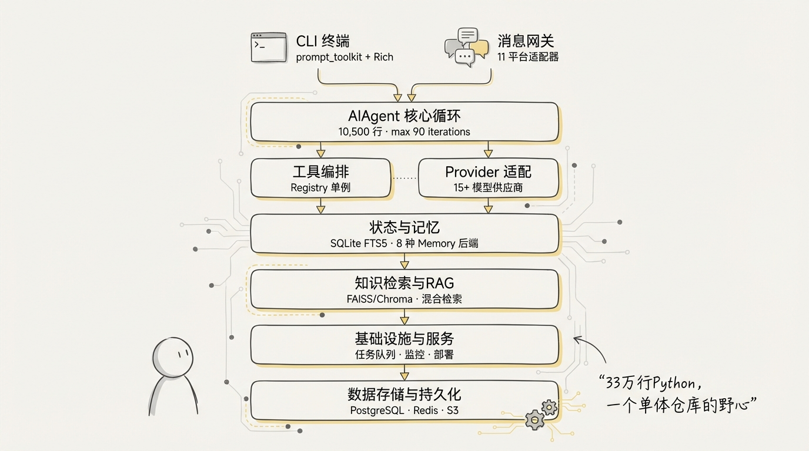
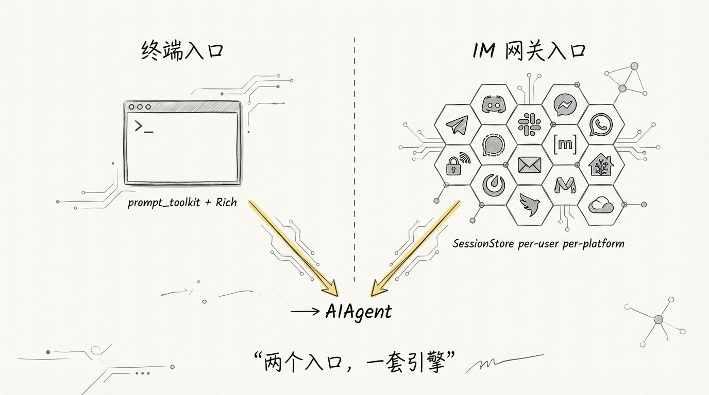
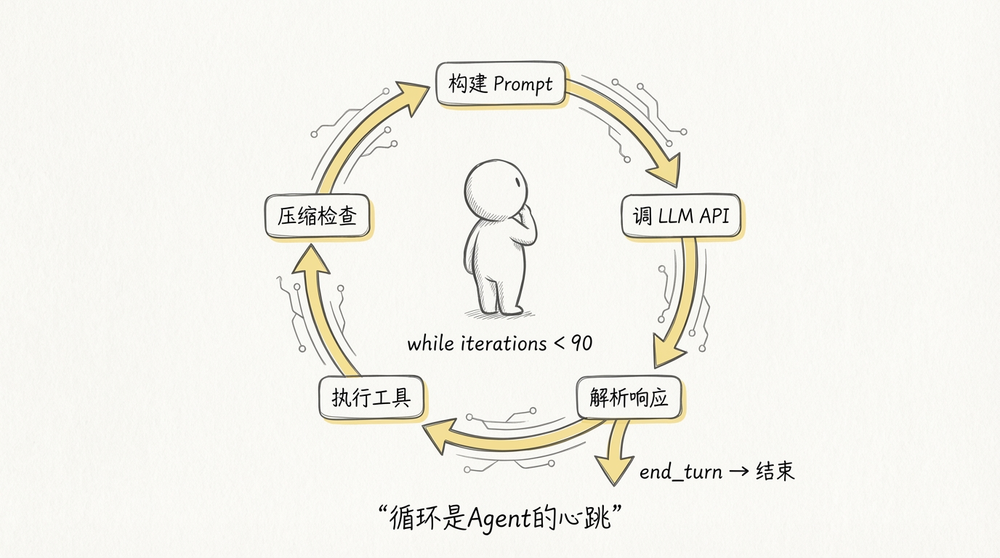
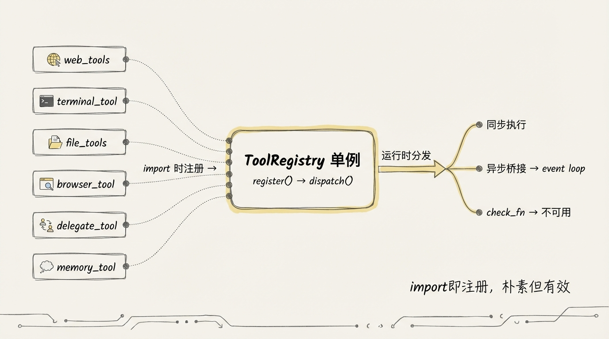
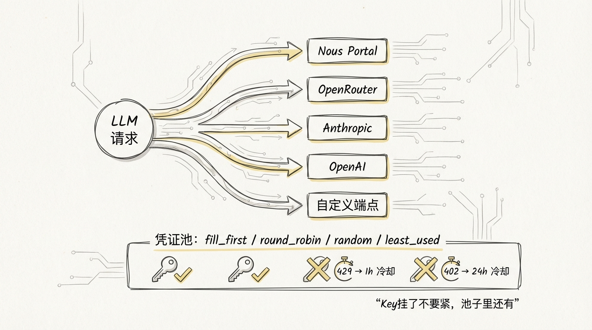
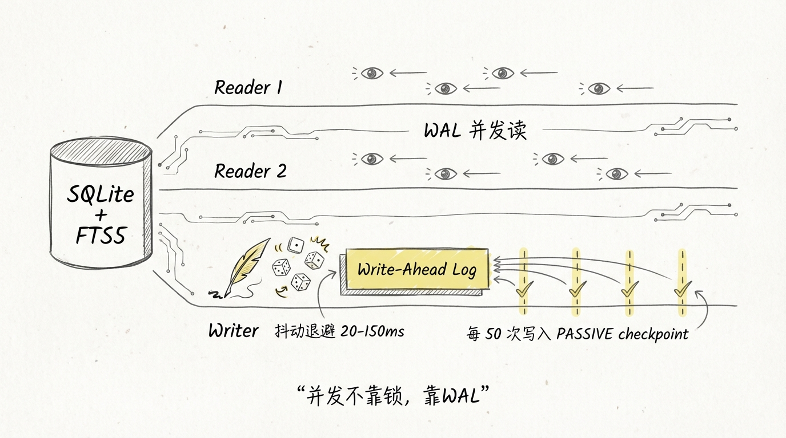
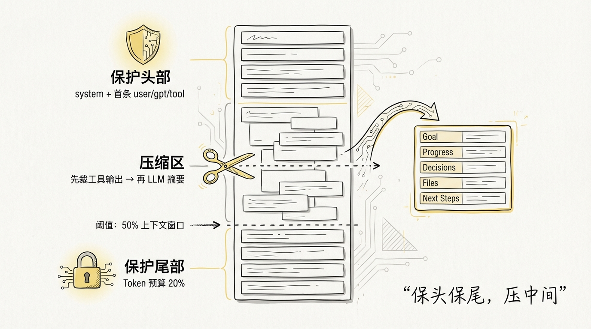
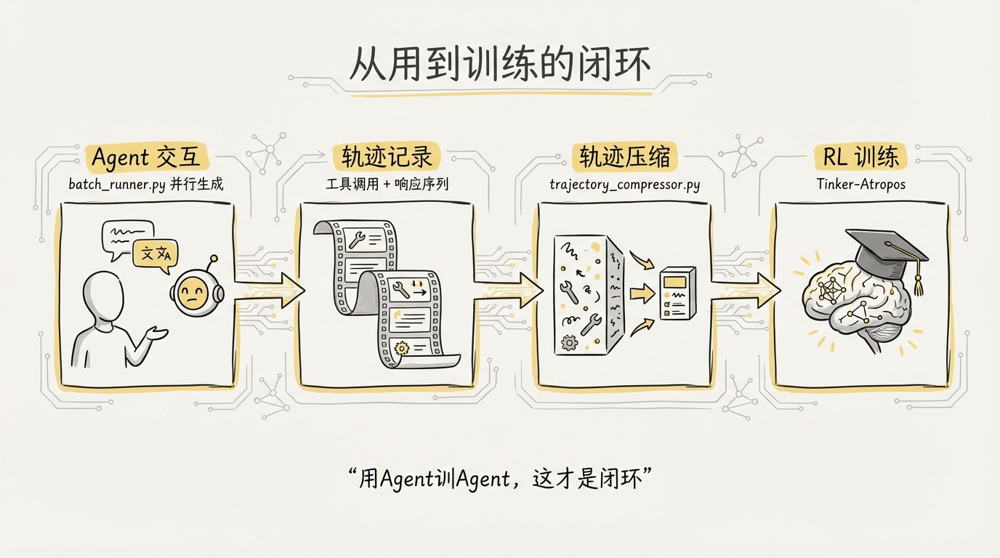
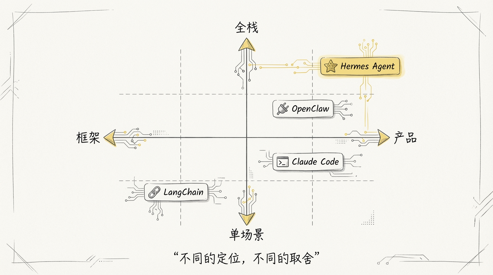

[English](docs/01-Architecture-Overview.md)

# 01 Hermes Agent 全景图：一个想做全栈 Agent 的开源项目

## Nous Research 是谁，为什么做这个

聊 Hermes Agent 之前得先聊 Nous Research。

这个团队在开源模型圈子里有一定知名度，核心产出是 **Hermes 系列微调模型**。他们的思路很直接：拿开源基座模型做 instruction tuning，让模型在工具调用、角色扮演、复杂推理这些场景上表现更好。Hermes 系列在 HuggingFace 上长期排在开源榜前列。

但光做模型不够。模型再好，用户拿到手里还是得自己搭 Agent 框架、接工具、搞部署。Nous Research 想把这个链路打通：**从模型到 Agent 到部署到自我改进，一条线全做了。**

Hermes Agent 就是这个野心的产物。一个 Python 写的、33 万行代码的 AI Agent 框架，从 CLI 交互到 11 平台消息网关到 RL 训练数据采集，全部内置。

这个定位本身就很有意思。市面上大部分 Agent 框架是 **library**，给你提供积木块让你自己搭。Hermes Agent 更接近一个 **完整产品**，开箱即用。

## 代码规模

先用数据建立一个量级感知。

| 指标 | 数据 |
|------|------|
| Python 文件数 | 744 |
| 代码总行数 | ~334,661 行 |
| 核心 Agent 循环 | run_agent.py，10,500 行 |
| CLI 交互层 | cli.py，390KB |
| 消息网关 | gateway/run.py，351KB |
| 会话持久化 | hermes_state.py，52KB |
| 内置工具 | ~25 个核心 + MCP/插件扩展 |
| 终端后端 | 6 种（local / Docker / SSH / Modal / Daytona / Singularity） |
| 消息平台 | 11 个（Telegram / Discord / Slack / WhatsApp / Signal / Matrix / Email / HomeAssistant / Mattermost / DingTalk / Feishu） |
| Memory 后端 | 8 种插件 |
| 凭证池策略 | 4 种（fill_first / round_robin / random / least_used） |

33 万行 Python 是什么概念？大致相当于 **Django 框架本体的 1.3 倍**。而且这 33 万行不是分散在几十个微服务里，是一个单体仓库。

## 整体架构



```
┌──────────────────────────────────────────────────────────┐
│                    用户在终端 / IM 平台输入                 │
└───────────────────────┬──────────────────────────────────┘
                        │
        ┌───────────────┼───────────────┐
        ↓                               ↓
┌───────────────────┐          ┌───────────────────┐
│  CLI 层            │          │  Gateway 层        │
│  cli.py (390KB)   │          │  gateway/run.py    │
│  prompt_toolkit    │          │  11 平台适配器      │
│  + Rich 渲染       │          │  SessionStore      │
└───────┬───────────┘          └───────┬───────────┘
        │                               │
        └───────────────┬───────────────┘
                        ↓
┌──────────────────────────────────────────────────────────┐
│  Agent 核心循环                                           │
│  run_agent.py (10,500 行)                                │
│  AIAgent 类：迭代预算 → API 调用 → 工具执行 → 压缩检查     │
│  并行工具执行 (ThreadPoolExecutor)                         │
│  max_iterations = 90（默认）                              │
└───────────┬───────────────────────┬──────────────────────┘
            │                       │
┌───────────▼──────────┐ ┌─────────▼────────────────────┐
│  工具编排层            │ │  Provider 适配层              │
│  model_tools.py       │ │  OpenAI 消息格式统一层        │
│  ToolRegistry 单例    │ │  Anthropic 适配器             │
│  异步桥接 event loop  │ │  credential_pool 凭证池化     │
│  ~25 内置工具          │ │  auxiliary_client 辅助路由    │
└───────────┬──────────┘ └─────────┬────────────────────┘
            │                       │
            └───────────┬───────────┘
                        ↓
┌──────────────────────────────────────────────────────────┐
│  状态与记忆层                                             │
│  SQLite + FTS5 全文搜索 (hermes_state.py)                 │
│  WAL 模式 + 抖动重试 + 被动 checkpoint                    │
│  MemoryManager：8 种插件后端                              │
│  context_compressor.py：头尾保护 + LLM 摘要压缩           │
│  Session 分裂：parent_session_id 链式压缩                 │
└──────────────────────────────────────────────────────────┘
```

看这张图你可能会觉得：这不就是标准的分层架构吗？

没错。但有两个不标准的地方值得注意：



**第一，入口是双通道的。** 大部分 Agent 框架只有一个 CLI 入口，Hermes Agent 同时支持终端交互和 IM 平台。一个 `AIAgent` 实例通过 Gateway 可以同时服务 Telegram 上的用户 A 和 Discord 上的用户 B，共享同一套工具和 Provider 配置，但各自维护独立的会话状态。

**第二，RL 训练数据采集是内置的。** `batch_runner.py` 和 `trajectory_compressor.py` 这两个模块让 Hermes Agent 可以批量生成工具调用轨迹，压缩后直接喂给 RL 训练。这个功能在其他开源 Agent 框架里几乎看不到，它暴露了 Nous Research 做 Hermes Agent 的另一层意图：**不只是做一个好用的 Agent，还要用它来训练更好的模型。**

## 1️⃣ 核心 Agent 循环：10,500 行的 run_agent.py



整个 Agent 的心脏是 `run_agent.py` 里的 `AIAgent` 类。

```python
class AIAgent:
    def __init__(
        self,
        model: str = "",
        max_iterations: int = 90,
        enabled_toolsets: List[str] = None,
        save_trajectories: bool = False,
        reasoning_config: Dict[str, Any] = None,
        platform: str = None,
        user_id: str = None,
        # ... 50+ 参数
    ):
```

50 多个构造参数，这个数量本身就说明了复杂度。`max_iterations` 默认 90，意思是一次对话最多循环 90 轮工具调用。对比 Claude Code 的无限循环 + 动态压缩，Hermes 选择了更保守的硬上限策略。

Agent 循环的核心流程：

```
用户输入 → 构建 system prompt → 调 LLM API
                                    ↓
                              模型返回响应
                                    ↓
                        ┌─── tool_use? ───┐
                        ↓ Yes             ↓ No
                   权限检查            输出结果
                        ↓              结束循环
                   执行工具
                        ↓
                   结果追加到
                   消息历史
                        ↓
                   压缩检查
                        ↓
                   回到调 API
```

和 Claude Code 用 **AsyncGenerator + yield** 实现流式循环不同，Hermes Agent 用的是更传统的 **同步 while 循环 + ThreadPoolExecutor 并行工具执行**。

这个选择背后的 trade-off 是：AsyncGenerator 的流式能力更优雅，但 Python 的 async 生态比 JavaScript 碎片化得多。Hermes Agent 需要兼容大量同步的第三方库（Playwright、Firecrawl、各种 SDK），用同步循环 + 线程池桥接异步是更务实的选择。

## 2️⃣ 工具系统：Registry 模式



Hermes Agent 的工具注册用的是经典的 **单例 Registry 模式**。

```python
# tools/registry.py
class ToolEntry:
    __slots__ = (
        "name", "toolset", "schema", "handler", "check_fn",
        "requires_env", "is_async", "description", "emoji",
        "max_result_size_chars",
    )

class ToolRegistry:
    def __init__(self):
        self._tools: Dict[str, ToolEntry] = {}
    
    def register(self, name, toolset, schema, handler, check_fn=None, ...):
        """每个工具文件在 import 时调用 register()"""
    
    def dispatch(self, name, args, task_id=None):
        """根据名字找到 handler 执行"""
    
    def get_definitions(self, check_fn_filter=True):
        """返回 OpenAI 格式的 tool schema 列表"""
```

工具发现的机制很朴素：`model_tools.py` 里硬编码了一个模块列表，`importlib.import_module()` 逐个导入，每个模块在导入时调用 `registry.register()` 注册自己。

```python
# model_tools.py
_modules = [
    "tools.web_tools",
    "tools.terminal_tool",
    "tools.file_tools",
    "tools.vision_tools",
    "tools.browser_tool",
    "tools.delegate_tool",
    "tools.memory_tool",
    # ... 15+ 工具模块
]
```

一个亮点是 **异步桥接**。很多工具的 handler 是 async 的，但 Agent 循环是同步的。Hermes 的解法是维护一个**持久化的 event loop**，所有异步工具调用都扔到这个 loop 里跑，避免了反复创建销毁 event loop 导致的 "Event loop is closed" 问题。

```python
# model_tools.py
def _run_async(coro):
    """持久化 event loop，解决 sync/async 阻抗"""
    global _loop
    if _loop is None or _loop.is_closed():
        _loop = asyncio.new_event_loop()
    return _loop.run_until_complete(coro)
```

这种写法在生产环境很常见，但在 Agent 框架的教程里几乎不会提到。

## 3️⃣ 多 Provider 适配



Hermes Agent 支持 15+ 个 LLM Provider，统一用 **OpenAI 消息格式**作为内部表示。Provider 差异通过适配器层屏蔽。

```
用户消息 → OpenAI 格式
              ↓
    ┌─────────┼─────────┬──────────┐
    ↓         ↓         ↓          ↓
  OpenAI  Anthropic  OpenRouter  自定义
              │
              ↓
    anthropic_adapter.py
    - Claude 4.6 adaptive thinking
    - 输出限制映射
    - OAuth device flow
```

**凭证池化** 是另一个有意思的设计。`credential_pool.py` 管理同一个 Provider 的多个 API Key，支持四种调度策略：

| 策略 | 行为 | 适用场景 |
|------|------|---------|
| `fill_first` | 优先用第一个，满了切下一个 | 有免费额度的 Key 先用完 |
| `round_robin` | 轮流使用 | 均匀分摊限额 |
| `random` | 随机选 | 避免热点 |
| `least_used` | 选用量最小的 | 最大化总吞吐 |

Key 被限流（429）后冷却 1 小时，欠费（402）后冷却 24 小时。这种差异化冷却策略说明团队在实际运营中踩过这两种不同的坑。

## 4️⃣ 状态持久化：SQLite + FTS5



Hermes Agent 的会话数据存在本地 SQLite 里，带 FTS5 全文搜索索引。

```sql
-- sessions 表
CREATE TABLE sessions (
    id TEXT PRIMARY KEY,
    source TEXT NOT NULL,           -- 'cli' / 'telegram' / 'discord' ...
    user_id TEXT,
    model TEXT,
    parent_session_id TEXT,         -- 压缩分裂链
    input_tokens INTEGER,
    output_tokens INTEGER,
    estimated_cost_usd REAL,
    FOREIGN KEY (parent_session_id) REFERENCES sessions(id)
);

-- messages 表 + FTS5 全文搜索
CREATE VIRTUAL TABLE messages_fts USING fts5(
    content, content=messages, content_rowid=id
);
```

**WAL 模式** 解决了多平台网关并发读写的问题：多个 reader 可以同时读，写入操作通过 Write-Ahead Log 串行化。写冲突时不是简单重试，而是用 **20-150ms 的随机抖动退避**，避免 thundering herd。

```python
class SessionDB:
    _WRITE_MAX_RETRIES = 15
    _WRITE_RETRY_MIN_S = 0.020   # 20ms
    _WRITE_RETRY_MAX_S = 0.150   # 150ms
    _CHECKPOINT_EVERY_N_WRITES = 50
```

每 50 次写入做一次 PASSIVE checkpoint，在不阻塞读取的前提下回收 WAL 文件空间。

## 5️⃣ 上下文压缩



长对话最大的敌人是上下文窗口溢出。Hermes Agent 的压缩策略分三步：

```
┌──────────────────────────────────────────────────┐
│  完整对话历史                                      │
│                                                  │
│  ┌─────────┐  保护头部                            │
│  │ system   │  ← 永远保留                         │
│  │ 首条 user │                                    │
│  │ 首条 gpt  │                                    │
│  │ 首条 tool │                                    │
│  ├─────────┤                                     │
│  │          │  ← 第一步：裁剪旧工具输出             │
│  │ 中间对话  │  ← 第二步：LLM 摘要压缩             │
│  │          │     (Goal → Progress → Decisions    │
│  │          │      → Files → Next Steps)          │
│  ├─────────┤                                     │
│  │ 最后 N 轮 │  ← Token 预算保护尾部               │
│  └─────────┘                                     │
└──────────────────────────────────────────────────┘
```

默认阈值是上下文窗口的 **50%**，尾部保护预算占压缩内容的 **20%**。摘要输出严格按 Goal / Progress / Decisions / Files / Next Steps 五个维度结构化，不是自由格式。

压缩触发后还会做 **session 分裂**：生成一个新的 session，通过 `parent_session_id` 链接到原 session。这样压缩前的完整历史不会丢失，随时可以回溯。

## 6️⃣ RL 训练数据采集：从用到训练的闭环



这是 Hermes Agent 和其他 Agent 框架拉开差距最大的地方。`batch_runner.py` 可以并行运行多个 Agent 实例，每个实例执行不同的任务，完整记录工具调用轨迹。`trajectory_compressor.py` 负责把冗长的轨迹压缩成结构化的训练数据，保留关键决策点，裁剪重复的工具输出。

压缩后的轨迹通过 Tinker-Atropos 对接 RL 训练流程。这意味着 Hermes Agent 不只是一个用来跑任务的 Agent，它同时还是一个**训练数据生产工厂**。每一次真实的用户交互，都可以变成改进下一代模型的素材。

## 和其他 Agent 框架的定位对比



| 维度 | Hermes Agent | Claude Code | OpenClaw | LangChain |
|------|-------------|-------------|----------|-----------|
| 语言 | Python | TypeScript | TypeScript | Python |
| 代码量 | 33 万行 | 51 万行 | 100 万行+ | ~5 万行 |
| 形态 | 产品 + 框架 | 产品 | 产品 + 平台 | 框架 |
| Agent 循环 | 同步 while + 线程池 | AsyncGenerator + yield | Gateway 事件驱动 | 回调链 / LCEL |
| 工具系统 | Registry 单例模式 | 内置 40+ 工具 | MCP 协议 + 插件 | 需自行注册 |
| Provider | 15+ (统一 OpenAI 格式) | Anthropic 为主 | 全平台插件 | 抽象接口 |
| 消息平台 | 11 个内置 | 无（终端 only） | 80+ 插件 | 无 |
| 记忆 | SQLite FTS5 + 8 插件 | CLAUDE.md 五层 + MEMORY.md | QMD 索引 | 需手动配 |
| 上下文压缩 | LLM 结构化摘要 | 三层压缩 + 微压缩 | compaction 策略 | token 截断 |
| RL 训练集成 | 原生支持 | 无 | 无 | 无 |
| 部署 | pip install / Docker / Modal | npm install | Docker / NixOS | pip install |

**一句话总结各自的定位：**
- **Hermes Agent**：研究驱动的全栈 Agent，从用到训练的闭环
- **Claude Code**：工程驱动的编程助手，极致的 Harness Engineering
- **OpenClaw**：平台驱动的 Agent 基座，靠插件连接一切
- **LangChain**：生态驱动的工具箱，给你积木自己搭

## 关键数据一览

| 指标 | 数据 |
|------|------|
| 版本 | v0.8.0 |
| Python 文件 | 744 个 |
| 代码总量 | ~334,661 行 |
| 核心依赖 | openai / anthropic / httpx / rich / prompt_toolkit |
| Agent 循环上限 | 90 次迭代 |
| 压缩阈值 | 50% 上下文窗口 |
| 摘要目标 | 压缩内容的 20% |
| 写冲突退避 | 20-150ms 随机抖动 |
| WAL checkpoint | 每 50 次写入 |
| 凭证冷却 | 429 → 1h, 402 → 24h |
| 测试目录 | 42 个 |

## 下一篇

现在你对 Hermes Agent 的整体架构有了一个量级感知。接下来逐个模块深入拆解。

下一篇 [02-Agent核心循环](docs/02-Agent核心循环.md) 会把 10,500 行的 run_agent.py 掰开揉碎，看看一个工业级 Agent 循环到底要处理多少边界条件。
