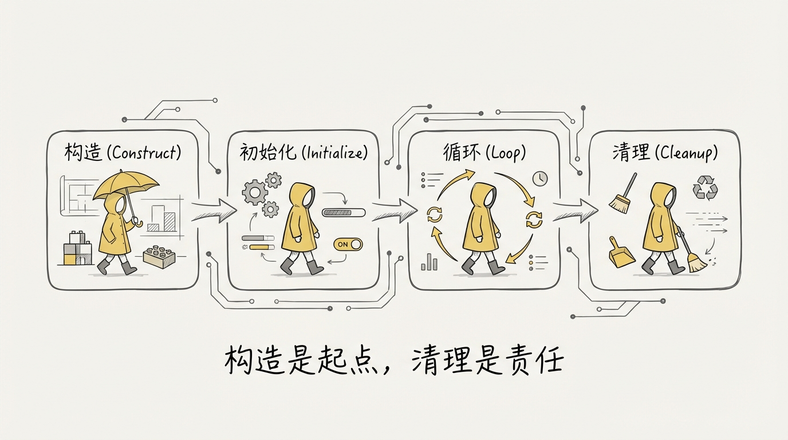
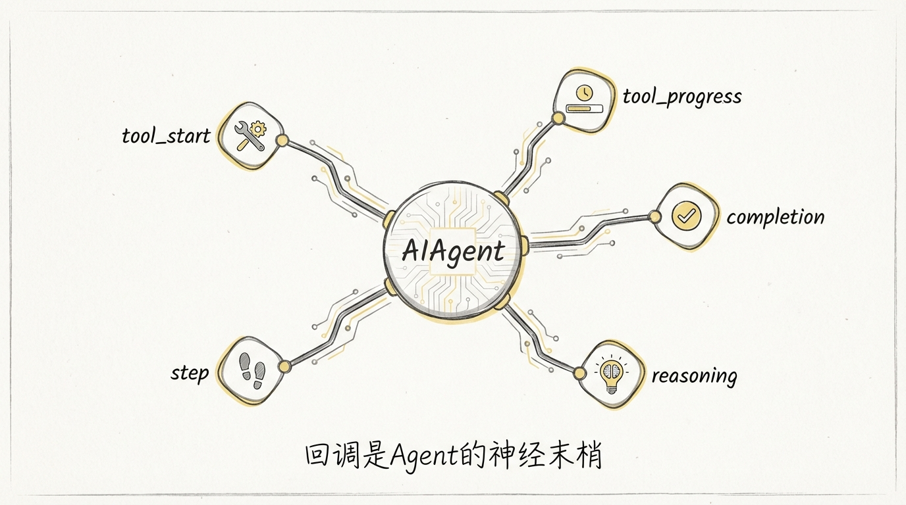
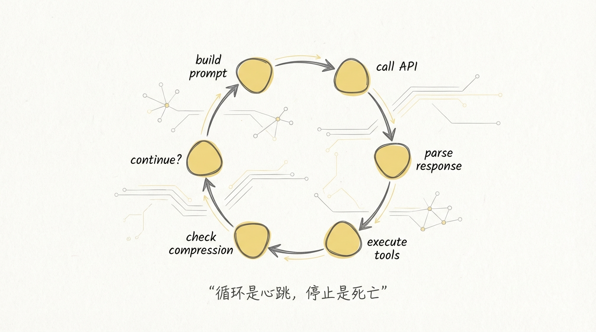
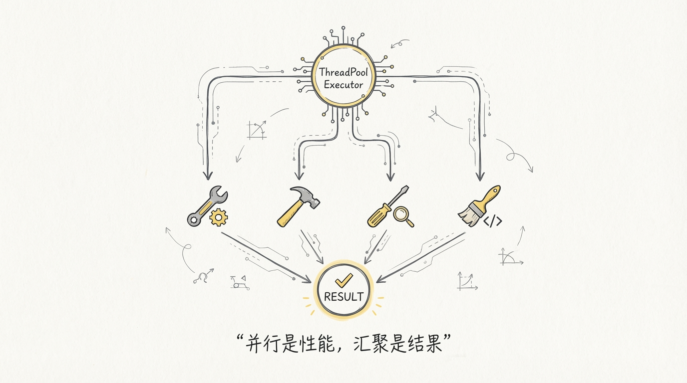
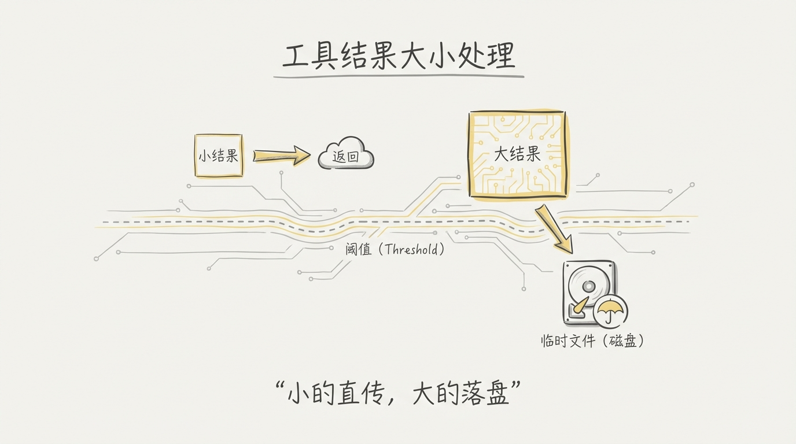
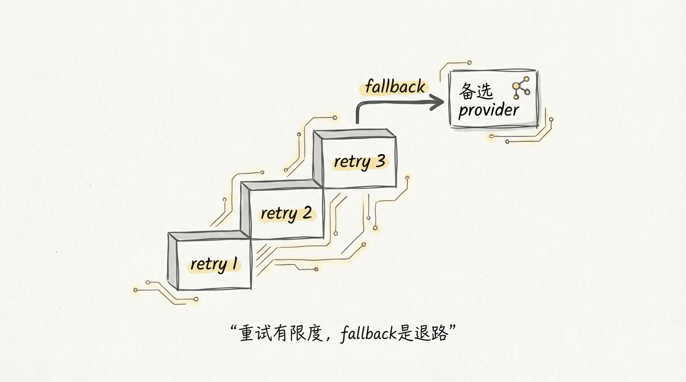
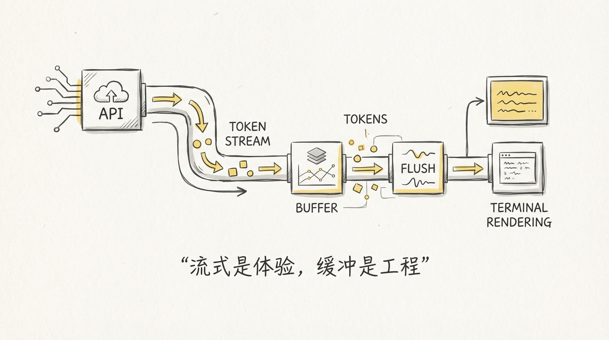
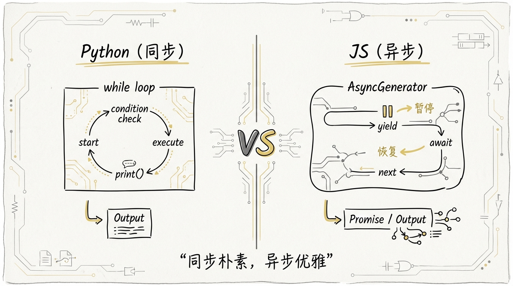

[English](docs/02-Agent-Loop.md)

# 02 Agent 核心循环：10,500 行的 run_agent.py 在干什么

上一篇我们站在 30,000 英尺的高度看了 Hermes Agent 的整体骨架。这一篇下到地面，钻进引擎舱。

run_agent.py 是整个项目的心脏。9,431 行代码（实际约 10,500 行含注释），一个文件，一个类 **AIAgent**，承载了从构造到运行到收尾的完整生命周期。你可以把它理解成一台**状态机**：接收用户输入，进入 while 循环，不断调用 LLM API → 执行工具 → 检查预算 → 压缩上下文，直到模型不再返回 tool_calls 为止。



## 1️⃣ AIAgent 构造：一个 486 行的 `__init__`

翻开 `__init__` 的签名，56 个参数。这不是设计失控，是**单体架构的代价**。CLI、Gateway、子 Agent、批量跑分器全部复用同一个类，每个调用方需要不同的旋钮。

```python
# run_agent.py L433-L486 (精简)
def __init__(
    self,
    base_url: str = None,
    api_key: str = None,
    provider: str = None,
    model: str = "",
    max_iterations: int = 90,
    tool_delay: float = 1.0,
    enabled_toolsets: List[str] = None,
    disabled_toolsets: List[str] = None,
    tool_progress_callback: callable = None,
    tool_start_callback: callable = None,
    tool_complete_callback: callable = None,
    thinking_callback: callable = None,
    reasoning_callback: callable = None,
    clarify_callback: callable = None,
    step_callback: callable = None,
    stream_delta_callback: callable = None,
    iteration_budget: "IterationBudget" = None,
    fallback_model: Dict[str, Any] = None,
    credential_pool=None,
    # ... 还有 30+ 个参数
):
```

构造阶段干了几件关键事：

1. **API 模式自动检测**：根据 provider、base_url 后缀自动判断用 chat_completions、codex_responses 还是 anthropic_messages。三套 API 格式，一个 if-elif 链搞定。
2. **客户端初始化**：Anthropic 走原生 SDK，OpenAI 兼容端走 OpenAI Python SDK，Codex 走 Responses API。三条路径各自构建 client。
3. **回调注册**：8 个 callback 插槽，覆盖工具执行的 start/progress/complete、思维链展示、流式输出、状态通知。这是 Agent 和上层 UI 解耦的关键接口。
4. **工具加载**：调用 `get_tool_definitions()` 拿到工具列表，构建 `valid_tool_names` 集合用于后续的幻觉工具名检测。
5. **IterationBudget 实例化**：如果父 Agent 没传进来，自己创建一个，默认上限 90 次。

```
┌──────────────────────────────────────────────────────────────┐
│                    AIAgent.__init__                           │
├──────────────────────────────────────────────────────────────┤
│                                                              │
│  1. API 模式检测                                              │
│     provider + base_url → chat_completions                   │
│                         → codex_responses                    │
│                         → anthropic_messages                 │
│                                                              │
│  2. 客户端构建                                                │
│     ├→ OpenAI SDK (chat_completions / codex_responses)       │
│     └→ Anthropic SDK (anthropic_messages)                    │
│                                                              │
│  3. 回调插槽注册 (8 个 callback)                              │
│     tool_progress / tool_start / tool_complete               │
│     thinking / reasoning / clarify / step / stream_delta     │
│                                                              │
│  4. 工具加载 → valid_tool_names 集合                          │
│                                                              │
│  5. IterationBudget(max_iterations=90)                       │
│                                                              │
│  6. Session / Memory / Checkpoint 初始化                      │
│                                                              │
└──────────────────────────────────────────────────────────────┘
```



值得注意的是 `_SafeWriter` 这个小组件。`__init__` 第一行就调用 `_install_safe_stdio()`，把 stdout/stderr 包一层。为什么？因为 Agent 可能跑在 systemd 服务、Docker 容器、无头守护进程里，stdout 管道随时可能断开。一个 `print()` 抛出 `OSError` 就能把整个 Agent 循环炸掉。**防御式编程的典型案例：你不知道你的输出管道什么时候会死。**

## 2️⃣ IterationBudget：工具调用的油量表

Agent 最怕什么？死循环。模型不停调用工具，工具返回结果，模型再调用工具，永远不给最终回答。IterationBudget 就是那个**油量表**，告诉引擎还能跑多远。

```python
# run_agent.py L168-L210
class IterationBudget:
    """Thread-safe iteration counter for an agent."""

    def __init__(self, max_total: int):
        self.max_total = max_total
        self._used = 0
        self._lock = threading.Lock()

    def consume(self) -> bool:
        """Try to consume one iteration. Returns True if allowed."""
        with self._lock:
            if self._used >= self.max_total:
                return False
            self._used += 1
            return True

    def refund(self) -> None:
        """Give back one iteration (e.g. for execute_code turns)."""
        with self._lock:
            if self._used > 0:
                self._used -= 1
```


几个设计细节：

1. **线程安全**：`threading.Lock()` 保护计数器。因为子 Agent 跑在 ThreadPoolExecutor 的工作线程里，多个 Agent 可能共享同一个 budget。
2. **consume/refund 语义**：consume 返回布尔值，调用方用 if 判断能不能继续。refund 给 `execute_code` 这类轻量级 RPC 调用免单，不让它们白白吃预算。
3. **父子预算隔离**：父 Agent 默认 90 次，子 Agent 独立预算（默认 50 次），两者不互相挤占。

预算耗尽不是唯一的刹车机制。Hermes 还有一套**两级预警系统**，在接近上限时往工具结果里注入压力信号：

```python
# run_agent.py L6586-L6608
def _get_budget_warning(self, api_call_count: int) -> Optional[str]:
    progress = api_call_count / self.max_iterations
    remaining = self.max_iterations - api_call_count
    if progress >= 0.9:  # 90% — 紧急
        return (
            f"[BUDGET WARNING: Iteration {api_call_count}/{self.max_iterations}. "
            f"Only {remaining} iteration(s) left. "
            "Provide your final response NOW.]"
        )
    if progress >= 0.7:  # 70% — 提醒
        return (
            f"[BUDGET: Iteration {api_call_count}/{self.max_iterations}. "
            f"{remaining} iterations left. Start consolidating your work.]"
        )
    return None
```

70% 的时候轻推一下：**开始收尾吧**。90% 的时候下最后通牒：**立刻给出最终回答**。这些警告注入到最后一条工具结果的 JSON 里，模型下一轮就能看到。但有个前提——这些警告是**一次性的**，下一轮 `_strip_budget_warnings_from_history` 会把历史消息里的旧警告全部清除，防止模型在后续 turn 里还以为预算紧张。

```
         0%              70%              90%           100%
         ├────────────────┼────────────────┼──────────────┤
         │   正常运行      │   CAUTION      │  WARNING     │ 预算耗尽
         │                │   开始收尾      │  立刻回答     │ 强制停止
         └────────────────┴────────────────┴──────────────┘
```

## 3️⃣ run_conversation：主循环的全貌

`run_conversation` 是 AIAgent 唯一的公开入口方法。每次用户发一条消息，上层调用一次这个方法。它内部是一个 while 循环，循环次数由 `max_iterations` 和 `IterationBudget` 双重控制。



```
┌─────────────────────────────────────────────────────────────────┐
│                     run_conversation()                           │
├─────────────────────────────────────────────────────────────────┤
│                                                                 │
│  准备阶段                                                        │
│  ├→ 重置重试计数器 / 清除中断状态                                  │
│  ├→ 消毒 surrogate 字符 (_sanitize_surrogates)                   │
│  ├→ 清除历史中的 budget warnings                                  │
│  ├→ 构建/复用 system prompt (缓存机制)                            │
│  └→ 预飞行上下文压缩 (超阈值时多 pass 压缩)                       │
│                                                                 │
│  while api_call_count < max_iterations:                          │
│  │                                                               │
│  │  ├→ 检查中断请求                                               │
│  │  ├→ consume iteration budget                                  │
│  │  ├→ 构建 api_messages (注入记忆/插件上下文)                     │
│  │  ├→ 应用 Anthropic prompt caching                             │
│  │  ├→ sanitize_api_messages (修复孤儿 tool_call)                 │
│  │  │                                                            │
│  │  ├→ while retry_count < 3:  ← 内层重试循环                    │
│  │  │   ├→ _interruptible_streaming_api_call()                   │
│  │  │   ├→ 响应验证 (None? choices 为空?)                         │
│  │  │   └→ 错误处理 → fallback → jittered_backoff                │
│  │  │                                                            │
│  │  ├→ if tool_calls:                                            │
│  │  │   ├→ 验证工具名 (幻觉检测 + 自动修复)                       │
│  │  │   ├→ 验证 JSON 参数                                        │
│  │  │   ├→ _execute_tool_calls()                                 │
│  │  │   ├→ 上下文压缩检查                                         │
│  │  │   └→ continue                                              │
│  │  │                                                            │
│  │  └→ else: (无 tool_calls → 最终回答)                           │
│  │      ├→ 检测空回答 / 思维链 only → 重试或 fallback             │
│  │      ├→ strip <think> blocks                                  │
│  │      └→ break                                                 │
│  │                                                               │
│  收尾阶段                                                        │
│  ├→ 保存 session / trajectory                                    │
│  ├→ 清理 VM 资源                                                 │
│  └→ 返回 {final_response, messages, api_calls, ...}             │
│                                                                 │
└─────────────────────────────────────────────────────────────────┘
```

进循环之前有一步容易被忽略：**预飞行上下文压缩**。如果用户切了一个上下文窗口更小的模型，已有的对话历史可能超过新模型的阈值。Hermes 在进主循环之前就检测这种情况，最多做 3 轮压缩把上下文塞进去。这比等着 API 报 4xx 错误再处理优雅得多。

系统提示词有个**缓存机制**：第一次调用时构建，存到 `_cached_system_prompt`，后续 turn 直接复用。对于 Gateway 场景（每条消息创建一个新的 AIAgent 实例），还会从 SQLite session DB 里加载上一轮存储的 system prompt，确保 Anthropic 的 prompt cache prefix 保持一致。**一个 system prompt 变了一个字，整个 prefix cache 就失效。**

## 4️⃣ 并行工具执行：ThreadPoolExecutor 的安全边界

模型一次返回多个 tool_calls 是常见场景。比如同时读 3 个文件，或者并行跑 web_search 和 read_file。Hermes 不是无脑并行，而是先做**安全检查**，通过才走并行路径。



```python
# run_agent.py L212-L235
_NEVER_PARALLEL_TOOLS = frozenset({"clarify"})  # 交互式工具，永远串行

_PARALLEL_SAFE_TOOLS = frozenset({
    "ha_get_state", "ha_list_entities", "ha_list_services",
    "read_file", "search_files", "session_search",
    "skill_view", "skills_list", "vision_analyze",
    "web_extract", "web_search",
})

_PATH_SCOPED_TOOLS = frozenset({"read_file", "write_file", "patch"})

_MAX_TOOL_WORKERS = 8
```

决策逻辑分三层：

1. **黑名单拦截**：`clarify` 这种需要用户交互的工具，出现在批次里就整批降级为串行。
2. **白名单放行**：`_PARALLEL_SAFE_TOOLS` 里的只读工具可以无条件并行。
3. **路径冲突检测**：`read_file`、`write_file`、`patch` 这些文件操作工具，只有目标路径**不重叠**时才能并行。重叠判断用 `_paths_overlap` 检查路径前缀包含关系。

```python
# run_agent.py L265-L306 (精简)
def _should_parallelize_tool_batch(tool_calls) -> bool:
    if len(tool_calls) <= 1:
        return False
    tool_names = [tc.function.name for tc in tool_calls]
    if any(name in _NEVER_PARALLEL_TOOLS for name in tool_names):
        return False

    reserved_paths: list[Path] = []
    for tool_call in tool_calls:
        tool_name = tool_call.function.name
        if tool_name in _PATH_SCOPED_TOOLS:
            scoped_path = _extract_parallel_scope_path(tool_name, function_args)
            if any(_paths_overlap(scoped_path, existing) for existing in reserved_paths):
                return False
            reserved_paths.append(scoped_path)
            continue
        if tool_name not in _PARALLEL_SAFE_TOOLS:
            return False
    return True
```

通过安全检查后，执行路径走 `_execute_tool_calls_concurrent`：

```python
# run_agent.py L6144-L6159 (核心)
max_workers = min(num_tools, _MAX_TOOL_WORKERS)
with concurrent.futures.ThreadPoolExecutor(max_workers=max_workers) as executor:
    futures = []
    for i, (tc, name, args) in enumerate(parsed_calls):
        f = executor.submit(_run_tool, i, tc, name, args)
        futures.append(f)
    concurrent.futures.wait(futures)
```

worker 数量取 `min(工具数, 8)`。结果按**原始顺序**收集到 `results` 数组（每个 worker 写固定 index），保证 API 看到的工具结果顺序和请求一致。

```
┌──────────────────────────────────────────────────────────────┐
│           _execute_tool_calls 调度入口                         │
├──────────────────────────────────────────────────────────────┤
│                                                              │
│  tool_calls 批次                                              │
│  ├→ _should_parallelize_tool_batch()                         │
│  │   ├→ clarify 在批次里? → 串行                              │
│  │   ├→ 全部在 PARALLEL_SAFE? → 并行                          │
│  │   ├→ 路径冲突? → 串行                                      │
│  │   └→ 未知工具? → 串行                                      │
│  │                                                           │
│  ├→ True:  _execute_tool_calls_concurrent()                  │
│  │   └→ ThreadPoolExecutor(max_workers=min(N, 8))            │
│  │       ├→ worker[0]: read_file("/a.py")                    │
│  │       ├→ worker[1]: web_search("query")                   │
│  │       └→ worker[2]: read_file("/b.py")                    │
│  │       → results[0..N] 按原序收集                           │
│  │                                                           │
│  └→ False: _execute_tool_calls_sequential()                  │
│      └→ for tool_call in tool_calls: _invoke_tool()          │
│                                                              │
└──────────────────────────────────────────────────────────────┘
```

串行路径 `_execute_tool_calls_sequential` 有一个并行路径没有的特性：**逐个中断检查**。每执行一个工具之前都检查 `_interrupt_requested`，如果用户发了新消息触发了中断，剩余的工具全部跳过，塞一条 `[Tool execution cancelled]` 消息进去。并行路径只在入口做一次中断检查，因为线程池里的任务一旦 submit 就没法细粒度取消。

## 5️⃣ 工具结果大小处理：超限就落盘

LLM 的上下文窗口是有限的。一个 `search_files` 返回 200KB 的结果，直接塞进 messages 数组会把上下文撑爆。Hermes 设计了**三级防御体系**来处理这个问题。



```python
# tools/tool_result_storage.py L1-L21 (文档注释)
"""
Defense against context-window overflow operates at three levels:

1. Per-tool output cap: Tools like search_files pre-truncate
   their own output before returning.

2. Per-result persistence (maybe_persist_tool_result): After a tool
   returns, if its output exceeds the tool's registered threshold,
   the full output is written INTO THE SANDBOX at
   /tmp/hermes-results/{tool_use_id}.txt.
   The in-context content is replaced with a preview + file path reference.

3. Per-turn aggregate budget (enforce_turn_budget): After all tool
   results in a single assistant turn are collected, if the total
   exceeds MAX_TURN_BUDGET_CHARS (200K), the largest non-persisted
   results are spilled to disk until the aggregate is under budget.
"""
```

```
                工具返回结果
                    │
                    ↓
        ┌───────────────────────┐
        │  第 1 级：工具自限      │  search_files 自己截断
        │  (工具代码内部)         │  terminal 限制输出行数
        └───────────┬───────────┘
                    ↓
        ┌───────────────────────┐
        │  第 2 级：单结果落盘    │  超过阈值?
        │  maybe_persist_tool   │  → 写入 /tmp/hermes-results/
        │  _result()            │  → 替换为 preview + 路径
        └───────────┬───────────┘
                    ↓
        ┌───────────────────────┐
        │  第 3 级：整轮预算      │  本轮所有结果 > 200K?
        │  enforce_turn_budget  │  → 最大的结果强制落盘
        └───────────┬───────────┘
                    ↓
               进入 messages
```

落盘的关键是 `_write_to_sandbox`：它用 heredoc 语法通过 `env.execute()` 把内容写进沙箱的 `/tmp/hermes-results/` 目录。替换后的消息长这样：

```xml
<persisted-output>
This tool result was too large (245,382 characters, 239.6 KB).
Full output saved to: /tmp/hermes-results/call_abc123.txt
Use the read_file tool with offset and limit to access specific sections.

Preview (first 2000 chars):
[实际内容前 2000 个字符...]
...
</persisted-output>
```

模型看到这个标签后知道完整结果在磁盘上，需要时用 `read_file` 按需读取。**这是一种经典的分页模式：先给摘要，按需加载全量。**

## 6️⃣ 消息清洗：不该留在历史里的东西

每轮 API 调用之前，Hermes 对 messages 做一系列清洗。这些清洗看起来琐碎，但每个都踩过真实的坑。


**Surrogate 字符消毒**

用户从 Google Docs 或 Word 粘贴内容，可能带上 lone surrogate code points（U+D800-U+DFFF）。这些在 UTF-8 里是非法的，OpenAI SDK 的 `json.dumps()` 会直接崩溃。

```python
# run_agent.py L338-L354
_SURROGATE_RE = re.compile(r'[\ud800-\udfff]')

def _sanitize_surrogates(text: str) -> str:
    if _SURROGATE_RE.search(text):
        return _SURROGATE_RE.sub('\ufffd', text)
    return text
```

先检查再替换，没有 surrogate 的字符串直接返回，零开销。

**Budget Warning 剥离**

上一轮注入的预算警告必须从历史消息中移除。如果留着，模型（尤其是 GPT 系列）会把旧警告当成当前指令，在所有后续 turn 里都不敢调用工具。

```python
# run_agent.py L381-L408
def _strip_budget_warnings_from_history(messages: list) -> None:
    for msg in messages:
        if msg.get("role") != "tool":
            continue
        content = msg.get("content")
        # 先尝试 JSON 格式 (_budget_warning key)
        try:
            parsed = json.loads(content)
            if isinstance(parsed, dict) and "_budget_warning" in parsed:
                del parsed["_budget_warning"]
                msg["content"] = json.dumps(parsed, ensure_ascii=False)
                continue
        except (json.JSONDecodeError, TypeError):
            pass
        # 回退到正则匹配纯文本格式
        cleaned = _BUDGET_WARNING_RE.sub("", content).strip()
        if cleaned != content:
            msg["content"] = cleaned
```

两种格式都处理：JSON 结构化的和纯文本拼接的。**先试精确的，再试模糊的。**

**孤儿 tool_call 修复**

上下文压缩可能删掉一条 assistant 消息（带 tool_calls），但保留了后面的 tool result 消息。这会导致 API 报错：tool result 找不到对应的 tool_call_id。`_sanitize_api_messages` 在每次 API 调用前扫描整个消息列表，修复这类不一致。

| 清洗操作 | 触发场景 | 处理方式 |
|----------|----------|----------|
| surrogate 消毒 | 富文本粘贴 | 替换为 U+FFFD |
| budget warning 剥离 | 每轮开头 | JSON del / 正则移除 |
| 孤儿 tool_call 修复 | 压缩/手动编辑后 | 删除孤儿 result / 补 stub |
| reasoning 字段转换 | 多轮推理上下文 | reasoning → reasoning_content |
| finish_reason 移除 | 严格 API 校验 | pop 掉非标准字段 |

## 7️⃣ 错误重试与 Fallback 链

Agent 跑在真实网络环境里，API 调用失败是家常便饭。Hermes 的重试策略不是简单的 `sleep(5)` + retry，而是一套**多层防御**。



**Jittered Backoff**

```python
# agent/retry_utils.py L19-L57
def jittered_backoff(
    attempt: int,
    *,
    base_delay: float = 5.0,
    max_delay: float = 120.0,
    jitter_ratio: float = 0.5,
) -> float:
    delay = min(base_delay * (2 ** (attempt - 1)), max_delay)
    # 用 time_ns + 单调递增计数器做种子，避免并发会话同步重试
    seed = (time.time_ns() ^ (tick * 0x9E3779B9)) & 0xFFFFFFFF
    rng = random.Random(seed)
    jitter = rng.uniform(0, jitter_ratio * delay)
    return delay + jitter
```

为什么不用 `random.random()` 直接生成抖动？因为多个 Gateway 会话可能同时触发重试，Python 全局 RNG 的种子相同会产生**雷同的抖动值**，大家同时重试还是挤在一起。这里用 `time_ns` 异或一个单调计数器做独立种子，确保每次调用产生不同的随机数。

**0x9E3779B9** 是黄金比例的 32 位整数近似值，常用于哈希扰动，让计数器的连续值映射到看起来随机的种子空间。

**Fallback 链**

```python
# run_agent.py L834-L853
if isinstance(fallback_model, list):
    self._fallback_chain = [
        f for f in fallback_model
        if isinstance(f, dict) and f.get("provider") and f.get("model")
    ]
elif isinstance(fallback_model, dict):
    self._fallback_chain = [fallback_model]
```

支持单个 fallback 和链式 fallback。主 provider 挂了先切 fallback[0]，再挂切 fallback[1]，逐级降级。每个新 turn 开始时 `_restore_primary_runtime()` 把主 provider 恢复回来，给它一次新的机会。

**内层重试循环**

主循环里嵌套了一个 `while retry_count < 3` 的内层循环处理 API 调用级别的错误：

| 错误类型 | 处理方式 |
|----------|----------|
| 响应为 None / choices 为空 | 重试 → fallback |
| 工具名幻觉 | 自动修复 → 注入错误消息让模型自纠 |
| JSON 参数解析失败 | 重试 3 次 → 注入 recovery tool results |
| 不完整 REASONING_SCRATCHPAD | 重试 2 次 → 返回 partial |
| Codex incomplete 状态 | 续发 3 次 → 放弃 |
| 429 Rate Limit | jittered_backoff → fallback |
| 上下文超限 | 压缩 → 降级上下文窗口探测 |

## 8️⃣ 流式处理：始终 Streaming

一个反直觉的设计决策：**Hermes 始终使用 streaming 路径**，即使没有流式消费者。

```python
# run_agent.py L7329-L7339 (注释)
# Always prefer the streaming path — even without stream
# consumers.  Streaming gives us fine-grained health
# checking (90s stale-stream detection, 60s read timeout)
# that the non-streaming path lacks.  Without this,
# subagents and other quiet-mode callers can hang
# indefinitely when the provider keeps the connection
# alive with SSE pings but never delivers a response.
```



非流式 API 调用有个隐蔽的问题：provider 可以用 SSE keep-alive ping 保持连接不断开，但就是不返回实际数据。HTTP 层面没超时，应用层面没心跳，Agent 就这么**无限挂住**。流式路径自带健康检查：90 秒没收到新 chunk 就判定连接死了，60 秒读超时自动断开。

`_interruptible_streaming_api_call` 统一处理三种 API 模式：

```
┌──────────────────────────────────────────────────────────────┐
│        _interruptible_streaming_api_call                      │
├──────────────────────────────────────────────────────────────┤
│                                                              │
│  api_mode == "codex_responses"                               │
│  └→ 委托给 _interruptible_api_call (Codex 自带流式)          │
│                                                              │
│  api_mode == "anthropic_messages"                            │
│  └→ client.messages.stream() → Anthropic SDK 原生流          │
│                                                              │
│  api_mode == "chat_completions"                              │
│  └→ client.chat.completions.create(stream=True)              │
│     ├→ 每个 chunk 更新 last_chunk_time                       │
│     ├→ 检查 _interrupt_requested → 提前 break                │
│     ├→ 累积 content_parts / tool_calls_acc                   │
│     └→ 触发 stream_delta_callback / _stream_callback         │
│                                                              │
│  → 组装 SimpleNamespace 模拟非流式响应格式                     │
│  → 返回给主循环，后续逻辑不感知流式/非流式差异                  │
│                                                              │
└──────────────────────────────────────────────────────────────┘
```

流式响应最后组装成一个 `SimpleNamespace` 对象，模拟非流式响应的接口。主循环完全不感知底层是流式还是非流式，**适配器模式的教科书用法**。

## 9️⃣ 与 Claude Code 的 AsyncGenerator 实现对比

Claude Code 用 TypeScript 写，核心循环用 **AsyncGenerator**（`yield` 出每一步的状态变化）。Hermes 用 Python，核心循环是**同步 while 循环 + 回调**。两种风格代表了 Agent 架构的两个流派。



| 维度 | Hermes Agent (Python) | Claude Code (TypeScript) |
|------|----------------------|--------------------------|
| 核心循环 | 同步 `while` + callback | `async function*` yield |
| 并发模型 | `ThreadPoolExecutor` (OS 线程) | 原生 `Promise.all` |
| 工具执行 | 安全检查 → 并行/串行分支 | 单线程事件循环 |
| 中断机制 | `_interrupt_requested` 标志位 | AbortController signal |
| 流式传播 | callback chain (8 个插槽) | yield 到上层 for-await-of |
| 状态管理 | 实例变量 (self._xxx) | Generator 闭包 |
| 上下文压缩 | 运行时 LLM 摘要 | 外部压缩策略 |
| 文件大小 | 9,431 行单文件 | 分散在多个模块 |

Claude Code 的 AsyncGenerator 模型天然适合流式 UI：每 yield 一个事件，上层 `for await` 循环就能实时渲染。消费者和生产者通过 Generator 协议解耦，不需要回调注册。

Hermes 的回调模型更灵活但更复杂。8 个回调插槽意味着 8 个可能的消费者，每个消费者独立注册、独立处理。好处是 CLI、Gateway、TTS 可以同时挂载不同的回调。代价是调用方必须理解每个回调的时序和语义。

从并发角度看，Python 的 GIL 让 ThreadPoolExecutor 在 CPU 密集型任务上没有真正的并行优势。但 Agent 的工具执行本质上是 **IO 密集型**——网络请求、文件读写、进程调用——线程模型刚好够用。TypeScript 的单线程 + async/await 天生适合这种场景，不需要考虑线程安全问题。

Hermes 为线程安全付出的代价体现在代码的每个角落：`IterationBudget` 用 `threading.Lock()`，`_active_children` 用 `threading.Lock()`，`_client_lock` 用 `threading.RLock()`，`_SafeWriter` 要 catch `ValueError: I/O operation on closed file`。这些防御代码在单线程模型里完全不需要。

---

**下一篇**：[03 工具编排层：ToolRegistry 单例与 25 个内置工具的设计](./03-工具编排层.md)
