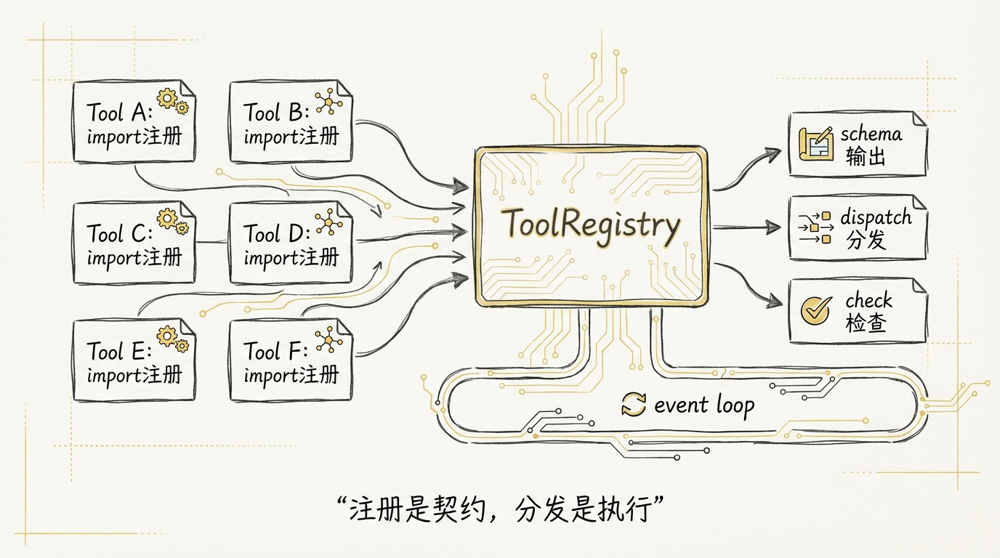
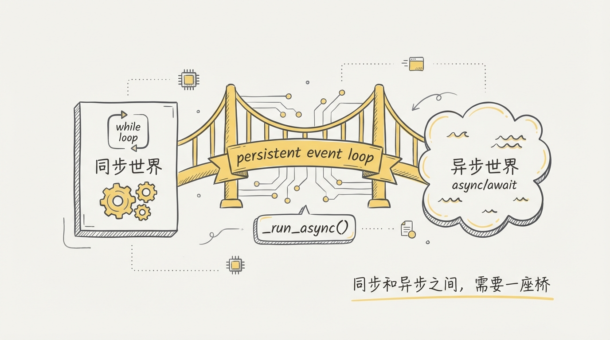
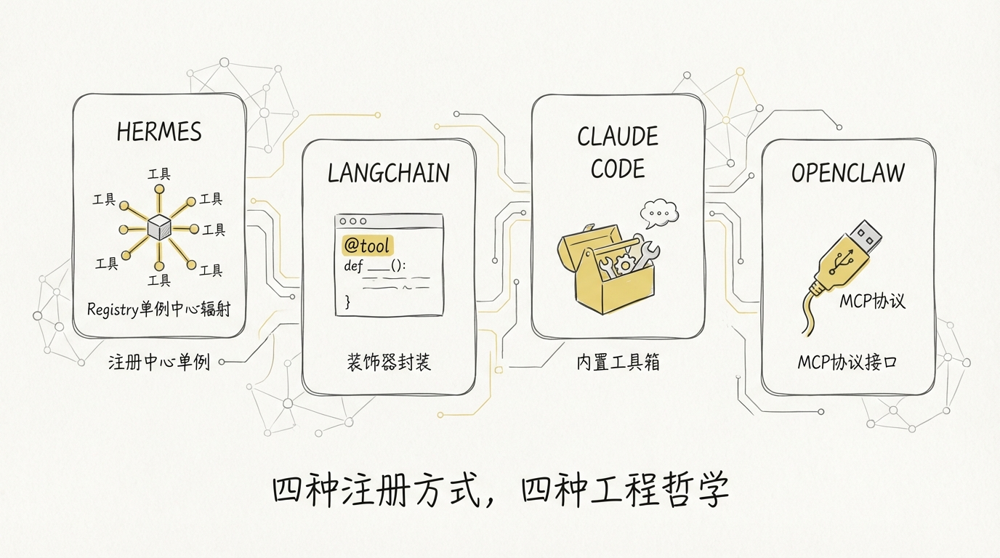

[English](docs/03-Tool-Registry.md)

# 03 Tool Registry：比 LangChain 更朴素的工具注册方式



LangChain 给工具系统套了四层抽象：BaseTool → StructuredTool → @tool 装饰器 → ToolNode，一个 web_search 落地要穿三件外套。hermes-agent 的选择正好相反——**一个字典，一个单例，一套模块级 register() 调用**，完事。

这篇拆的就是这套朴素到有点粗暴的工具系统：从元数据结构 ToolEntry，到单例注册表 ToolRegistry，到 model_tools.py 的发现与分发机制，再到那个解决 sync/async 阻抗的持久化 event loop。整套核心代码不到 600 行。

---

## 1️⃣ ToolEntry：一个工具的全部身份证明

每个工具在 registry 里的存在形式就是一个 **ToolEntry** 实例。用 `__slots__` 锁死字段，没有继承、没有 mixin、没有 Protocol：

```python
# tools/registry.py

class ToolEntry:
    """Metadata for a single registered tool."""

    __slots__ = (
        "name", "toolset", "schema", "handler", "check_fn",
        "requires_env", "is_async", "description", "emoji",
        "max_result_size_chars",
    )

    def __init__(self, name, toolset, schema, handler, check_fn,
                 requires_env, is_async, description, emoji,
                 max_result_size_chars=None):
        self.name = name
        self.toolset = toolset
        self.schema = schema
        self.handler = handler
        self.check_fn = check_fn
        self.requires_env = requires_env
        self.is_async = is_async
        self.description = description
        self.emoji = emoji
        self.max_result_size_chars = max_result_size_chars
```

逐个字段看：

| 字段 | 类型 | 作用 |
|------|------|------|
| **name** | str | 工具唯一标识，LLM 调用时用的名字 |
| **toolset** | str | 所属工具集，控制批量启用/禁用 |
| **schema** | dict | OpenAI function calling 格式的 JSON Schema |
| **handler** | Callable | 实际执行函数，签名 `(args, **kwargs) -> str` |
| **check_fn** | Callable \| None | 可用性检查函数，返回 False 则工具从 schema 列表中消失 |
| **requires_env** | list | 依赖的环境变量名列表，给 `hermes doctor` 和 UI 展示用 |
| **is_async** | bool | handler 是否返回协程，True 则走 `_run_async` 桥接 |
| **emoji** | str | 显示用 emoji，`💻` 代表终端，`🔍` 代表搜索 |
| **max_result_size_chars** | int \| float \| None | 单次返回结果的字符上限，超了走持久化存储给 LLM 一个摘要 |

**为什么用 `__slots__` 而不是 dataclass？** 不是为了省那几十字节内存。工具注册发生在进程启动时，数量固定在 30-50 个之间，内存根本不是瓶颈。真正的好处是**防止 typo 变成 silent bug**——你写 `entry.naem = "xxx"` 直接 AttributeError，而不是默默创建一个新属性然后在运行时才炸。

---

## 2️⃣ ToolRegistry 单例 + 延迟注册：解决循环引用

```python
# tools/registry.py

class ToolRegistry:
    """Singleton registry that collects tool schemas + handlers from tool files."""

    def __init__(self):
        self._tools: Dict[str, ToolEntry] = {}
        self._toolset_checks: Dict[str, Callable] = {}

# Module-level singleton
registry = ToolRegistry()
```

**单例模式在这里不是 `__new__` 元类那套花活**，就是模块级变量。Python 的 module import 机制保证同一个模块只 import 一次，`registry` 天然就是单例。

注册方法签名：

```python
# tools/registry.py

def register(
    self,
    name: str,
    toolset: str,
    schema: dict,
    handler: Callable,
    check_fn: Callable = None,
    requires_env: list = None,
    is_async: bool = False,
    description: str = "",
    emoji: str = "",
    max_result_size_chars: int | float | None = None,
):
    """Register a tool. Called at module-import time by each tool file."""
```

**延迟注册解决循环引用**是整个设计最关键的决定。看这条 import 链：

```
┌─────────────────────────────────────────────────────────────┐
│                  Import Chain（无循环）                       │
├─────────────────────────────────────────────────────────────┤
│                                                             │
│  tools/registry.py  ←── 零外部依赖，最先加载                  │
│        ▲                                                    │
│        │  from tools.registry import registry               │
│        │                                                    │
│  tools/*.py  ←── 各工具文件，模块级调用 registry.register()    │
│        ▲                                                    │
│        │  importlib.import_module()                          │
│        │                                                    │
│  model_tools.py  ←── _discover_tools() 触发全部导入          │
│        ▲                                                    │
│        │                                                    │
│  run_agent.py / cli.py / batch_runner.py                    │
│                                                             │
└─────────────────────────────────────────────────────────────┘
```

一句话概括：**registry.py 不依赖任何人，所有人都依赖它。** 这是教科书级的依赖倒置。registry 作为最底层的叶子节点，保证了无论以什么顺序导入都不会循环。30+ 个工具模块可以随意增删，不怕互相踩脚。

实际的注册调用长这样：

```python
# tools/terminal_tool.py (文件末尾)

registry.register(
    name="terminal",
    toolset="terminal",
    schema=TERMINAL_SCHEMA,
    handler=_handle_terminal,
    check_fn=check_terminal_requirements,
    emoji="💻",
    max_result_size_chars=100_000,
)
```

```python
# tools/web_tools.py (文件末尾)

registry.register(
    name="web_search",
    toolset="web",
    schema=WEB_SEARCH_SCHEMA,
    handler=lambda args, **kw: web_search_tool(args.get("query", ""), limit=5),
    check_fn=check_web_api_key,
    requires_env=_web_requires_env(),
    emoji="🔍",
    max_result_size_chars=100_000,
)
```

注意 web_tools 的 handler 用了 **lambda 做适配层**，把 `args` dict 解包成函数参数。terminal_tool 直接传了一个 `_handle_terminal` 函数。两种写法都行，registry 不关心你的 handler 内部长什么样，只要签名是 `(args_dict, **kwargs) -> str` 就够了。

再看 **web_extract** 的注册，多了一个 `is_async=True`：

```python
# tools/web_tools.py

registry.register(
    name="web_extract",
    toolset="web",
    schema=WEB_EXTRACT_SCHEMA,
    handler=lambda args, **kw: web_extract_tool(
        args.get("urls", [])[:5] if isinstance(args.get("urls"), list) else [], "markdown"),
    check_fn=check_web_api_key,
    requires_env=_web_requires_env(),
    is_async=True,   # ← handler 返回协程
    emoji="📄",
    max_result_size_chars=100_000,
)
```

这个 `is_async` 标记决定了 dispatch 时走不走 `_run_async` 桥接——第 5 节会详细拆。

还有一个**名字冲突检测**的防御机制：

```python
# tools/registry.py — register()

existing = self._tools.get(name)
if existing and existing.toolset != toolset:
    logger.warning(
        "Tool name collision: '%s' (toolset '%s') is being "
        "overwritten by toolset '%s'",
        name, existing.toolset, toolset,
    )
```

同一个 toolset 内重复注册直接覆盖，跨 toolset 冲突会 warning。MCP 动态发现的工具可能和内置工具撞名，这个检测能帮你在日志里快速定位问题。

---

## 3️⃣ tool_result() / tool_error()：标准化响应

hermes-agent 所有工具 handler 返回的都是 **JSON 字符串**。为了干掉遍布 25 个工具文件的 `json.dumps({"error": msg}, ensure_ascii=False)` 样板代码，registry.py 底部提供了两个辅助函数：

```python
# tools/registry.py

def tool_error(message, **extra) -> str:
    result = {"error": str(message)}
    if extra:
        result.update(extra)
    return json.dumps(result, ensure_ascii=False)


def tool_result(data=None, **kwargs) -> str:
    if data is not None:
        return json.dumps(data, ensure_ascii=False)
    return json.dumps(kwargs, ensure_ascii=False)
```

用法：

```python
from tools.registry import registry, tool_error, tool_result

# 错误
return tool_error("file not found")
# → '{"error": "file not found"}'

# 带额外字段的错误
return tool_error("bad input", code=400)
# → '{"error": "bad input", "code": 400}'

# 成功结果（keyword 方式）
return tool_result(success=True, count=42)
# → '{"success": true, "count": 42}'

# 成功结果（直接传 dict）
return tool_result({"key": "value"})
# → '{"key": "value"}'
```

**为什么统一返回 JSON 字符串而不是 dict？** OpenAI function calling 协议要求 tool response 的 content 是字符串。在 handler 层就序列化好，上层不需要再关心格式转换。`ensure_ascii=False` 这个细节也值得注意——hermes-agent 支持多语言内容，默认的 `ensure_ascii=True` 会把中文编码成 `\uXXXX`，白白浪费 token。

看起来笨，实际上省了很多麻烦。

---

## 4️⃣ 工具可用性检查：check_fn 过滤

Agent 不应该告诉 LLM 它有一个工具，却在调用时报错说缺少 API key。**check_fn 就是这个门卫。**

`get_definitions()` 在返回工具 schema 之前，会对每个工具执行 check_fn：

```python
# tools/registry.py — get_definitions()

def get_definitions(self, tool_names: Set[str], quiet: bool = False) -> List[dict]:
    result = []
    check_results: Dict[Callable, bool] = {}
    for name in sorted(tool_names):
        entry = self._tools.get(name)
        if not entry:
            continue
        if entry.check_fn:
            if entry.check_fn not in check_results:
                try:
                    check_results[entry.check_fn] = bool(entry.check_fn())
                except Exception:
                    check_results[entry.check_fn] = False
            if not check_results[entry.check_fn]:
                continue
        schema_with_name = {**entry.schema, "name": entry.name}
        result.append({"type": "function", "function": schema_with_name})
    return result
```

整个过滤流程：

```
┌──────────────────────────────────────────────────────┐
│              get_definitions() 过滤流程                │
├──────────────────────────────────────────────────────┤
│                                                      │
│  输入: tool_names = {"terminal", "web_search", ...}  │
│                     ↓                                │
│  ┌─────────────────────────────┐                     │
│  │  for name in sorted(names)  │                     │
│  └─────────┬───────────────────┘                     │
│            ↓                                         │
│  ┌─────────────────────┐    No                       │
│  │  entry 存在？        │──────→ skip                 │
│  └─────────┬───────────┘                             │
│            ↓ Yes                                     │
│  ┌─────────────────────┐    No check_fn              │
│  │  有 check_fn？       │──────→ 直接加入 result      │
│  └─────────┬───────────┘                             │
│            ↓ Yes                                     │
│  ┌─────────────────────┐    已缓存                    │
│  │  check_fn 执行过？    │──────→ 读缓存              │
│  └─────────┬───────────┘                             │
│            ↓ 首次                                     │
│  ┌─────────────────────┐                             │
│  │  执行 check_fn()    │                              │
│  │  异常 → False       │                              │
│  └─────────┬───────────┘                             │
│            ↓                                         │
│  True → 加入 result    False → skip                  │
│                                                      │
└──────────────────────────────────────────────────────┘
```

几个设计点值得关注：

1. **check_fn 结果缓存**——`check_results` dict 用 check_fn 函数对象本身作为 key。同一个 toolset 里的多个工具共享一个 check_fn，比如 `web_search` 和 `web_extract` 共用 `check_web_api_key`，只执行一次检查

2. **异常 = 不可用**——check_fn 抛异常直接视为 False，不会因为一个检查函数 import 了没装的库就让整个 Agent 挂掉。代价是 check_fn 有 bug 时会静默失败，排查起来费劲

3. **按 name 排序**——`sorted(tool_names)` 保证同样的输入永远产出同样顺序的 schema，对 prompt caching 友好

**工具的可见性是动态的。** 用户没配 API key，web_search 就不会出现在 LLM 的工具列表里。LLM 根本看不到它不能用的工具，不需要靠 system prompt 去告诉它。

---

## 5️⃣ 异步桥接：一个持久化 event loop 解决 sync/async 阻抗

hermes-agent 的工具 handler 有同步的也有异步的。terminal_tool 是同步的，web_extract 是异步的。但调用方 `handle_function_call` 是同步代码。

**用 `asyncio.run()` 不行吗？** 不行。`asyncio.run()` 每次创建一个新 event loop，跑完就关掉。问题是 httpx / AsyncOpenAI 这类异步客户端会缓存在内存里，绑定到创建时的 event loop。loop 关了，客户端 GC 时尝试在已死的 loop 上执行清理，`RuntimeError: Event loop is closed` 就来了。

hermes-agent 的解法——**一个持久化的 event loop，活到进程退出**：

```python
# model_tools.py

_tool_loop = None          # 主线程的持久化 loop
_tool_loop_lock = threading.Lock()
_worker_thread_local = threading.local()  # 每个 worker 线程独立的持久化 loop


def _get_tool_loop():
    """返回主线程的长生命周期 event loop。"""
    global _tool_loop
    with _tool_loop_lock:
        if _tool_loop is None or _tool_loop.is_closed():
            _tool_loop = asyncio.new_event_loop()
        return _tool_loop


def _get_worker_loop():
    """返回当前 worker 线程的持久化 event loop。"""
    loop = getattr(_worker_thread_local, 'loop', None)
    if loop is None or loop.is_closed():
        loop = asyncio.new_event_loop()
        asyncio.set_event_loop(loop)
        _worker_thread_local.loop = loop
    return loop
```

`_run_async()` 是所有 sync→async 桥接的**唯一入口**，处理三种场景：

```python
# model_tools.py

def _run_async(coro):
    try:
        loop = asyncio.get_running_loop()
    except RuntimeError:
        loop = None

    if loop and loop.is_running():
        # 场景 1：已经在 async 上下文里（gateway / RL env）
        # 开一个新线程跑 asyncio.run()
        import concurrent.futures
        with concurrent.futures.ThreadPoolExecutor(max_workers=1) as pool:
            future = pool.submit(asyncio.run, coro)
            return future.result(timeout=300)

    # 场景 2：worker 线程（delegate_task 的并行工具执行）
    if threading.current_thread() is not threading.main_thread():
        worker_loop = _get_worker_loop()
        return worker_loop.run_until_complete(coro)

    # 场景 3：主线程，CLI 常规路径
    tool_loop = _get_tool_loop()
    return tool_loop.run_until_complete(coro)
```



三条路径的决策树：

```
┌────────────────────────────────────────────────────────────┐
│               _run_async(coro) 三条路径                     │
├────────────────────────────────────────────────────────────┤
│                                                            │
│  调用 _run_async(coro)                                     │
│            ↓                                               │
│  ┌──────────────────────────────┐                          │
│  │  当前线程有 running loop？     │                          │
│  └──────┬──────────────┬────────┘                          │
│     Yes ↓              ↓ No                                │
│  ┌────────────┐   ┌────────────────────┐                   │
│  │ 新建线程    │   │ 是主线程？           │                   │
│  │ asyncio    │   └───┬──────────┬─────┘                   │
│  │ .run()    │    Yes ↓          ↓ No                      │
│  └────────────┘  ┌──────────┐ ┌──────────────┐            │
│  (gateway/RL)    │ 全局持久  │ │ thread-local │            │
│                  │ _tool    │ │ 持久化 loop   │            │
│                  │ _loop    │ │              │             │
│                  └──────────┘ └──────────────┘            │
│                  (CLI 路径)    (并行工具执行)               │
│                                                            │
└────────────────────────────────────────────────────────────┘
```

**为什么 worker 线程不共享主线程的 loop？** `run_until_complete()` 不是线程安全的。两个线程同时往同一个 loop 塞协程会产生竞争条件。每个 worker 线程用 `threading.local()` 持有自己的 loop，互不干扰。

核心原则只有一条：**loop 的生命周期必须 >= 所有绑定到它上面的 async 客户端的生命周期。** 持久化 loop 解决 GC 时序问题，per-thread loop 解决并发安全问题。

这个方案被 registry.py 的 `dispatch()` 方法引用：

```python
# tools/registry.py — dispatch()

def dispatch(self, name: str, args: dict, **kwargs) -> str:
    entry = self._tools.get(name)
    if not entry:
        return json.dumps({"error": f"Unknown tool: {name}"})
    try:
        if entry.is_async:
            from model_tools import _run_async
            return _run_async(entry.handler(args, **kwargs))
        return entry.handler(args, **kwargs)
    except Exception as e:
        logger.exception("Tool %s dispatch error: %s", name, e)
        return json.dumps({"error": f"Tool execution failed: {type(e).__name__}: {e}"})
```

`is_async` 标记 + `_run_async` 桥接，让工具作者只需要声明一个布尔值，不用关心 sync/async 的胶水代码。

---

## 6️⃣ 工具发现机制：importlib 逐个导入

工具注册发生在 import 时，那谁来触发 import？`model_tools.py` 的 `_discover_tools()`：

```python
# model_tools.py

def _discover_tools():
    _modules = [
        "tools.web_tools",
        "tools.terminal_tool",
        "tools.file_tools",
        "tools.vision_tools",
        "tools.mixture_of_agents_tool",
        "tools.image_generation_tool",
        "tools.skills_tool",
        "tools.skill_manager_tool",
        "tools.browser_tool",
        "tools.cronjob_tools",
        "tools.rl_training_tool",
        "tools.tts_tool",
        "tools.todo_tool",
        "tools.memory_tool",
        "tools.session_search_tool",
        "tools.clarify_tool",
        "tools.code_execution_tool",
        "tools.delegate_tool",
        "tools.process_registry",
        "tools.send_message_tool",
        "tools.homeassistant_tool",
    ]
    import importlib
    for mod_name in _modules:
        try:
            importlib.import_module(mod_name)
        except Exception as e:
            logger.warning("Could not import tool module %s: %s", mod_name, e)


_discover_tools()  # 模块级调用，import model_tools 时立即执行
```

每个 `importlib.import_module()` 触发对应模块的顶层代码执行，模块末尾的 `registry.register()` 被调用，工具就注册好了。

**每个模块单独 try/except**——image_generation_tool 依赖的 fal_client 没装？没关系，跳过，其他 20 个工具照常工作。这种**容错式加载**让 hermes-agent 能跑在各种残缺环境里，不会因为一个可选依赖缺失就全盘崩溃。

为什么不用 `pkgutil.walk_packages()` 做自动发现？因为 `tools/` 目录下有 60+ 个 .py 文件，大量是 helper、provider、utility，不是顶层工具。自动扫描要么需要命名约定，要么需要每个文件声明自己是不是工具。**硬编码模块列表反而最清晰**——加新工具必须改这个列表，忘了就不会被加载，意图明确。

`_discover_tools()` 之后还有两轮补充发现：

```python
# model_tools.py

# MCP 外部工具服务器
try:
    from tools.mcp_tool import discover_mcp_tools
    discover_mcp_tools()
except Exception as e:
    logger.debug("MCP tool discovery failed: %s", e)

# 插件系统（用户/项目/pip 插件）
try:
    from hermes_cli.plugins import discover_plugins
    discover_plugins()
except Exception as e:
    logger.debug("Plugin discovery failed: %s", e)
```

三层发现形成**洋葱结构**：

```
┌─────────────────────────────────────────┐
│          Plugin Tools（最外层）           │
│   ┌─────────────────────────────────┐   │
│   │       MCP Tools（中间层）         │   │
│   │   ┌─────────────────────────┐   │   │
│   │   │   Built-in Tools（核心） │   │   │
│   │   │   _discover_tools()     │   │   │
│   │   └─────────────────────────┘   │   │
│   │   discover_mcp_tools()          │   │
│   └─────────────────────────────────┘   │
│   discover_plugins()                    │
└─────────────────────────────────────────┘
```

三层都往同一个 `registry` 单例里注册，下游代码完全无感，不需要区分工具来源。

---

## 7️⃣ handle_function_call：完整的分发流程

LLM 返回一个 tool call，agent loop 就调 `handle_function_call`。这是整个工具系统的入口函数。

完整流程拆成六步：

```
┌────────────────────────────────────────────────────────────────┐
│            handle_function_call 完整分发流程                     │
├────────────────────────────────────────────────────────────────┤
│                                                                │
│  输入: function_name, function_args, task_id, ...              │
│            ↓                                                   │
│  ┌──────────────────────────────────┐                          │
│  │  ① coerce_tool_args()            │  "42" → 42              │
│  │     类型强制转换                   │  "true" → True          │
│  └──────────────┬───────────────────┘                          │
│                 ↓                                               │
│  ┌──────────────────────────────────┐                          │
│  │  ② notify_other_tool_call()      │  重置连续 read 计数器     │
│  │     防止无限 read 循环             │                          │
│  └──────────────┬───────────────────┘                          │
│                 ↓                                               │
│  ┌──────────────────────────────────┐                          │
│  │  ③ _AGENT_LOOP_TOOLS 拦截        │  todo/memory/delegate    │
│  │     需要 agent 状态的工具         │  返回错误，交给 agent     │
│  └──────────────┬───────────────────┘                          │
│                 ↓                                               │
│  ┌──────────────────────────────────┐                          │
│  │  ④ pre_tool_call hook            │  插件可拦截/修改参数      │
│  └──────────────┬───────────────────┘                          │
│                 ↓                                               │
│  ┌──────────────────────────────────┐                          │
│  │  ⑤ registry.dispatch()           │  实际执行 handler         │
│  │     is_async? → _run_async()     │                          │
│  └──────────────┬───────────────────┘                          │
│                 ↓                                               │
│  ┌──────────────────────────────────┐                          │
│  │  ⑥ post_tool_call hook           │  插件可审计/修改结果      │
│  └──────────────┬───────────────────┘                          │
│                 ↓                                               │
│  输出: JSON 字符串                                              │
│                                                                │
└────────────────────────────────────────────────────────────────┘
```

关键代码：

```python
# model_tools.py — handle_function_call()

def handle_function_call(
    function_name, function_args, task_id=None,
    tool_call_id=None, session_id=None,
    user_task=None, enabled_tools=None,
) -> str:
    # ① 类型强制转换
    function_args = coerce_tool_args(function_name, function_args)

    # ② 重置 read 计数器（防止 LLM 陷入无限读文件循环）
    if function_name not in _READ_SEARCH_TOOLS:
        from tools.file_tools import notify_other_tool_call
        notify_other_tool_call(task_id or "default")

    # ③ agent loop 专属工具直接拒绝
    if function_name in _AGENT_LOOP_TOOLS:
        return json.dumps({"error": f"{function_name} must be handled by the agent loop"})

    # ④ pre hook
    from hermes_cli.plugins import invoke_hook
    invoke_hook("pre_tool_call", tool_name=function_name, args=function_args, ...)

    # ⑤ 实际 dispatch
    result = registry.dispatch(function_name, function_args, task_id=task_id, ...)

    # ⑥ post hook
    invoke_hook("post_tool_call", tool_name=function_name, result=result, ...)

    return result
```

**_AGENT_LOOP_TOOLS** 这个集合值得展开说。`todo`、`memory`、`session_search`、`delegate_task` 这四个工具的 schema 由 registry 持有（LLM 知道它们存在），但执行权在 agent loop 手里。为什么？它们需要访问 agent 级别的状态——TodoStore、MemoryStore 这些对象的生命周期绑定在 run_agent.py 的作用域里，工具文件拿不到。

**schema 和 handler 分属两层**，这是有意为之。registry 里注册 schema 是为了让 LLM 看见工具，dispatch 里返回 error 是防止有人绕过 agent loop 直接调用。

另一个细节：`execute_code` 工具有特殊处理路径。它需要知道当前 session 有哪些工具可用，以便在沙箱环境里生成对应的工具引用。所以 dispatch 时会额外传入 `enabled_tools` 参数。

---

## 8️⃣ coerce_tool_args：LLM 输出的类型修复

LLM 经常干这种事：schema 声明参数类型是 `"integer"`，它给你一个 `"42"` 字符串。schema 要 `"boolean"`，它给你 `"true"`。不做处理，下游工具拿到字符串做数学运算直接 TypeError。

```python
# model_tools.py

def coerce_tool_args(tool_name: str, args: Dict[str, Any]) -> Dict[str, Any]:
    schema = registry.get_schema(tool_name)
    if not schema:
        return args

    properties = (schema.get("parameters") or {}).get("properties")
    if not properties:
        return args

    for key, value in args.items():
        if not isinstance(value, str):
            continue
        prop_schema = properties.get(key)
        if not prop_schema:
            continue
        expected = prop_schema.get("type")
        if not expected:
            continue
        coerced = _coerce_value(value, expected)
        if coerced is not value:
            args[key] = coerced

    return args
```

支持的转换：

| 输入 | schema 期望 | 输出 |
|------|-------------|------|
| `"42"` | `"integer"` | `42` |
| `"3.14"` | `"number"` | `3.14` |
| `"true"` | `"boolean"` | `True` |
| `"42"` | `["integer", "string"]` | `42`（union type 按顺序尝试） |
| `"hello"` | `"integer"` | `"hello"`（转换失败保留原值） |

`_coerce_number` 里有个防御性细节：

```python
# model_tools.py

def _coerce_number(value: str, integer_only: bool = False):
    try:
        f = float(value)
    except (ValueError, OverflowError):
        return value
    # Guard against inf/nan before int() conversion
    if f != f or f == float("inf") or f == float("-inf"):
        return f
    if f == int(f):
        return int(f)
    if integer_only:
        return value  # schema 要 int，值有小数 → 保留字符串
    return f
```

`f != f` 这行在检查 NaN——NaN 是 IEEE 754 里唯一一个不等于自身的值。**inf 和 NaN 不做 int 转换**，防止 `int(float('inf'))` 抛 OverflowError。schema 要 integer 但值有小数部分时也保留原字符串，把错误留给下游的 schema 校验去报，而不是在这里悄悄截断。

这个设计很务实：与其在每个工具 handler 里自己做类型检查和转换，不如在入口处统一修复一次。**把 LLM 的不可靠性隔离在调用链最前面。**

---

## 9️⃣ 对比：四套工具系统的设计哲学

| 维度 | **hermes-agent** | **LangChain** | **Claude Code** | **OpenClaw (TME-Claw)** |
|------|-----------------|---------------|-----------------|------------------------|
| **注册方式** | 模块级 `register()` 调用 | `@tool` 装饰器 / BaseTool 子类 | 硬编码 tool 列表 | YAML 配置 + 动态加载 |
| **元数据载体** | ToolEntry（`__slots__` 纯数据类） | BaseTool（多层继承 + Pydantic） | 内联 JSON schema | dict + JSON Schema |
| **可用性检查** | check_fn 动态过滤 + 按 toolset 缓存 | 无内置机制 | 无（全量内置） | 容器启动时检查依赖 |
| **async 处理** | 持久化 loop + per-thread loop | `arun()` / `ainvoke()` 双 API | N/A（全同步） | 全同步 |
| **类型修正** | coerce_tool_args 统一转换 | Pydantic 自动 coerce | 内部处理 | 手动校验 |
| **扩展机制** | 新 .py 文件 + registry + MCP + Plugin | 装饰器/子类 | 改源码 | Docker 镜像内预装 |
| **工具发现** | importlib 硬编码列表 + 三层洋葱 | 自动从 class 收集 | 编译时确定 | 目录扫描 |
| **hook 机制** | pre/post_tool_call 插件钩子 | callback system | 无 | 无 |
| **设计倾向** | 朴素够用，防御性强 | 抽象优先，类型安全 | 封闭可控 | 运维思维，够用就行 |

**hermes-agent 和 LangChain 的核心分歧**在于对抽象的态度。LangChain 相信好的抽象能让系统更灵活，所以给你 BaseTool → StructuredTool → @tool 三层。hermes-agent 相信**抽象是有成本的**——每多一层就多一个需要理解的概念、多一个出 bug 的位置。一个字典 + 一个 register 函数，够用就不加。

**Claude Code** 走的是另一个极端——工具列表直接写死在代码里，没有注册机制。能这么做是因为 Claude Code 的工具集固定在 Bash、Read、Write、Edit 等少数几个，不需要动态增减。hermes-agent 要支持 20+ 个可选工具集 + MCP 外部工具 + 插件系统，写死不现实。

**OpenClaw / TME-Claw** 用 YAML 声明式配置，适合非开发者通过配置文件管理工具。代价是灵活性受限于 YAML 能表达的范围，复杂的 check_fn 逻辑放不进去。



四套系统最能说明一个道理：**工具注册的复杂度应该匹配你的扩展需求**。LangChain 是通用框架，必须考虑所有可能的用法，所以抽象层多。Claude Code 是封闭产品，工具集固定，所以零抽象。hermes-agent 介于两者之间——需要扩展但不需要无限灵活，所以用最少的抽象覆盖实际需求。

hermes-agent 的 `register()` 方法有一个最能体现这种哲学的细节：**它不做任何 schema 校验**。你传什么 dict 进来它就存什么。校验的责任交给 LLM provider 的 API 层。这种做法在生产环境会不会出问题？会。但它让你在开发阶段**零摩擦地加工具**——写一个 handler，丢一个 schema dict，挂上去就能测试，10 秒搞定。

等你被 LangChain 的 `args_schema` Pydantic model 折腾过之后，就会理解这种粗暴的好。

---

> Next: [04-多Provider适配](04-多Provider适配.md)
