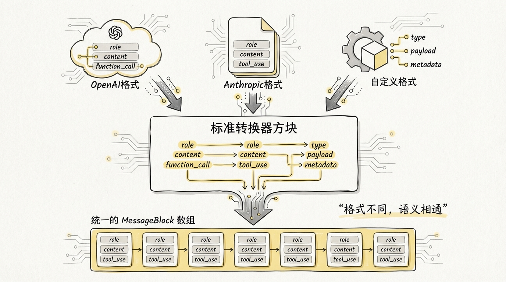
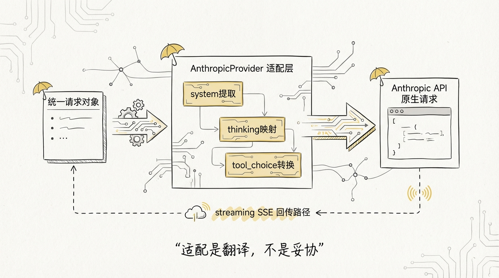
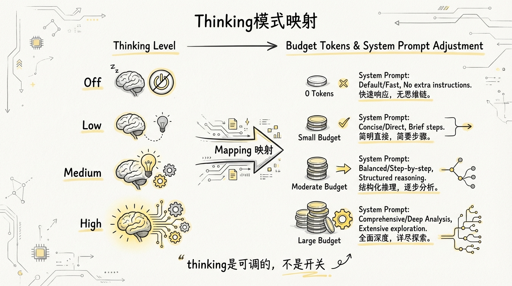
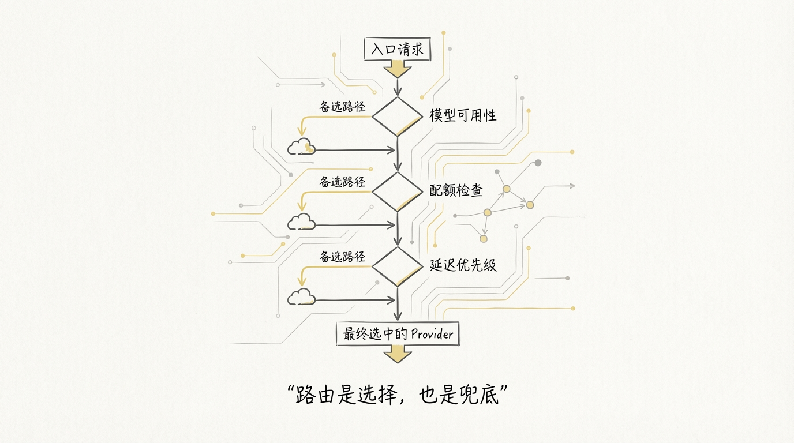
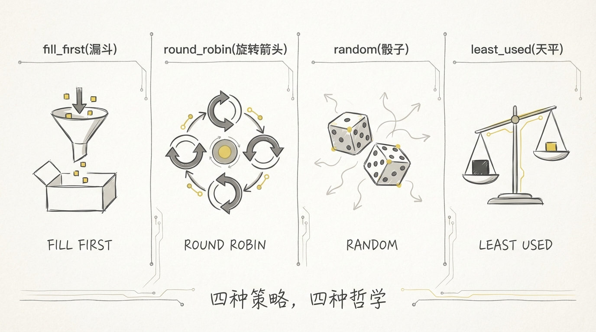
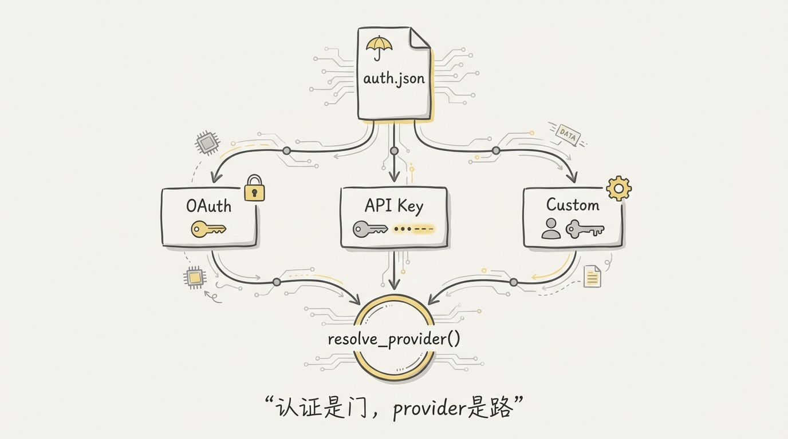
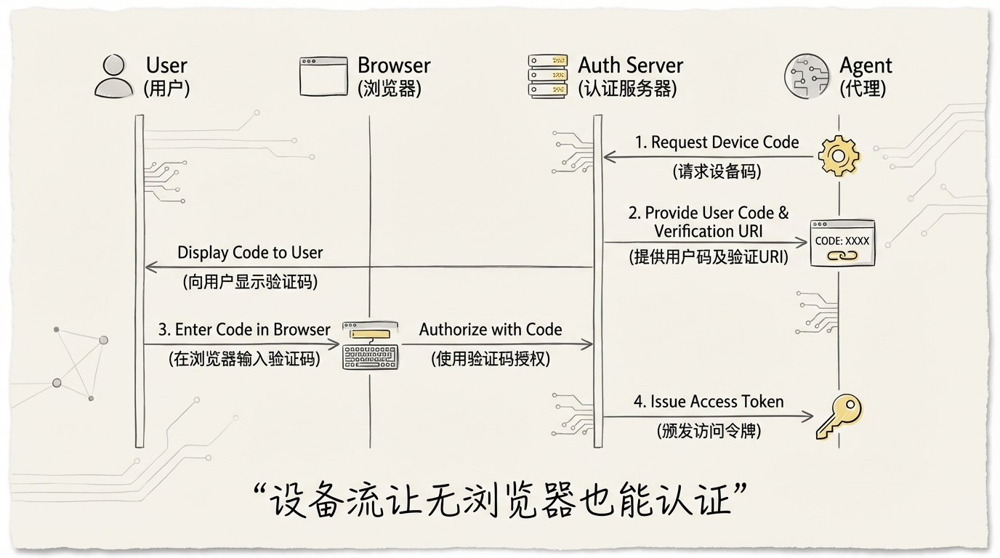
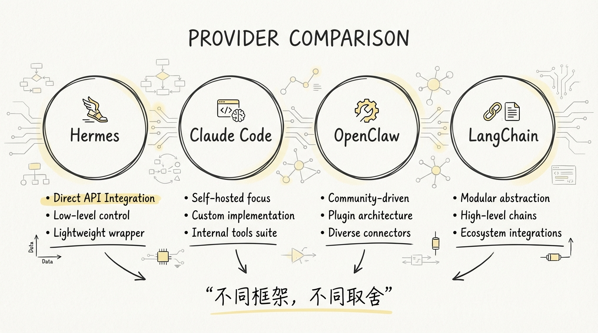

[English](docs/04-Multi-Provider-Adaptation.md)

# 04 多 Provider 适配：统一消息格式下的差异化处理

## 一个消息格式统治所有 Provider？想多了

做过多模型接入的人都知道一个残酷现实：**没有两个 Provider 的 API 是完全一样的。**

OpenAI 的 `chat.completions` 定义了事实上的行业标准消息格式，大部分 Provider 号称兼容。但号称兼容和真正能跑是两码事。Anthropic 的 Messages API 不接受 `system` 角色在消息列表里，必须单独传。OpenAI 的 Codex 走的是 Responses API。Nous Portal 需要先 mint 一个短命的 agent_key 才能调推理。

Hermes Agent 的做法是：**内部全部用 OpenAI 消息格式，出口处做适配。** 听起来简单，实现起来有 1,374 行的 `anthropic_adapter.py`、2,227 行的 `auxiliary_client.py`、1,208 行的 `credential_pool.py`，加上 2,924 行的 `auth.py`。

这篇文章拆解的就是这个适配层的全部细节。



## 1️⃣ OpenAI 消息格式作为统一层

Hermes Agent 的核心循环 `AIAgent` 全程操作 OpenAI 格式的消息：

```python
# agent/run_agent.py 中 AIAgent 的消息结构
messages = [
    {"role": "system", "content": "..."},
    {"role": "user", "content": "..."},
    {"role": "assistant", "content": "...", "tool_calls": [...]},
    {"role": "tool", "tool_call_id": "call_xxx", "content": "..."},
]
```

这个选择有一个很实际的原因：**生态位。** OpenAI SDK 是最多人用的，OpenRouter、Nous Portal、DeepSeek、阿里 DashScope 都提供了 OpenAI 兼容接口。用 OpenAI 格式做内部表示，意味着大部分 Provider 可以零转换直接调用。

需要转换的是少数几个特殊 Provider：

| Provider | API 格式 | 需要适配的点 |
|----------|----------|------------|
| OpenAI (Chat) | chat.completions | 原生，零转换 |
| OpenRouter | chat.completions | 零转换，加 HTTP-Referer 和 X-OpenRouter-Title 头 |
| Nous Portal | chat.completions | 零转换，需要 agent_key mint + product tags |
| Anthropic | Messages API | **完整转换**：system 抽离、tool 格式映射、thinking 块处理 |
| OpenAI (Codex) | Responses API | **完整转换**：input_text/input_image + stream 收集 |
| MiniMax | Anthropic Messages | Bearer auth 替代 x-api-key |

```
┌──────────────────────────────────────────────────┐
│           AIAgent 核心循环                         │
│        (OpenAI 消息格式 · 统一内部表示)             │
└────────────────────┬─────────────────────────────┘
                     │
    ┌────────────────┼───────────────────┐
    │                │                   │
    ▼                ▼                   ▼
┌─────────┐  ┌──────────────┐  ┌──────────────┐
│ OpenAI  │  │  Anthropic   │  │   Codex      │
│ 兼容    │  │  Adapter     │  │   Adapter    │
│ 直通    │  │  1,374 行    │  │   Responses  │
└─────────┘  └──────────────┘  └──────────────┘
  OpenRouter     Messages API    Responses API
  Nous Portal    + OAuth 伪装     + stream 收集
  DeepSeek       + thinking 处理
  DashScope
  Z.AI / Kimi
```

这个架构的好处很明显：**新增一个 OpenAI 兼容的 Provider，只需要在 `auth.py` 的 `PROVIDER_REGISTRY` 里加一个条目。** 目前已经注册了 15+ 个 Provider。

## 2️⃣ Anthropic 适配器：Claude 4.6 adaptive thinking、输出限制映射、OAuth



`anthropic_adapter.py` 是整个适配层最复杂的文件。1,374 行，处理的问题可以分成三层：消息格式转换、模型能力映射、认证协议适配。

### 消息格式转换：比你想的复杂得多

Anthropic 的 Messages API 和 OpenAI 有几个关键差异：

```python
# agent/anthropic_adapter.py:943-1193
def convert_messages_to_anthropic(messages):
    """OpenAI → Anthropic 消息转换"""
    system = None      # Anthropic 要求 system 单独传
    result = []
    
    for m in messages:
        role = m.get("role", "user")
        if role == "system":
            # 抽离 system，保留 cache_control 标记
            system = content  
            continue
        if role == "assistant":
            # 提取保留的 thinking 块
            blocks = _extract_preserved_thinking_blocks(m)
            # 转换 tool_calls 为 tool_use 块
            for tc in m.get("tool_calls", []):
                blocks.append({
                    "type": "tool_use",
                    "id": _sanitize_tool_id(tc.get("id", "")),
                    "name": fn.get("name", ""),
                    "input": parsed_args,
                })
        if role == "tool":
            # 合并连续 tool_result 到同一个 user 消息
            tool_result = {
                "type": "tool_result",
                "tool_use_id": _sanitize_tool_id(...),
                "content": result_content,
            }
    # ... 后续还有 6 个修复步骤
```

转换完消息还没完。Anthropic 对消息有一堆约束，每一个都是用 HTTP 400 错误换来的教训：

1. **严格角色交替** — 不能出现两条连续的 user 或 assistant 消息，必须合并
2. **孤儿 tool_use 清理** — 如果一个 `tool_use` 块没有对应的 `tool_result`，必须删掉
3. **孤儿 tool_result 清理** — 反过来，`tool_result` 没有对应的 `tool_use` 也要删
4. **空内容拒绝** — Anthropic 不接受空字符串的 content，必须填 `"(empty)"`
5. **thinking 块签名管理** — 最复杂的一个

第 5 点值得单独说。Anthropic 对 thinking 块做了密码学签名，签名是基于完整 turn 内容计算的。**一旦上游做了任何修改**，比如上下文压缩删了几条消息、会话截断丢了 tool_result，签名就失效了。Hermes 的策略参考了 OpenClaw：

```python
# agent/anthropic_adapter.py:1145-1192
# 只保留最后一条 assistant 消息的 thinking 块
# 其他全部删掉，避免签名失效
for idx, m in enumerate(result):
    if idx != last_assistant_idx:
        # 非最后一条：删除所有 thinking 块
        stripped = [b for b in m["content"] 
                   if b.get("type") not in ("thinking", "redacted_thinking")]
    else:
        # 最后一条：保留有签名的，降级无签名的
        for b in m["content"]:
            if b.get("signature"):
                new_content.append(b)  # 有签名，保留
            else:
                # 无签名，降级为普通文本
                new_content.append({"type": "text", "text": b.get("thinking", "")})
```

### Claude 4.6 Adaptive Thinking vs 旧模型 Manual Thinking



Claude 4.6 引入了 **adaptive thinking**，跟旧模型的 manual thinking 完全不同。Hermes 的 `build_anthropic_kwargs` 做了自动检测和映射：

```python
# agent/anthropic_adapter.py:30-37
THINKING_BUDGET = {"xhigh": 32000, "high": 16000, "medium": 8000, "low": 4000}
ADAPTIVE_EFFORT_MAP = {
    "xhigh": "max",
    "high": "high",
    "medium": "medium",
    "low": "low",
    "minimal": "low",
}
```

```python
# agent/anthropic_adapter.py:1298-1312
if _supports_adaptive_thinking(model):  # 检测 "4-6" 或 "4.6"
    kwargs["thinking"] = {"type": "adaptive"}
    kwargs["output_config"] = {
        "effort": ADAPTIVE_EFFORT_MAP.get(effort, "medium")
    }
else:
    # 旧模型：手动 budget + 强制 temperature=1
    kwargs["thinking"] = {"type": "enabled", "budget_tokens": budget}
    kwargs["temperature"] = 1
    kwargs["max_tokens"] = max(effective_max_tokens, budget + 4096)
```

| 特性 | Claude 4.6 (adaptive) | 旧模型 (manual) |
|------|----------------------|-----------------|
| thinking 类型 | `{"type": "adaptive"}` | `{"type": "enabled", "budget_tokens": N}` |
| 控制方式 | `output_config.effort` (low/medium/high/max) | `budget_tokens` (4000-32000) |
| temperature | 自由设定 | **强制 1**（Anthropic 要求） |
| max_tokens 处理 | 模型原生限制 | 手动加 budget + 4096 |

### 输出限制映射

Anthropic 要求 `max_tokens` 是必填字段，而且不同模型的上限差异巨大：

```python
# agent/anthropic_adapter.py:43-63
_ANTHROPIC_OUTPUT_LIMITS = {
    "claude-opus-4-6":   128_000,
    "claude-sonnet-4-6":  64_000,
    "claude-opus-4-5":    64_000,
    "claude-sonnet-4-5":  64_000,
    "claude-opus-4":      32_000,
    "claude-sonnet-4":    64_000,
    "claude-3-7-sonnet": 128_000,
    "claude-3-5-sonnet":   8_192,
    "claude-3-opus":       4_096,
    # ...
}
_ANTHROPIC_DEFAULT_OUTPUT_LIMIT = 128_000  # 新模型兜底
```

查找用的是**最长子串匹配**，这样 `claude-sonnet-4-5-20250929` 或 `claude-opus-4-6:1m` 这类带日期戳和变体后缀的 ID 都能正确命中：

```python
# agent/anthropic_adapter.py:70-85
def _get_anthropic_max_output(model: str) -> int:
    m = model.lower()
    best_key = ""
    best_val = _ANTHROPIC_DEFAULT_OUTPUT_LIMIT
    for key, val in _ANTHROPIC_OUTPUT_LIMITS.items():
        if key in m and len(key) > len(best_key):  # 最长匹配
            best_key = key
            best_val = val
    return best_val
```

### OAuth 伪装：Claude Code 身份

这是整个适配器最有意思的部分。当用户用 Claude Pro/Max 订阅的 OAuth token 调用 Anthropic API 时，**必须伪装成 Claude Code 的身份**，否则 Anthropic 的基础设施会间歇性返回 500。

```python
# agent/anthropic_adapter.py:230-246
elif _is_oauth_token(api_key):
    all_betas = _COMMON_BETAS + _OAUTH_ONLY_BETAS
    kwargs["auth_token"] = api_key
    kwargs["default_headers"] = {
        "anthropic-beta": ",".join(all_betas),
        "user-agent": f"claude-cli/{_get_claude_code_version()} (external, cli)",
        "x-app": "cli",
    }
```

伪装不止 header。OAuth 模式下还要做三件事：

1. **注入 Claude Code 系统提示前缀** — `"You are Claude Code, Anthropic's official CLI for Claude."`
2. **替换产品名** — `"Hermes Agent"` → `"Claude Code"`，`"Nous Research"` → `"Anthropic"`
3. **给所有工具名加 `mcp_` 前缀** — Claude Code 的工具命名约定

```python
# agent/anthropic_adapter.py:1232-1268
if is_oauth:
    cc_block = {"type": "text", "text": _CLAUDE_CODE_SYSTEM_PREFIX}
    system = [cc_block] + system
    # 替换品牌名
    for block in system:
        text = block.get("text", "")
        text = text.replace("Hermes Agent", "Claude Code")
        text = text.replace("Nous Research", "Anthropic")
    # 加 mcp_ 前缀
    for tool in anthropic_tools:
        tool["name"] = "mcp_" + tool["name"]
```

版本号检测也很讲究。Anthropic 会验证 user-agent 里的版本号，太旧的版本会被拒绝：

```python
# agent/anthropic_adapter.py:114-136
def _detect_claude_code_version() -> str:
    for cmd in ("claude", "claude-code"):
        result = _sp.run([cmd, "--version"], capture_output=True, text=True, timeout=5)
        if result.returncode == 0:
            version = result.stdout.strip().split()[0]
            if version and version[0].isdigit():
                return version
    return _CLAUDE_CODE_VERSION_FALLBACK  # "2.1.74"
```

## 3️⃣ auxiliary_client.py：辅助任务的 Provider 路由优先级链



Agent 的核心循环只用一个 Provider 做推理。但有一类任务叫**辅助任务**：上下文压缩、会话搜索、网页提取、视觉分析、Memory flush。这些任务对模型能力要求不高，用便宜的小模型就行。

`auxiliary_client.py` 做的事就是给这些辅助任务找到**最便宜且可用的 Provider**。

### 文本任务自动检测链

```
┌─ 步骤 0: 非聚合器的主 Provider? ─── 有 → 直接用 ────────────┐
│   (Alibaba/DeepSeek/Z.AI 等直连 Provider)                   │
└───────────────────────────────┬──────────────────────────────┘
                                │ 没有
┌─ 步骤 1: OpenRouter? ────────┤─── OPENROUTER_API_KEY ── 有 → 用
│                               │
├─ 步骤 2: Nous Portal? ───────┤─── auth.json active ──── 有 → 用
│                               │
├─ 步骤 3: Custom Endpoint? ───┤─── config.yaml ───────── 有 → 用
│                               │
├─ 步骤 4: Codex OAuth? ───────┤─── ~/.hermes/auth.json ─ 有 → 用
│                               │
├─ 步骤 5: API-key Providers? ─┤─── env vars ──────────── 有 → 用
│   (Gemini/Z.AI/Kimi/MiniMax/Anthropic/...)                   │
│                               │
└─ 步骤 6: None ────────────────┴─ 所有都没有 → 压缩/摘要不可用
```

每个 Provider 都有专门的 `_try_xxx()` 函数，返回 `(client, model)` 或 `(None, None)`。整个链路是**短路求值**的，命中一个就停。

```python
# agent/auxiliary_client.py:1003-1015
def _get_provider_chain() -> List[tuple]:
    return [
        ("openrouter", _try_openrouter),
        ("nous", _try_nous),
        ("local/custom", _try_custom_endpoint),
        ("openai-codex", _try_codex),
        ("api-key", _resolve_api_key_provider),
    ]
```

### Codex Responses API 适配器

Codex OAuth token 只能访问 Responses API，不能用 `chat.completions`。但所有辅助任务的消费者都调 `client.chat.completions.create(**kwargs)`。

解决方案是一个**适配器模式**：`CodexAuxiliaryClient` 伪装成 OpenAI client，内部把 chat.completions 的调用翻译成 Responses API：

```python
# agent/auxiliary_client.py:254-414
class _CodexCompletionsAdapter:
    """把 chat.completions.create() 翻译成 Responses API 调用"""
    
    def create(self, **kwargs) -> Any:
        # 1. 分离 system prompt 和对话消息
        # 2. 转换 content 格式
        #    text → input_text
        #    image_url → input_image
        # 3. 用 responses.stream() 收集结果
        # 4. 包装成 chat.completions 的响应格式返回
```

Anthropic 也有一个类似的适配器 `_AnthropicCompletionsAdapter`，让辅助任务可以透明地用 Anthropic 做后端。

### 付费耗尽自动降级

当一个 Provider 返回 HTTP 402 或信用相关的错误时，`call_llm()` 会自动跳到链路上的下一个可用 Provider：

```python
# agent/auxiliary_client.py:2069-2079
if _is_payment_error(first_err):
    fb_client, fb_model, fb_label = _try_payment_fallback(
        resolved_provider, task)
    if fb_client is not None:
        return fb_client.chat.completions.create(**fb_kwargs)
```

判断逻辑很细：

```python
# agent/auxiliary_client.py:1018-1036
def _is_payment_error(exc: Exception) -> bool:
    status = getattr(exc, "status_code", None)
    if status == 402:
        return True
    err_lower = str(exc).lower()
    if any(kw in err_lower for kw in (
        "credits", "insufficient funds",
        "can only afford", "billing", "payment required")):
        return True
    return False
```

这个设计的价值在实际使用中很明显。用户 OpenRouter 余额跑完了，辅助任务自动切到 Codex OAuth 或 Anthropic，**完全无感。**

## 4️⃣ credential_pool.py：多凭证池化策略



一个 Provider 只能有一个 API key？太天真了。

企业用户经常有多个 API key 做负载均衡。个人用户可能有一个 API key 和一个 OAuth 订阅。Hermes 的 `credential_pool.py` 就是来管理这件事的：**同一个 Provider 下的多个凭证，按策略选择和轮转。**

### 四种选择策略

```python
# agent/credential_pool.py:58-64
STRATEGY_FILL_FIRST = "fill_first"     # 默认：用第一个，耗尽了换下一个
STRATEGY_ROUND_ROBIN = "round_robin"   # 轮流用，每次选完重排优先级
STRATEGY_RANDOM = "random"             # 随机选
STRATEGY_LEAST_USED = "least_used"     # 选 request_count 最小的
```

配置在 `config.yaml` 里：

```yaml
credential_pool_strategies:
  openrouter: round_robin
  anthropic: fill_first
  nous: least_used
```

`CredentialPool.select()` 的选择逻辑：

```python
# agent/credential_pool.py:706-734
def _select_unlocked(self) -> Optional[PooledCredential]:
    available = self._available_entries(clear_expired=True, refresh=True)
    if not available:
        return None
    
    if self._strategy == STRATEGY_RANDOM:
        return random.choice(available)
    
    if self._strategy == STRATEGY_LEAST_USED:
        return min(available, key=lambda e: e.request_count)
    
    if self._strategy == STRATEGY_ROUND_ROBIN:
        entry = available[0]
        # 用完的放到队尾，重新排优先级
        rotated = [c for c in self._entries if c.id != entry.id]
        rotated.append(replace(entry, priority=len(self._entries) - 1))
        self._entries = [replace(c, priority=idx) for idx, c in enumerate(rotated)]
        self._persist()
        return entry
    
    # fill_first: 直接返回优先级最高的
    return available[0]
```

### 耗尽冷却机制

当一个凭证遇到 429 或 402 时，它会被标记为 exhausted 并进入冷却期：

```python
# agent/credential_pool.py:69-71
EXHAUSTED_TTL_429_SECONDS = 60 * 60          # 429 → 1 小时
EXHAUSTED_TTL_DEFAULT_SECONDS = 24 * 60 * 60 # 402 → 24 小时
```

**429 冷却 1 小时**是因为 rate limit 通常按小时重置。**402 冷却 24 小时**是因为账单问题需要人工介入，频繁重试没意义还浪费别的凭证的额度。

冷却恢复后自动清除状态：

```python
# agent/credential_pool.py:679-695
if entry.last_status == STATUS_EXHAUSTED:
    exhausted_until = _exhausted_until(entry)
    if exhausted_until is not None and now < exhausted_until:
        continue  # 还在冷却，跳过
    if clear_expired:
        # 冷却结束，清除状态
        cleared = replace(entry,
            last_status=STATUS_OK,
            last_status_at=None,
            last_error_code=None,
        )
```

Provider 还能返回精确的重试时间。`_normalize_error_context()` 会解析 `quotaResetDelay` 和 `retry after N seconds` 这类消息，将它们转换为精确的 `reset_at` 时间戳。

### 并发租约

Gateway 模式下多个用户同时发消息，需要避免所有请求都压到同一个凭证上。`acquire_lease()` 做了软并发控制：

```python
# agent/credential_pool.py:766-795
def acquire_lease(self, credential_id=None):
    available = self._available_entries(clear_expired=True, refresh=True)
    below_cap = [e for e in available 
                 if self._active_leases.get(e.id, 0) < self._max_concurrent]
    candidates = below_cap if below_cap else available
    chosen = min(candidates, 
                 key=lambda e: (self._active_leases.get(e.id, 0), e.priority))
    self._active_leases[chosen.id] = self._active_leases.get(chosen.id, 0) + 1
    return chosen.id
```

所有凭证都超过并发上限时不会阻塞，而是降级到选最少使用的那个。

### OAuth Token 的跨进程同步

OAuth refresh token 是**单次使用**的。当 Claude Code CLI 在后台刷新了 token，Hermes 手里的 refresh token 就失效了。

`credential_pool.py` 做了两层同步：

**第一层：启动时从文件同步。** 对 Anthropic，检查 `~/.claude/.credentials.json`；对 Codex，检查 `~/.codex/auth.json`。如果文件里的 refresh token 和池里的不一样，说明外部进程刷新过了。

```python
# agent/credential_pool.py:410-445
def _sync_anthropic_entry_from_credentials_file(self, entry):
    creds = read_claude_code_credentials()
    if creds and creds.get("refreshToken") != entry.refresh_token:
        updated = replace(entry,
            access_token=creds["accessToken"],
            refresh_token=creds["refreshToken"],
            last_status=None,  # 清除 exhausted 状态
        )
        self._replace_entry(entry, updated)
        self._persist()
        return updated
```

**第二层：刷新失败时重试。** 如果本地 refresh token 已经被消费，先从文件同步最新的 token，再用新 token 重试一次。

## 5️⃣ auth.py：OAuth Device Code Flow 和 API Key 认证



`auth.py` 是整个认证系统的骨架，2,924 行代码。它要解决的核心问题是：**15+ 个 Provider，三种认证方式，怎么统一管理。**

### Provider Registry：声明式的 Provider 注册

```python
# hermes_cli/auth.py:99-236
PROVIDER_REGISTRY: Dict[str, ProviderConfig] = {
    "nous": ProviderConfig(
        id="nous", name="Nous Portal",
        auth_type="oauth_device_code",
        portal_base_url="https://portal.nousresearch.com",
        inference_base_url="https://inference-api.nousresearch.com/v1",
        client_id="hermes-cli",
        scope="inference:mint_agent_key",
    ),
    "openai-codex": ProviderConfig(
        id="openai-codex", name="OpenAI Codex",
        auth_type="oauth_external",
        inference_base_url="https://chatgpt.com/backend-api/codex",
    ),
    "zai": ProviderConfig(
        id="zai", name="Z.AI / GLM",
        auth_type="api_key",
        inference_base_url="https://api.z.ai/api/paas/v4",
        api_key_env_vars=("GLM_API_KEY", "ZAI_API_KEY", "Z_AI_API_KEY"),
    ),
    # ... 15+ providers
}
```

三种 `auth_type`：

| 类型 | Provider | 认证流程 |
|------|----------|---------|
| `oauth_device_code` | Nous Portal | 设备码 → 用户授权 → 轮询 token → refresh + mint agent_key |
| `oauth_external` | OpenAI Codex | 设备码 → OpenAI 授权 → PKCE token exchange |
| `api_key` | Anthropic, Z.AI, Kimi, MiniMax, DeepSeek, Gemini, Alibaba 等 | 环境变量 / config.yaml 读取 |

### Nous Device Code Flow



Nous Portal 用的是 RFC 8628 标准的 Device Authorization Grant。这个流程是为 CLI 这种没有浏览器重定向能力的客户端设计的。

```
用户终端                  Nous Portal                浏览器
   │                         │                         │
   │─── POST /device/code ──→│                         │
   │←── device_code +        │                         │
   │    user_code +          │                         │
   │    verification_uri ────│                         │
   │                         │                         │
   │ "打开 URL, 输入 code:"  │                         │
   │─────────────────────────│────── 用户打开浏览器 ──→│
   │                         │←──── 用户输入 code ─────│
   │                         │←──── 用户点批准 ────────│
   │                         │                         │
   │─── POST /token ────────→│                         │
   │    (每 1s 轮询)         │                         │
   │←── "authorization_      │                         │
   │     pending"            │                         │
   │─── POST /token ────────→│                         │
   │←── access_token +       │                         │
   │    refresh_token        │                         │
   │                         │                         │
   │─── POST /agent-key ───→│   (用 access_token       │
   │←── agent_key (短命) ───│    mint 推理用 API key)  │
```

**为什么要 mint agent_key？** Nous 的设计是 access_token 只用于身份验证和管理操作，推理调用用短命的 agent_key。这样即使 agent_key 泄露，影响范围也是有限的。`min_ttl_seconds` 默认 30 分钟。

### Codex Device Code Flow

Codex 的 OAuth 流程有个重要设计决策：**Hermes 维护自己独立的 OAuth 会话，不和 Codex CLI 或 VS Code 共享。**

```python
# hermes_cli/auth.py:2531
def _codex_device_code_login() -> Dict[str, Any]:
    """Hermes 独立的 Codex OAuth 会话"""
    # 1. POST /deviceauth/usercode → 获取 user_code
    # 2. 用户在浏览器完成授权
    # 3. 轮询 /deviceauth/token → 获取 authorization_code
    # 4. POST /oauth/token → 交换 access_token + refresh_token
```

为什么要独立？因为 **OAuth refresh token 是单次使用**的。如果 Hermes 和 Codex CLI 共享同一个 session，任何一方刷新 token 都会导致另一方的 refresh token 失效。

### Anthropic PKCE OAuth

除了读取 Claude Code 的凭证文件，Hermes 还有自己原生的 Anthropic OAuth PKCE 流程：

```python
# agent/anthropic_adapter.py:591-706
_OAUTH_CLIENT_ID = "9d1c250a-e61b-44d9-88ed-5944d1962f5e"

def run_hermes_oauth_login_pure():
    verifier, challenge = _generate_pkce()
    # 生成授权 URL → 用户在浏览器授权 → 粘贴 code
    # POST /oauth/token 交换 access_token + refresh_token
```

### Auth Store：跨进程文件锁

所有认证状态持久化在 `~/.hermes/auth.json`。多个 Hermes 进程可能同时读写这个文件，所以用了**文件锁**：

```python
# hermes_cli/auth.py:535-589
@contextmanager
def _auth_store_lock(timeout_seconds=15.0):
    """跨进程 advisory lock, 可重入"""
    # Unix: fcntl.flock(LOCK_EX | LOCK_NB)
    # Windows: msvcrt.locking(LK_NBLCK, 1)
    # 重入: 同线程内直接 yield，不重复加锁
```

写入用原子替换：先写 `.tmp.{pid}.{uuid}` 再 `os.replace()`，避免中途崩溃导致文件损坏。

### Provider 自动检测

`resolve_provider()` 的自动检测优先级链：

```python
# hermes_cli/auth.py:790-882
def resolve_provider(requested=None):
    # 1. auth.json 里有 active OAuth provider → 用它
    # 2. OPENAI_API_KEY 或 OPENROUTER_API_KEY → openrouter
    # 3. 遍历 PROVIDER_REGISTRY 的 api_key providers
    #    检查各自的环境变量 → 第一个有的就用
    # 4. 没有任何配置 → 报错
```

有个细节值得注意：**GitHub token 被跳过了**。很多开发者有 `GH_TOKEN` 环境变量用于 repo 操作，如果自动检测把它当成推理 Provider 会很 confusing。

```python
# hermes_cli/auth.py:871-872
if pid == "copilot":
    continue  # GitHub tokens 太常见了，不自动检测
```

### Z.AI 端点探测

Z.AI 是一个特殊 case。它有 4 个不同的端点：全球通用、中国、全球编程、中国编程。同一个 API key 可能只在其中一个端点上有余额。

```python
# hermes_cli/auth.py:362-404
ZAI_ENDPOINTS = [
    ("global",        "https://api.z.ai/api/paas/v4",        "glm-5",   "Global"),
    ("cn",            "https://open.bigmodel.cn/api/paas/v4", "glm-5",   "China"),
    ("coding-global", "https://api.z.ai/api/coding/paas/v4",  "glm-4.7", "Global (Coding)"),
    ("coding-cn",     "https://open.bigmodel.cn/api/coding/paas/v4", "glm-4.7", "China (Coding)"),
]

def detect_zai_endpoint(api_key: str):
    for ep_id, base_url, model, label in ZAI_ENDPOINTS:
        resp = httpx.post(f"{base_url}/chat/completions", ...)
        if resp.status_code == 200:
            return {"base_url": base_url, ...}
    return None
```

探测结果按 API key 的 hash 缓存在 auth.json 里，避免每次启动都花 8 秒探测。

## 6️⃣ 和 Claude Code / OpenClaw 的 Provider 管理对比



三个项目对 Provider 管理的思路差异很大，反映了各自的产品定位。

| 维度 | Hermes Agent | Claude Code | OpenClaw |
|------|-------------|-------------|---------------------|
| **Provider 数量** | 15+ (注册表式) | 1 (Anthropic only) | 1 per instance (腾讯混元) |
| **消息格式** | OpenAI 内部 + 出口适配 | Anthropic 原生 | OpenAI 兼容 |
| **凭证管理** | credential_pool 多凭证池化 | 单凭证 ~/.claude.json | Docker 环境变量注入 |
| **选择策略** | 4 种 (fill_first/round_robin/random/least_used) | 无 (只有一个) | 无 (运维固定配置) |
| **耗尽处理** | 冷却 + 自动降级到下一个 Provider | 报错，用户手动处理 | 配置文件声明 fallback 链 |
| **OAuth 流程** | Device Code + PKCE + 独立会话 | 内置 setup-token | Device Code + API key |
| **辅助任务路由** | 7 级优先级自动检测链 | 无 (所有任务都用 Anthropic) | 无 (按配置使用固定 Provider) |
| **认证持久化** | ~/.hermes/auth.json + 文件锁 | ~/.claude/.credentials.json | openclaw.json + auth.json |

**Claude Code** 只需要对接自家 API，所以认证逻辑相对简单。它的复杂度集中在 thinking 块管理和内容过滤上。

**OpenClaw** 采用声明式配置管理 Provider。凭证通过 `openclaw.json` 或 `openclaw onboard` 交互式引导配置，支持 OAuth device flow 和 API key 两种认证方式。多 Provider fallback 通过配置文件声明，运行时自动切换。

**Hermes Agent** 是面向终端用户的桌面工具，必须处理用户有各种 Provider 凭证的情况。15 个 Provider 注册表、4 种池化策略、7 级辅助路由链，这些复杂度都来自一个产品决策：**让用户尽可能少配置，Agent 自己搞定。**

这三个项目的 Provider 管理思路遵循一个规律：**产品的用户画像决定了 Provider 管理的复杂度。** 面向开发者的桌面 CLI 需要适配最多场景，多渠道平台需要声明式统一管理，一方产品只需要对接自己。

## 数字总结

| 指标 | 数据 |
|------|------|
| anthropic_adapter.py | 1,374 行 |
| auxiliary_client.py | 2,227 行 |
| credential_pool.py | 1,208 行 |
| auth.py | 2,924 行 |
| 注册 Provider 总数 | 15+ |
| 认证方式 | 3 种 (oauth_device_code / oauth_external / api_key) |
| 池化策略 | 4 种 (fill_first / round_robin / random / least_used) |
| 辅助路由优先级 | 7 级 |
| 429 冷却时间 | 1 小时 |
| 402 冷却时间 | 24 小时 |
| Anthropic 输出限制映射 | 12 个模型 + 128K 兜底 |
| Claude Code 伪装头 | 4 个 (anthropic-beta, user-agent, x-app, system prefix) |

## 下一篇

Provider 适配解决了出口问题，那入口呢？下一篇 [05-CLI与Gateway双入口](docs/05-CLI与Gateway双入口.md) 会拆解 Hermes Agent 如何同时服务终端用户和 11 个 IM 平台，以及 390KB 的 cli.py 到底在做什么。
