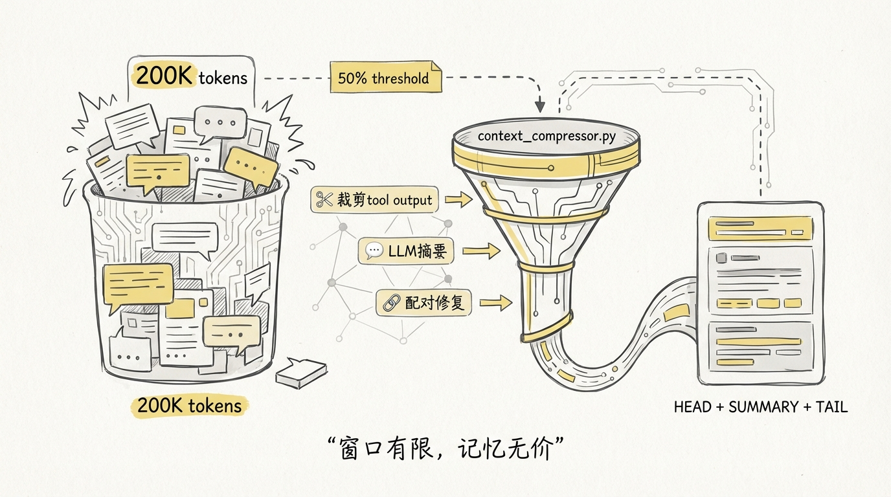
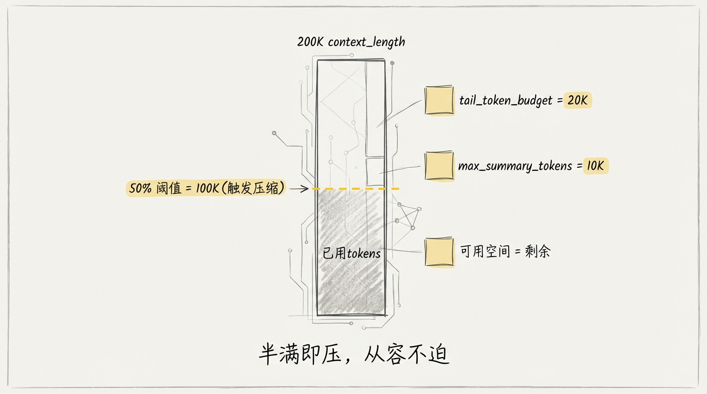
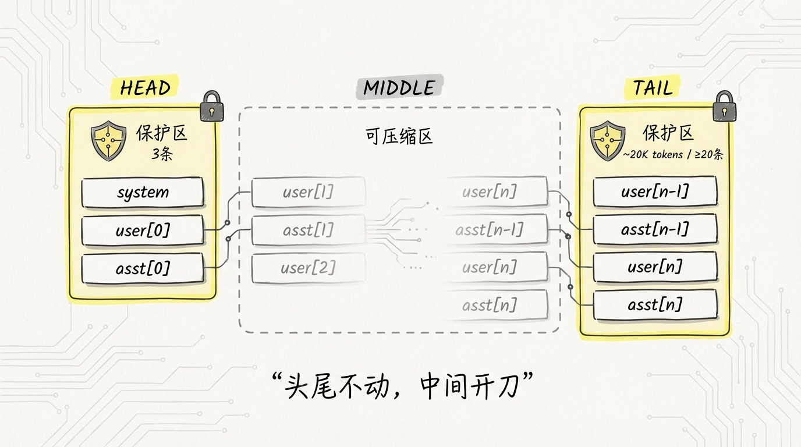
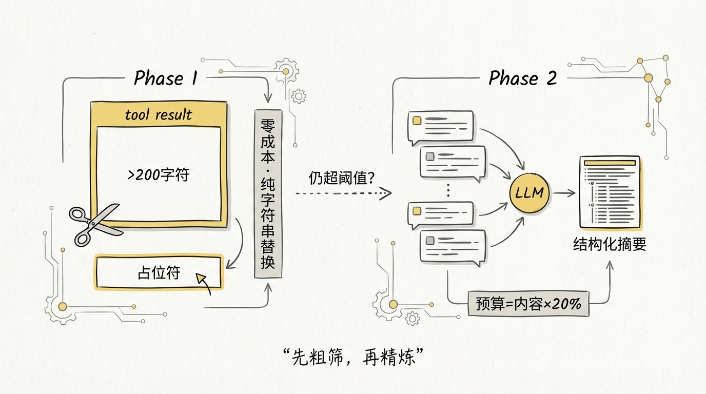
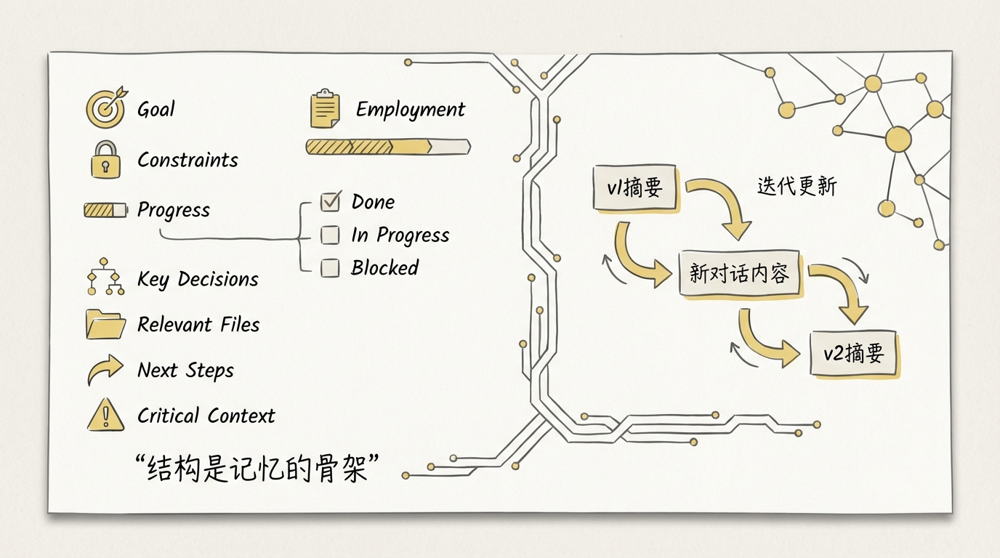
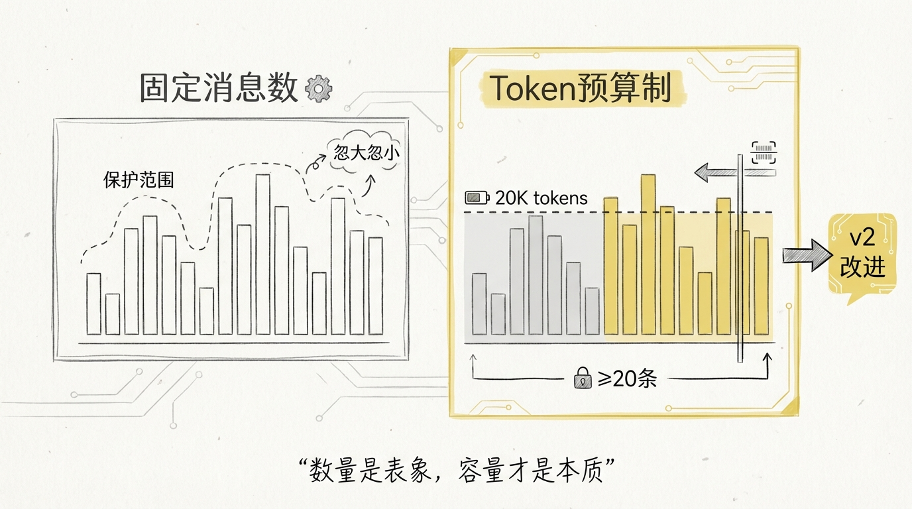
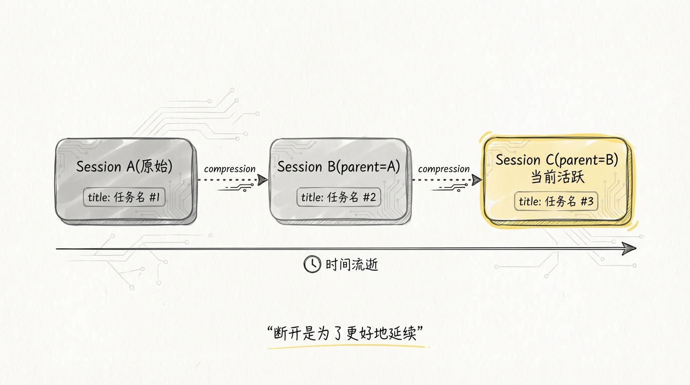
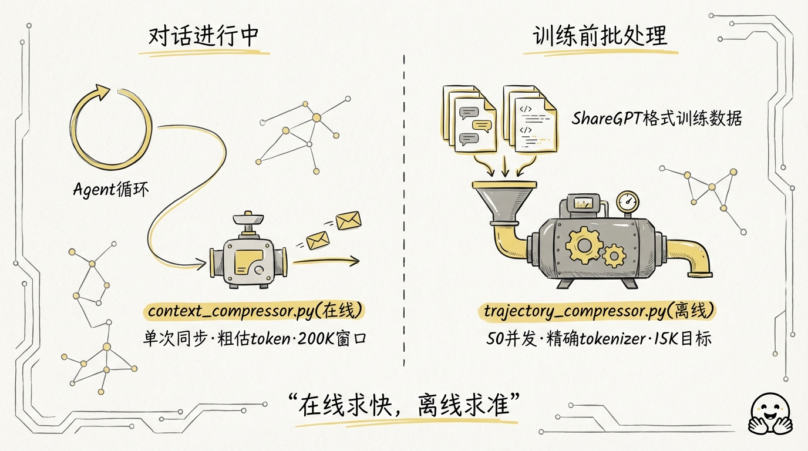
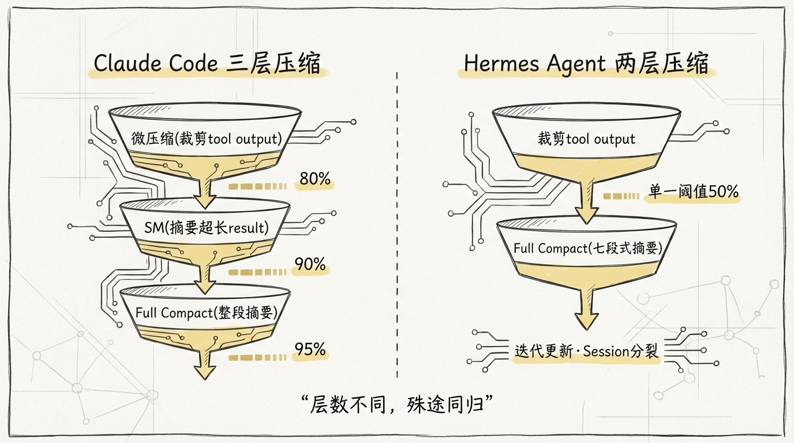
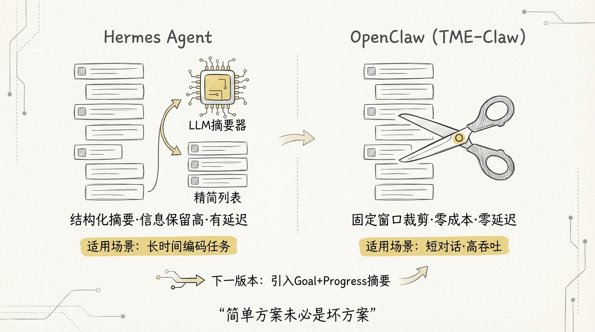

[English](docs/05-Context-Compression.md)

# 05 上下文压缩：长对话不崩的秘密

每个 Agent 框架都会遇到同一个墙：**上下文窗口用完了**。

用户觉得自己只是多问了几个问题，模型那边已经在处理一份 20 万 token 的消息列表。系统提示占一块，工具调用返回占一块，多轮对话本身占一块，三者叠加的速度远超直觉。Claude 的 200K 窗口听起来很大，实际跑一个复杂编码任务，30 轮左右就能打满。

**暴力截断是最差的方案。** 直接砍掉早期消息，模型会丢失用户的核心目标、已完成的工作进度、做过的技术决策。等于让一个人突然失忆，然后继续干同一个项目。

Hermes Agent 的 `context_compressor.py` 用了一套**渐进式压缩策略**：先裁剪工具输出，再用 LLM 做结构化摘要，同时严格保护头尾上下文。整个过程对用户完全透明。



## 1️⃣ 压缩器的初始化与阈值设计

压缩器在 `AIAgent.__init__` 里创建，跟随 Agent 生命周期：

```python
# run_agent.py L1132-1144
self.context_compressor = ContextCompressor(
    model=self.model,
    threshold_percent=compression_threshold,     # 默认 0.50
    protect_first_n=3,
    protect_last_n=compression_protect_last,     # 默认 20
    summary_target_ratio=compression_target_ratio, # 默认 0.20
    summary_model_override=compression_summary_model,
    quiet_mode=self.quiet_mode,
    base_url=self.base_url,
    api_key=getattr(self, "api_key", ""),
    config_context_length=_config_context_length,
    provider=self.provider,
)
```

**threshold_percent = 0.50** 这个数字值得注意。上下文用到一半就触发压缩，给摘要生成和后续对话都留了充裕空间。相比之下，如果设成 0.85 或 0.90，压缩时已经快爆了，一旦摘要 API 超时就直接 context overflow。

初始化过程中有几个关键计算：

```python
# agent/context_compressor.py L88-101
self.context_length = get_model_context_length(
    model, base_url=base_url, api_key=api_key,
    config_context_length=config_context_length,
    provider=provider,
)
self.threshold_tokens = int(self.context_length * threshold_percent)

# 尾部保护预算 = 阈值 × summary_target_ratio
target_tokens = int(self.threshold_tokens * self.summary_target_ratio)
self.tail_token_budget = target_tokens
self.max_summary_tokens = min(
    int(self.context_length * 0.05), _SUMMARY_TOKENS_CEILING,  # 上限 12000
)
```

以 Claude 200K 窗口为例，具体数字是这样的：

| 参数 | 计算 | 值 |
|------|------|----|
| context_length | 200,000 | 200K |
| threshold_tokens | 200K × 0.50 | 100K |
| tail_token_budget | 100K × 0.20 | 20K |
| max_summary_tokens | min(200K × 0.05, 12000) | 10K |

**50% 触发、20K 尾部保护、10K 摘要上限。** 这三个数字组成了压缩策略的骨架。



## 2️⃣ 头尾保护策略：不能压的绝对不压

压缩不是均匀裁剪。有些消息砍掉等于自杀。

**头部保护**固定 3 条消息：`protect_first_n=3`。按典型对话结构，这 3 条分别是 system prompt、第一条用户消息、第一条 assistant 回复。system prompt 包含了人格设定、工具列表、工作目录等关键信息；第一条用户消息通常是任务描述；第一条回复是模型对任务的理解确认。

**尾部保护**用 token 预算而非固定消息数。这是 v2 相比 v1 的核心升级。

```python
# agent/context_compressor.py L510-558
def _find_tail_cut_by_tokens(
    self, messages: List[Dict[str, Any]], head_end: int,
    token_budget: int | None = None,
) -> int:
    if token_budget is None:
        token_budget = self.tail_token_budget
    n = len(messages)
    min_tail = self.protect_last_n
    accumulated = 0
    cut_idx = n

    for i in range(n - 1, head_end - 1, -1):
        msg = messages[i]
        content = msg.get("content") or ""
        msg_tokens = len(content) // _CHARS_PER_TOKEN + 10
        for tc in msg.get("tool_calls") or []:
            if isinstance(tc, dict):
                args = tc.get("function", {}).get("arguments", "")
                msg_tokens += len(args) // _CHARS_PER_TOKEN
        if accumulated + msg_tokens > token_budget and (n - i) >= min_tail:
            break
        accumulated += msg_tokens
        cut_idx = i

    # 兜底：至少保护 protect_last_n 条消息
    fallback_cut = n - min_tail
    if cut_idx > fallback_cut:
        cut_idx = fallback_cut

    cut_idx = self._align_boundary_backward(messages, cut_idx)
    return max(cut_idx, head_end + 1)
```

从后往前遍历，逐条累加 token 直到预算耗尽。**同时保留 `protect_last_n=20` 作为最低保底**。这种双重保护的好处是：如果最近 20 条消息很短，token 预算还没用完，就多保留几条；如果最近几条消息特别长（比如一个巨大的 tool result），至少还能保证 20 条。

```
 ┌─────────────────────────────────────────────────────────┐
 │                    消息列表                               │
 ├──────────┬──────────────────────────────┬───────────────┤
 │  HEAD    │        MIDDLE (可压缩区)       │     TAIL      │
 │  3 条    │                              │  ~20K tokens  │
 │          │                              │  ≥20 条保底    │
 │ system   │   ← 先裁剪 tool output       │               │
 │ user[0]  │   ← 再 LLM 摘要成一条消息     │  最近的完整    │
 │ asst[0]  │                              │  对话上下文    │
 ├──────────┤                              ├───────────────┤
 │ 绝不压缩  │      ← 被摘要替换 →          │   绝不压缩     │
 └──────────┴──────────────────────────────┴───────────────┘
```



## 3️⃣ 中间段压缩：两阶段裁剪

中间段的压缩分两步，成本从低到高递进。

**Phase 1: 裁剪工具输出（零成本）**

```python
# agent/context_compressor.py L155-185
def _prune_old_tool_results(
    self, messages: List[Dict[str, Any]], protect_tail_count: int,
) -> tuple[List[Dict[str, Any]], int]:
    result = [m.copy() for m in messages]
    pruned = 0
    prune_boundary = len(result) - protect_tail_count

    for i in range(prune_boundary):
        msg = result[i]
        if msg.get("role") != "tool":
            continue
        content = msg.get("content", "")
        if not content or content == _PRUNED_TOOL_PLACEHOLDER:
            continue
        if len(content) > 200:
            result[i] = {**msg, "content": _PRUNED_TOOL_PLACEHOLDER}
            pruned += 1

    return result, pruned
```

逻辑很直接：200 字符以下的短 tool result 留着，超过的替换成 `[Old tool output cleared to save context space]`。不调 LLM，纯字符串替换，速度极快。

这步能砍掉的 token 量通常很可观。一次 `cat` 大文件的 tool result 可能有上万 token，替换后只剩几十个。

**Phase 2: LLM 结构化摘要**

裁剪完 tool output 后，如果 token 还是超阈值，就对中间区域做 LLM 摘要。摘要预算按被压缩内容的 20% 计算，下限 2000 token，上限跟随模型窗口自动缩放：

```python
# agent/context_compressor.py L191-200
def _compute_summary_budget(self, turns_to_summarize: List[Dict[str, Any]]) -> int:
    content_tokens = estimate_messages_tokens_rough(turns_to_summarize)
    budget = int(content_tokens * _SUMMARY_RATIO)     # 0.20
    return max(_MIN_SUMMARY_TOKENS, min(budget, self.max_summary_tokens))
```

**摘要模型走的是 auxiliary client**，不占主模型的调用额度。可以通过 `compression.summary_model` 配置一个便宜的小模型来做摘要。



## 4️⃣ 结构化摘要模板

摘要不是随便让 LLM 写一段话。Hermes 用了一个**七段式结构化模板**：

```
## Goal
[用户在做什么]

## Constraints & Preferences
[用户偏好、编码风格、约束条件]

## Progress
### Done
[完成了什么 — 文件路径、执行命令、具体结果]
### In Progress
[正在做什么]
### Blocked
[卡在哪里]

## Key Decisions
[技术决策和理由]

## Relevant Files
[读过/改过/创建的文件列表]

## Next Steps
[下一步该做什么]

## Critical Context
[不能丢的具体值：错误信息、配置参数、数据]
```

这个模板的设计受到了 **Pi-mono 和 OpenCode** 的启发（代码注释里直接写了）。

为什么要结构化？因为自由格式的摘要有一个致命问题：**LLM 会按自己的偏好选择保留什么、丢弃什么**。一个写得很好的错误信息、一个关键的文件路径、一个用户明确表达过的偏好，都可能在一段流水账式摘要中被吃掉。

结构化模板强制 LLM 按类别填充，每个类别的信息密度更高，遗漏率更低。

**迭代更新是另一个亮点。** 第二次压缩时，摘要器不是从零开始，而是在前一次摘要基础上做增量更新：

```python
# agent/context_compressor.py L275-315
if self._previous_summary:
    prompt = f"""You are updating a context compaction summary...
PREVIOUS SUMMARY:
{self._previous_summary}

NEW TURNS TO INCORPORATE:
{content_to_summarize}

Update the summary using this exact structure. PRESERVE all existing
information that is still relevant. ADD new progress. Move items from
"In Progress" to "Done" when completed..."""
```

多次压缩后，摘要就像一份**不断更新的项目状态文档**，而不是多段互相矛盾的片段拼接。



## 5️⃣ Token 预算尾部保护 vs 固定消息数

这是 Hermes v2 压缩器的一个重要改进，值得单独拿出来说。

v1 的尾部保护是 `protect_last_n = 20`，简单粗暴。问题在于：20 条消息的 token 量方差极大。如果最近 20 条都是简短的确认消息，可能只有 2000 token；如果包含几个大文件的 read 操作，可能有 80K token。

v2 改成 **token 预算制**，默认 20K token 的预算从后往前扫描。同时保留 `protect_last_n` 作为保底下限，形成双重保护：

```
Token 预算制 vs 固定消息数：

场景 A：最近 20 条消息都很短（共 3K tokens）
  固定消息数：保护 20 条 = 3K tokens     ← 只保留了很少的上下文
  Token 预算：保护到 20K tokens = ~130 条  ← 保留了更多有用信息

场景 B：最近 5 条消息是巨型 tool result（共 25K tokens）
  固定消息数：保护 20 条 = 80K tokens     ← 保护过多，压不动
  Token 预算：保护到 20K tokens = ~4 条   ← 但保底还是 20 条
```

`_find_tail_cut_by_tokens` 方法里有一个细节：如果 token 预算大到能覆盖所有消息，就回退到固定消息数模式。这防止了小对话被误压缩：

```python
# agent/context_compressor.py L551-553
if cut_idx <= head_end:
    cut_idx = fallback_cut  # 回退到 n - protect_last_n
```



## 6️⃣ Tool Call / Result 配对完整性

压缩最怕的不是丢信息，而是**破坏消息格式**。

OpenAI 和 Anthropic 的 API 对 tool_call 和 tool_result 有严格的配对要求：每个 `tool_call_id` 必须有对应的 `tool` role 消息返回结果。压缩过程中砍掉中间消息，极易产生孤儿配对。

Hermes 用 `_sanitize_tool_pairs` 做压缩后修复：

```python
# agent/context_compressor.py L412-470
def _sanitize_tool_pairs(self, messages):
    # 1. 收集所有存活的 tool_call ID
    surviving_call_ids = set()
    for msg in messages:
        if msg.get("role") == "assistant":
            for tc in msg.get("tool_calls") or []:
                cid = self._get_tool_call_id(tc)
                if cid:
                    surviving_call_ids.add(cid)

    # 2. 收集所有 tool result 的 call_id
    result_call_ids = set()
    for msg in messages:
        if msg.get("role") == "tool":
            cid = msg.get("tool_call_id")
            if cid:
                result_call_ids.add(cid)

    # 3. 删除没有对应 assistant tool_call 的 tool result
    orphaned_results = result_call_ids - surviving_call_ids

    # 4. 为缺少 result 的 tool_call 插入 stub
    missing_results = surviving_call_ids - result_call_ids
    # 插入: "[Result from earlier conversation — see context summary above]"
```

两种孤儿都处理了：

1. **有 result 没 call**：直接删除 tool result 消息
2. **有 call 没 result**：在 assistant 消息后面插入一条 stub result

另外还有**边界对齐**逻辑。压缩区域的起止点不能落在 tool_call/result 组的中间，否则会把一个完整的工具调用切成两半：

```python
# agent/context_compressor.py L472-504
def _align_boundary_forward(self, messages, idx):
    """起始边界：跳过连续的 tool result"""
    while idx < len(messages) and messages[idx].get("role") == "tool":
        idx += 1
    return idx

def _align_boundary_backward(self, messages, idx):
    """结束边界：把 assistant + tool_results 整组拉进压缩区"""
    check = idx - 1
    while check >= 0 and messages[check].get("role") == "tool":
        check -= 1
    if check >= 0 and messages[check].get("role") == "assistant" \
       and messages[check].get("tool_calls"):
        idx = check
    return idx
```


## 7️⃣ Session 分裂：parent_session_id 链式压缩

压缩不只是砍消息。Hermes 在每次压缩时会**分裂 session**。

```python
# run_agent.py L5867-5893
if self._session_db:
    self._session_db.end_session(self.session_id, "compression")
    old_session_id = self.session_id
    self.session_id = f"{datetime.now().strftime('%Y%m%d_%H%M%S')}_{uuid.uuid4().hex[:6]}"
    self._session_db.create_session(
        session_id=self.session_id,
        source=self.platform or os.environ.get("HERMES_SESSION_SOURCE", "cli"),
        model=self.model,
        parent_session_id=old_session_id,
    )
    # 标题自动编号
    if old_title:
        new_title = self._session_db.get_next_title_in_lineage(old_title)
        self._session_db.set_session_title(self.session_id, new_title)
```

旧 session 被标记为 `end_reason="compression"` 结束，新 session 通过 `parent_session_id` 指向旧的。数据库 schema 里专门有外键和索引支持：

```sql
-- hermes_state.py
parent_session_id TEXT,
FOREIGN KEY (parent_session_id) REFERENCES sessions(id)

CREATE INDEX IF NOT EXISTS idx_sessions_parent ON sessions(parent_session_id);
```

这形成了一条**链式结构**：

```
Session_A (original)
  └─ end_reason: "compression"
      └─ Session_B (parent=A)
          └─ end_reason: "compression"
              └─ Session_C (parent=B)  ← 当前活跃
```

链式 session 有三个好处：

1. **历史可追溯**：通过 `session_search` 工具可以搜索到被压缩掉的早期对话内容
2. **标题继承**：新 session 自动在旧标题后加编号，用户看到的是一个连续的对话
3. **成本归集**：每个 session 段独立记录 token 消耗和费用，但可以沿链聚合

压缩时还会做几件收尾工作：todo list 快照注入到新消息列表、system prompt 重建、file-read 去重缓存清空。每一步都是为了让压缩后的对话状态尽量接近一个全新 session 的起点。



## 8️⃣ trajectory_compressor.py：RL 训练轨迹压缩

Hermes 还有另一个独立的压缩器：`trajectory_compressor.py`，**1500 行的专用脚本**，专门处理 RL 训练数据。

这个压缩器和在线对话压缩器的定位完全不同：

| 维度 | context_compressor.py | trajectory_compressor.py |
|------|----------------------|--------------------------|
| 运行时机 | 在线，对话进行中 | 离线，训练前批处理 |
| 输入格式 | OpenAI messages 格式 | ShareGPT conversations 格式 |
| 压缩目标 | 不超过模型窗口 | 压到 target_max_tokens（默认 15250） |
| 摘要模型 | auxiliary client | OpenRouter / gemini-3-flash |
| 并发能力 | 单次同步调用 | asyncio + semaphore，50 并发 |
| 保护策略 | 头 3 条 + 尾 ~20K token | system + human + 首条 gpt + 首条 tool + 尾 4 条 |
| Token 计数 | 粗估（字符数 / 4） | HuggingFace tokenizer 精确计数 |

轨迹压缩的保护策略更细粒度：

```python
# trajectory_compressor.py L443-489
def _find_protected_indices(self, trajectory):
    for i, turn in enumerate(trajectory):
        role = turn.get("from", "")
        if role == "system" and first_system is None:
            first_system = i
        elif role == "human" and first_human is None:
            first_human = i
        elif role == "gpt" and first_gpt is None:
            first_gpt = i
        elif role == "tool" and first_tool is None:
            first_tool = i
```

**保护首条 system、首条 human、首条 gpt、首条 tool** 加上 **最后 4 轮**。这是因为 RL 训练需要保留任务描述（让模型知道在干什么）和最终结果（作为 reward signal 的依据）。

另一个重要区别：轨迹压缩用的是**精确 tokenizer**，不是字符数粗估。训练数据需要严格控制在 token 预算内，一个 batch 里轨迹长度差异太大会影响训练效率。

```python
# trajectory_compressor.py L425-431
def count_tokens(self, text: str) -> int:
    if not text:
        return 0
    try:
        return len(self.tokenizer.encode(text))
    except Exception:
        return len(text) // 4  # fallback
```

压缩策略是**按需最小压缩**：算出需要省多少 token，从中间区域的头部开始累计，攒够了就停。剩余的中间消息保持原样。这比在线压缩器一刀切压掉整个中间区域更精细。



## 9️⃣ 和 Claude Code 三层压缩的对比

Claude Code 的上下文管理是业界标杆之一，用了三层递进压缩：

| 层级 | Claude Code | Hermes Agent |
|------|-------------|-------------|
| **微压缩** | 自动裁剪 tool output 到 ~2000 字符 | `_prune_old_tool_results`，>200 字符的旧 tool result 替换为占位符 |
| **中等压缩 (SM)** | 对超长 tool result 做摘要，保留消息结构 | 无独立中间层，直接从裁剪跳到全量摘要 |
| **Full Compact** | 整个中间段 LLM 摘要，结构化 handoff 格式 | 整个中间段 LLM 摘要，七段式结构化模板 |
| **触发条件** | 多级阈值（80%/90%/95%）| 单一阈值（默认 50%） |
| **摘要迭代** | 每次从零生成 | 迭代更新 `_previous_summary` |
| **Session 管理** | 无 session 分裂 | parent_session_id 链式分裂 |

Hermes 的 50% 触发阈值看起来激进，但配合迭代摘要其实是合理的。**早压缩、多次压缩、每次增量更新**，比 Claude Code 的**晚压缩、一次性大范围摘要**有一个优势：每次被压缩的内容量更小，摘要质量更高。

Hermes 缺少 Claude Code 的中间层是一个遗憾。对于那些返回了 5000 字的 tool result 但 tool call 本身还在保护区内的情况，Hermes 只能等到下次 Full Compact 才处理，Claude Code 的 SM 层可以先把它压一下。



## 🔟 和 OpenClaw compaction 策略的对比

OpenClaw 的 compaction 策略是另一种思路，适合企业内部场景。

TME-Claw 里我们用的方案比较简单：**固定消息数裁剪 + 手动注入 system reminder**。没有 LLM 摘要，没有结构化模板，直接砍到最近 N 轮，然后在 system prompt 里追加一段提醒告诉模型之前的对话已被截断。

| 维度 | Hermes Agent | OpenClaw (TME-Claw) |
|------|-------------|---------------------|
| 压缩方式 | LLM 结构化摘要 | 固定窗口裁剪 |
| 上下文保留 | 摘要保留关键信息 | 被裁掉的就丢了 |
| 计算成本 | 每次压缩需要一次 LLM 调用 | 零额外成本 |
| 延迟影响 | 摘要生成会引入几秒延迟 | 无延迟 |
| Tool 配对 | 自动修复孤儿配对 | 依赖上层处理 |
| Session 持久化 | 链式 session 可追溯 | 无 session 分裂 |
| 适用场景 | 长时间复杂编码任务 | 短对话、高吞吐客服场景 |

两种方案没有绝对优劣。**OpenClaw 的裁剪方案胜在简单、零延迟、零成本**，适合每轮对话相对独立的场景。Hermes 的摘要方案胜在**信息保留率高**，适合需要跨几十轮持续记住上下文的编码任务。

实际上在 TME-Claw 的下一个版本里，我们正在考虑引入类似 Hermes 的结构化摘要。不需要做得这么复杂，只要在裁剪前用小模型生成一段简短的 Goal + Progress 摘要注入到 system prompt，就能显著改善长对话的连贯性。



## 完整压缩流程

把以上所有环节串起来，一次完整的压缩是这样走的：

```
┌─────────────────────────────────────────────────────────────────┐
│  Agent Loop 检测到 prompt_tokens ≥ threshold_tokens             │
│  (每次 API 返回后检查，或用 rough estimate 预检)                  │
└─────────────────────────┬───────────────────────────────────────┘
                          ↓
┌─────────────────────────────────────────────────────────────────┐
│  Step 0: 预压缩 Memory Flush                                    │
│  把重要信息存到 Memory，防止压缩丢失                               │
└─────────────────────────┬───────────────────────────────────────┘
                          ↓
┌─────────────────────────────────────────────────────────────────┐
│  Step 1: _prune_old_tool_results                                │
│  遍历保护尾部之前的消息，>200 字符的 tool result → 占位符           │
└─────────────────────────┬───────────────────────────────────────┘
                          ↓
┌─────────────────────────────────────────────────────────────────┐
│  Step 2: 确定压缩边界                                            │
│  head_end = protect_first_n (对齐到非 tool 消息)                  │
│  tail_start = _find_tail_cut_by_tokens (≥20 条 或 ≥20K tokens)  │
└─────────────────────────┬───────────────────────────────────────┘
                          ↓
┌─────────────────────────────────────────────────────────────────┐
│  Step 3: _generate_summary                                       │
│  首次: 从零生成七段式结构化摘要                                    │
│  后续: 在 _previous_summary 基础上增量更新                        │
│  预算: max(2000, min(内容量×20%, 窗口×5%))                       │
└─────────────────────────┬───────────────────────────────────────┘
                          ↓
┌─────────────────────────────────────────────────────────────────┐
│  Step 4: 组装压缩后消息列表                                       │
│  HEAD (3条) + SUMMARY (1条) + TAIL (~20K tokens)                │
│  _sanitize_tool_pairs 修复孤儿配对                                │
└─────────────────────────┬───────────────────────────────────────┘
                          ↓
┌─────────────────────────────────────────────────────────────────┐
│  Step 5: Session 分裂                                            │
│  旧 session → end_reason="compression"                           │
│  新 session → parent_session_id = 旧 session                     │
│  标题继承、system prompt 重建、file dedup 清空                     │
└─────────────────────────────────────────────────────────────────┘
```

整个流程对用户唯一可感知的影响是**几秒钟的摘要延迟**。摘要模型走 auxiliary client，如果配了 gemini-flash 这类快速模型，延迟可以压到 2 秒以内。

**压缩失败也不会炸。** `_generate_summary` 有 600 秒冷却机制，失败后直接丢弃中间消息（不注入摘要），比挂起整个对话强得多。

你的 Agent 跑了 100 轮还没崩，不是因为模型窗口真的够用，是因为有人在背后默默帮你压缩了三四次。

---

> Next: [06-消息网关](06-消息网关.md)
