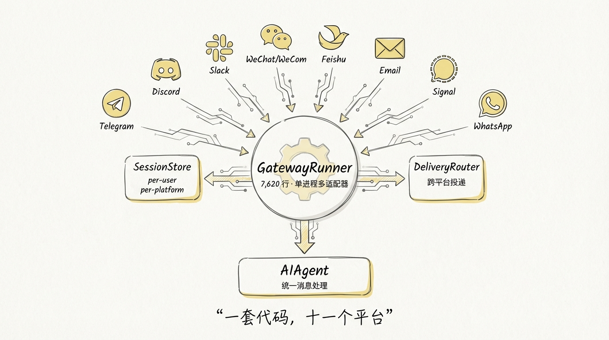
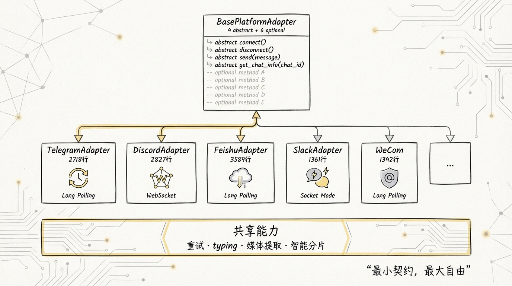

[English](docs/06-Message-Gateway.md)

# 06 消息网关：一套代码接 11 个平台

大多数 Agent 项目把 **IM 接入** 当成边缘需求，写个 Telegram bot 就算完事。Hermes 的做法完全相反：它把消息网关做成了一个独立的运行时，16 个 Platform 枚举值、15 个适配器 Python 文件、22000+ 行平台代码，撑起了一套 **write once, deliver everywhere** 的架构。

这篇文章拆解的就是 `gateway/` 目录的全貌。你会发现，真正复杂的从来不是 Telegram 和 Discord 的 API 调用，而是跨平台场景下的**会话隔离、命令分发、生命周期管理**这些看不见的东西。



---

## 1️⃣ GatewayRunner：一个进程管所有平台

`gateway/run.py` 是整个网关的入口，7620 行，核心类 `GatewayRunner` 承担了几乎所有非平台特定的逻辑。

先看它的骨架：

```
# gateway/run.py

┌─────────────────────────────────────────────────────┐
│                  GatewayRunner                       │
│                                                     │
│  config: GatewayConfig      ← 加载 config.yaml + env│
│  adapters: Dict[Platform, BasePlatformAdapter]      │
│  session_store: SessionStore                        │
│  delivery_router: DeliveryRouter                    │
│  hooks: HookRegistry                                │
│  pairing_store: PairingStore                        │
│                                                     │
│  _running_agents: Dict[str, AIAgent]   ← 并发控制   │
│  _agent_cache: Dict[str, (AIAgent, sig)]  ← 缓存复用│
│  _failed_platforms: Dict[Platform, ...]  ← 断线重连 │
│  _session_model_overrides: Dict          ← /model   │
│  _pending_approvals: Dict                ← 危险命令 │
│                                                     │
│  start() → 遍历 platforms, 创建 adapter, connect()   │
│  _handle_message() → 消息处理主管道                   │
│  _create_adapter() → 工厂方法, 15 个 elif 分支       │
│  stop() → 优雅关闭, 取消 background tasks            │
└─────────────────────────────────────────────────────┘
```

**启动流程**一目了然：

```python
# gateway/run.py — GatewayRunner.start()
for platform, platform_config in self.config.platforms.items():
    if not platform_config.enabled:
        continue
    adapter = self._create_adapter(platform, platform_config)
    adapter.set_message_handler(self._handle_message)    # 统一入口
    adapter.set_fatal_error_handler(self._handle_adapter_fatal_error)
    adapter.set_session_store(self.session_store)
    success = await adapter.connect()
    if success:
        self.adapters[platform] = adapter
```

每个 adapter 连上之后，所有消息都路由到同一个 `_handle_message` 方法。Telegram 来的消息和 Discord 来的消息，到了这里已经是统一的 `MessageEvent` 了。平台差异在 adapter 层被抹平，GatewayRunner 只跟抽象接口打交道。

`_create_adapter` 是一个巨型 if-elif 工厂，15 个平台 15 个分支，每个分支先检查依赖库是否安装，再实例化对应的 Adapter：

```python
# gateway/run.py — _create_adapter() (简化)
if platform == Platform.TELEGRAM:
    from gateway.platforms.telegram import TelegramAdapter, check_telegram_requirements
    if not check_telegram_requirements():
        logger.warning("Telegram: python-telegram-bot not installed")
        return None
    return TelegramAdapter(config)
elif platform == Platform.DISCORD:
    from gateway.platforms.discord import DiscordAdapter, check_discord_requirements
    # ...
elif platform == Platform.FEISHU:
    from gateway.platforms.feishu import FeishuAdapter, check_feishu_requirements
    # ... 15 个分支
```

`pip install hermes-agent[telegram]` 就能启用 Telegram，不安装就优雅跳过，零运行时依赖冲突。


---

## 2️⃣ SessionStore：per-user per-platform 的会话上下文

Session 管理是网关最精密的子系统。一个 Agent 同时挂在 Telegram 和 Discord 上，两个平台的用户各自有独立会话，群聊里每个用户也互不干扰。靠的就是 `SessionStore` 和它的 session key 设计。

### Session Key 的构造规则

```python
# gateway/session.py — build_session_key()

# DM 场景
"agent:main:telegram:dm:12345"              # 普通 DM
"agent:main:telegram:dm:12345:thread_67890" # DM 中的子线程

# 群聊场景（per-user 隔离）
"agent:main:discord:group:guild_001:user_42"

# 共享线程（Telegram forum topic / Discord thread）
"agent:main:telegram:group:chat_001:topic_99"  # 没有 user_id
```

关键设计决策：

| 场景 | 隔离策略 | 原因 |
|------|----------|------|
| DM | per-chat | 一对一，天然隔离 |
| 群聊 | per-user（默认） | 避免 A 的对话污染 B 的上下文 |
| 群聊线程 | per-thread（共享） | 线程本身就是一个话题，所有人看到同一个上下文才合理 |
| DM 子线程 | per-thread | Slack 特有：bot 回复自动创建 thread |

`group_sessions_per_user` 和 `thread_sessions_per_user` 两个布尔开关控制这套行为，默认 `True/False`。

### Session 过期与 Proactive Memory Flush

```python
# gateway/session.py — SessionResetPolicy
@dataclass
class SessionResetPolicy:
    mode: str = "both"        # "daily" | "idle" | "both" | "none"
    at_hour: int = 4          # 每天几点重置
    idle_minutes: int = 1440  # 24 小时无活动后重置
```

过期策略支持三个维度叠加：按平台、按会话类型（dm/group）、全局默认，优先级是 **platform > type > default**。

后台 `_session_expiry_watcher` 每 5 分钟扫一次过期 session，先起一个临时 Agent 把记忆和技能存下来，**然后**才清理上下文。用户下次来的时候，拿到的是一个全新的 session，但记忆没丢。

```
┌────────────────────────────────────────────────────┐
│          Session Lifecycle                          │
│                                                    │
│  用户消息 → get_or_create_session()                 │
│             ├─ 已有 session + 未过期 → 复用          │
│             ├─ 已有 session + 已过期                 │
│             │   └─ flush memories → create new      │
│             └─ 无 session → create new              │
│                                                    │
│  后台 watcher (每 5min):                            │
│    for entry in all_sessions:                      │
│      if expired and not memory_flushed:            │
│        → _async_flush_memories(session_id)         │
│        → entry.memory_flushed = True               │
└────────────────────────────────────────────────────┘
```

Flush 过程也不是简单地把 transcript dump 到磁盘。它起一个真正的 AIAgent，读完整对话历史，读当前 MEMORY.md 和 USER.md 的最新内容（防止覆盖其他 session 写入的信息），然后让 Agent 自己决定什么值得保存：

```python
# gateway/run.py — _flush_memories_for_session()
flush_prompt = (
    "[System: This session is about to be automatically reset. "
    "Review the conversation and save important facts/preferences "
    "to memory. If nothing is worth saving, just skip.]"
)
tmp_agent.run_conversation(user_message=flush_prompt, conversation_history=msgs)
```

### SQLite + JSONL 双写

Transcript 持久化走了一条务实的迁移路线：新 session 同时写 SQLite 和 JSONL，加载时**取长度更大的那个**。

```python
# gateway/session.py — SessionStore.load_transcript()
if len(jsonl_messages) > len(db_messages):
    return jsonl_messages   # 老 session，JSONL 更全
return db_messages          # 新 session，SQLite 为主
```

老版本升级不丢历史，新数据逐步汇入 SQLite。典型的 zero-downtime migration 思路。

---

## 3️⃣ 统一 Slash 命令注册和分发

`_handle_message` 是一个 **500+ 行的 command dispatch pipeline**，所有平台的 `/` 命令最终都汇聚到这里。

分发优先级从高到低：

```
┌─────────────────────────────────────────────────┐
│  Command Dispatch Pipeline                       │
│                                                 │
│  1. Running-agent 拦截（最高优先级）              │
│     /stop  → hard kill + 释放 session 锁         │
│     /new   → interrupt agent + reset session     │
│     /approve /deny → 直通 approval handler       │
│     /queue → 排队，不打断当前任务                  │
│     /model → 拒绝，提示先 /stop                  │
│                                                 │
│  2. Built-in 命令 (resolve_command → canonical)  │
│     /new /help /status /model /retry /undo       │
│     /compress /usage /voice /reasoning ...       │
│     /title /resume /branch /rollback             │
│     /background /btw /verbose /yolo              │
│                                                 │
│  3. User-defined Quick Commands (config.yaml)    │
│     type: exec  → subprocess 直出                │
│     type: alias → 重写 event.text, fall through  │
│                                                 │
│  4. Plugin commands (hermes_cli.plugins)          │
│     第三方 pip 包注册的命令                        │
│                                                 │
│  5. Skill slash commands                         │
│     /imagine → 加载 imagine SKILL.md → agent     │
│     /claude-code → 加载 skill → agent 执行       │
│                                                 │
│  6. Unknown command → 返回明确提示                │
│                                                 │
│  7. 普通消息 → _handle_message_with_agent()       │
└─────────────────────────────────────────────────┘
```

每一层都有**短路退出**：命中就立即 return，不走 agent 循环。只有真正需要 LLM 的消息才会落到最底层。

三个设计值得细看：

**a) Alias 穿透**

Quick command 的 `alias` 类型不直接返回结果，而是**重写 event.text 然后 fall through**。`/gpt` alias 到 `/model gpt-4o`，让后续的 `/model` handler 接管。零额外代码就复用了已有逻辑。

**b) Skill 命令的注入方式**

Skill 不是独立的命令处理器。`build_skill_invocation_message()` 把 SKILL.md 内容打包成一条特殊消息注入到 `event.text`，然后走正常的 agent 循环。Agent 读到这条消息后执行 skill 定义的工作流。这比 hard-code 每个 skill 的执行逻辑灵活太多。

**c) Running-agent 期间的命令拦截**

Agent 在线程池里跑的时候，某些命令必须立刻处理。`/approve` 和 `/deny` 不能等，因为 agent 线程正 block 在 `threading.Event.wait()` 上等审批结果。`/stop` 必须能强制清理 session 锁，防止 hung agent 把 session 永久锁死。

这些命令走了一条 **bypass 路径**，在 `BasePlatformAdapter.handle_message()` 层就直接分发：

```python
# gateway/platforms/base.py — handle_message()
cmd = event.get_command()
if cmd in ("approve", "deny", "status", "stop", "new", "reset"):
    response = await self._message_handler(event)
    # 直接回复，不走排队，不走中断
```

---

## 4️⃣ Hooks 系统的扩展点

`gateway/hooks.py` 实现了一套轻量的 event-driven hook system。

```python
# gateway/hooks.py — 支持的事件

gateway:startup     # 网关进程启动
session:start       # 新 session 创建
session:end         # 用户 /new 或 /reset
session:reset       # reset 完成后
agent:start         # Agent 开始处理消息
agent:step          # tool-calling loop 每一轮
agent:end           # Agent 处理完毕
command:*           # 通配符：匹配所有 slash command
```

Hook 的发现机制是**约定大于配置**：扫描 `~/.hermes/hooks/` 目录，每个子目录包含 `HOOK.yaml`（声明 name + events）和 `handler.py`（实现 `handle(event_type, context)`），自动加载。

```yaml
# ~/.hermes/hooks/my-hook/HOOK.yaml
name: my-hook
description: Custom action on new sessions
events:
  - session:start
  - command:*
```

```python
# ~/.hermes/hooks/my-hook/handler.py
async def handle(event_type, context):
    if event_type == "session:start":
        print(f"New session from {context['platform']}")
```

**通配符匹配**的实现很简洁：

```python
# gateway/hooks.py — HookRegistry.emit()
handlers = list(self._handlers.get(event_type, []))
if ":" in event_type:
    base = event_type.split(":")[0]
    wildcard_key = f"{base}:*"
    handlers.extend(self._handlers.get(wildcard_key, []))
```

`command:*` 会匹配所有 `command:reset`、`command:help` 等事件。先精确匹配，再拆出 base 做通配搜索。

内置 hook 只有一个：**boot-md**。它在 gateway 启动时检查 `~/.hermes/BOOT.md`，找到就在后台线程起一个 Agent 执行里面的指令。比如启动巡检、cron 失败检查、给 Discord 发状态汇报。Agent 判断没什么好报的就回复 `[SILENT]`，静默吞掉。

```python
# gateway/builtin_hooks/boot_md.py
def _run_boot_agent(content: str) -> None:
    agent = AIAgent(quiet_mode=True, skip_memory=True, max_iterations=20)
    result = agent.run_conversation(prompt)
    if "[SILENT]" not in response:
        logger.info("boot-md completed: %s", response[:200])
```

**Hook 的核心特点：fail-open。** 所有 handler 调用都包在 try-except 里，异常只打日志，永远不阻塞主管道。做生产级插件系统的正确姿势。

---

## 5️⃣ 各平台适配器的差异处理

15 个适配器共 22000+ 行代码，全部继承自 `BasePlatformAdapter`。先看基类定义的契约：

```python
# gateway/platforms/base.py — BasePlatformAdapter

# 4 个 @abstractmethod（必须实现）
async def connect(self) -> bool: ...
async def disconnect(self) -> None: ...
async def send(self, chat_id, content, reply_to, metadata) -> SendResult: ...
async def get_chat_info(self, chat_id) -> Dict: ...

# 6 个可选方法（有默认 fallback）
async def send_typing(self, chat_id) -> None: ...
async def send_image(self, chat_id, image_url, caption) -> SendResult: ...
async def send_voice(self, chat_id, audio_path) -> SendResult: ...
async def send_video(self, chat_id, video_path) -> SendResult: ...
async def send_document(self, chat_id, file_path) -> SendResult: ...
async def edit_message(self, chat_id, message_id, content) -> SendResult: ...
```

4 个 abstract 是最小契约，6 个可选方法有默认 fallback。比如 `send_image` 默认把 URL 当文本发，不支持原生图片的平台也不会崩。

### 代码量与连接方式一览

| 平台 | 行数 | 连接方式 | Markdown 支持 | 消息上限 |
|------|------|----------|--------------|---------|
| Feishu 飞书 | 3589 | WebSocket/Webhook | 富文本 JSON | 4000 |
| Discord | 2827 | WebSocket Gateway | 标准 Markdown | 2000 |
| Telegram | 2718 | Long Polling | MarkdownV2 | 4096 |
| Matrix | 2053 | Long Polling | HTML | 无限制 |
| API Server | 1696 | HTTP REST | 原样传递 | 无限制 |
| Slack | 1361 | Socket Mode | mrkdwn | 40000 |
| WeCom 企微 | 1342 | WebSocket | Markdown | 4096 |
| WhatsApp | 940 | Node.js Bridge | 纯文本 | 无限制 |
| Signal | 867 | HTTP REST | 纯文本 | 无限制 |
| Mattermost | 746 | WebSocket | 标准 Markdown | 16383 |
| Webhook | 661 | HTTP inbound | JSON 原样 | 无限制 |
| Email | 621 | IMAP/SMTP | HTML | 无限制 |
| Home Assistant | 449 | WebSocket | 纯文本 | 无限制 |
| DingTalk | 340 | Stream SDK | Markdown | 20000 |
| SMS | 276 | Twilio HTTP | 纯文本 | 1600 |

**飞书 3589 行高居榜首**。事件加解密、token 自动刷新、两种连接模式切换、富文本消息格式转换，每一项都是代码量大户。Telegram 和 Discord 因为第三方 SDK 封装了大量底层细节，适配器本身反而没那么长。

### Telegram：MarkdownV2 的转义地狱

Telegram 的 MarkdownV2 对特殊字符的转义要求很变态。`_*[]()~>#+-=|{}.!\` 每一个都要反斜杠转义，但**在 code block 里又不能转义**。

```python
# gateway/platforms/telegram.py
_MDV2_ESCAPE_RE = re.compile(r'([_*\[\]()~`>#\+\-=|{}.!\\])')
```

消息截断也有讲究。`truncate_message` 在基类里实现，切分时追踪 code block 的开闭状态。如果切点落在 code block 内部，自动在当前 chunk 末尾关闭 fence，在下一个 chunk 开头重新打开，带上原始 language tag。还有行内 code span 的 backtick 奇偶检测，防止切在 `` ` `` 中间导致后续内容裸奔。

Telegram 还有独特的 **Fallback IP 机制**。某些网络环境下 `api.telegram.org` 的 DNS 被污染，`TelegramFallbackTransport` 可以直连已知的 Telegram 服务器 IP。

### Discord：Voice 接收 + Reaction 反馈

Discord adapter 独有一个 `VoiceReceiver` 类，能解密 RTP 数据包、解码 Opus 音频、按用户缓冲语音，检测 1.5 秒静默就认为一句话说完了。让 Hermes 可以加入 Discord 语音频道做实时对话。

处理流程有 lifecycle hook：收到消息加 👀 反应，处理完成加 ✅，失败加 ❌。`auto_thread` 模式下收到消息自动创建一个线程来回复，避免刷屏公共频道。

### Slack：Socket Mode + Thread 追踪

Slack 用 Socket Mode 连接，不需要公网 IP。Thread 追踪逻辑相当复杂：

```python
# gateway/platforms/slack.py — SlackAdapter
self._bot_message_ts: set = set()       # bot 发过的消息 ts
self._mentioned_threads: set = set()     # bot 被 @过的 thread
```

规则是：channel 里必须 @mention 才响应，但一旦被 mention 过一次，该 thread 后续所有消息都自动响应。DM 中 bot 回复自动创建 thread 时，还会把父 DM session 的历史 seed 到子线程，保证上下文不丢。

### Signal：PII 脱敏

因为 Signal 的 user_id 就是手机号，直接发给 LLM 不妥。`session.py` 对 WhatsApp、Signal、Telegram 这三个平台做 SHA256 哈希再注入 system prompt：

```python
# gateway/session.py
_PII_SAFE_PLATFORMS = frozenset({
    Platform.WHATSAPP, Platform.SIGNAL, Platform.TELEGRAM,
})

def _hash_sender_id(value: str) -> str:
    return f"user_{hashlib.sha256(value.encode()).hexdigest()[:12]}"
```

Discord 被刻意排除在外，因为 Discord 的 mention 语法 `<@user_id>` 需要真实 ID，哈希了 LLM 就没法 @人了。

### WhatsApp：跨进程 Bridge

WhatsApp 没有 Python SDK。adapter 启动一个 Node.js 子进程跑 `whatsapp-web.js` bridge，通过 stdin/stdout 或 HTTP 跟 Python 侧通信。鉴权用 LID-mapping 文件做 phone↔LID 别名解析，一个用户可能有多个 identifier 指向同一个人。

### 所有适配器共享的基类能力

1. **`_send_with_retry`** — 网络错误指数退避重试，格式化错误降级纯文本，超时不重试（可能已发出），全部失败给用户发通知
2. **`_keep_typing`** — 每 2 秒刷新 typing 指示器，支持 pause/resume（审批等待时暂停）
3. **`extract_images` / `extract_media` / `extract_local_files`** — 从 agent 回复中提取媒体，路由到对应的 send 方法
4. **`truncate_message`** — 按平台限制智能分片，保护 code block 边界和 inline code
5. **`handle_message`** — 中断管理、session lock、photo burst 合并、后台任务生命周期



---

## 6️⃣ SSL 证书自动检测

`_ensure_ssl_certs()` 是 `run.py` 的**第一个函数**，在任何 HTTP 库导入之前执行。

```python
# gateway/run.py — _ensure_ssl_certs()

def _ensure_ssl_certs() -> None:
    if "SSL_CERT_FILE" in os.environ:
        return  # 用户已配置

    import ssl
    paths = ssl.get_default_verify_paths()

    # 1. Python 编译时内置的路径
    for candidate in (paths.cafile, paths.openssl_cafile):
        if candidate and os.path.exists(candidate):
            os.environ["SSL_CERT_FILE"] = candidate
            return

    # 2. certifi 包自带的 Mozilla CA bundle
    try:
        import certifi
        os.environ["SSL_CERT_FILE"] = certifi.where()
        return
    except ImportError:
        pass

    # 3. 常见发行版 / macOS 路径硬扫
    for candidate in (
        "/etc/ssl/certs/ca-certificates.crt",          # Debian/Ubuntu
        "/etc/pki/tls/certs/ca-bundle.crt",            # RHEL/CentOS 7
        "/etc/pki/ca-trust/extracted/pem/...",          # RHEL 8+
        "/etc/ssl/cert.pem",                            # Alpine / macOS
        "/opt/homebrew/etc/openssl@1.1/cert.pem",       # macOS ARM
    ):
        if os.path.exists(candidate):
            os.environ["SSL_CERT_FILE"] = candidate
            return
```

三层 fallback，从最规范到最暴力。为什么需要这个？**NixOS。** Nix 的沙箱环境下，Python 编译时写死的 CA 路径跟运行时的实际路径不一致。`ssl.get_default_verify_paths()` 返回的路径不存在，`aiohttp` / `httpx` 连 HTTPS 就直接报 `CERTIFICATE_VERIFY_FAILED`。这个问题在 Docker 容器、Homebrew Python、Alpine 镜像里也会出现。

整个检测必须在 `import discord` / `import aiohttp` 之前完成，因为这些库在 import 时就会初始化 SSL 上下文。做过运维的人都知道，SSL 证书这种事儿，平时不出事你根本想不到它，一出事就是全量 HTTPS 请求瘫痪。

---

## 7️⃣ 和 OpenClaw 80+ Extensions 插件体系的对比

OpenClaw 是一个开源的个人 AI 助手平台，它的插件体系和 Hermes 的网关放一起看，设计哲学差异很明显。

| 维度 | Hermes Gateway | OpenClaw Extensions |
|------|---------------|-------------------|
| **架构模式** | 单进程多适配器 | 每个 extension 独立容器/进程 |
| **注册机制** | Platform enum + 工厂方法 | manifest.yaml + REST/gRPC |
| **通信协议** | 直接函数调用（in-process） | HTTP/gRPC 跨进程 |
| **扩展粒度** | 整个平台适配器 | 单个功能点（tool/action/trigger） |
| **会话管理** | 内置 SessionStore, per-user 隔离 | 依赖外部状态服务 |
| **容错策略** | try-except + 后台重连 | 独立进程崩溃不影响主服务 |
| **跨平台投递** | DeliveryRouter 内置 | 无原生跨 extension 路由 |
| **部署方式** | pip install extras | Docker compose / K8s sidecar |

**Hermes 的优势在轻量和一致性。** 所有平台适配器共享同一个 SessionStore、同一个 hook system、同一个 agent 实例缓存。用户在 Telegram 创建的 cron job 可以把结果投递到 Discord，一个 `delivery_router.deliver(target, content)` 调用搞定。代价是所有平台跑在一个进程里，一个适配器的内存泄漏会影响全局。

**OpenClaw 的优势在隔离和可扩展性。** 80+ extensions 各自独立部署，一个挂了不影响其他。适合多租户场景。但每个 extension 都要自己处理鉴权、限流、会话追踪，重复代码量大。

个人/小团队 Agent 用 Hermes 的单进程模型效率更高。企业级多租户平台用 OpenClaw 的 sidecar 模式更安全。两者解决的问题看似一样，适用的场景完全不同。

---

## 8️⃣ 数据流：一条消息从进入到回复

把上面的内容串起来，看一条 `/imagine a cat` 从 Telegram 进来到图片发回去的完整路径：

```
用户在 Telegram 发 /imagine a cat

  ┌──────────────────┐
  │  TelegramAdapter  │
  │  (long polling)   │
  └────────┬─────────┘
           │ MessageEvent(text="/imagine a cat",
           │   source=SessionSource(platform=TELEGRAM, chat_id="12345"),
           │   message_type=COMMAND)
           ▼
  ┌──────────────────────────┐
  │  BasePlatformAdapter     │
  │  .handle_message()       │
  │  → set _active_sessions  │
  │  → spawn background task │
  │  → start _keep_typing    │
  └────────┬─────────────────┘
           ▼
  ┌──────────────────────────────────────┐
  │  GatewayRunner._handle_message()     │
  │                                      │
  │  1. _is_user_authorized() → pass     │
  │  2. resolve_command("imagine")       │
  │     → 未命中 built-in                 │
  │  3. quick_commands → miss            │
  │  4. plugin commands → miss           │
  │  5. skill commands → HIT!            │
  │     build_skill_invocation_message() │
  │     → rewrite event.text             │
  │  6. _AGENT_PENDING_SENTINEL 占位     │
  │  7. _handle_message_with_agent()     │
  │     → get_or_create_session()        │
  │     → build_session_context_prompt() │
  │     → AIAgent.run_conversation()     │
  │       → agent 调用 imagine 工具生图   │
  │     → return response (含 )  │
  └────────┬─────────────────────────────┘
           ▼
  ┌──────────────────────────────────────┐
  │  BasePlatformAdapter                 │
  │  ._process_message_background()      │
  │                                      │
  │  1. extract_images(response)         │
  │     → 提取 markdown 图片 URL          │
  │  2. send text via _send_with_retry() │
  │  3. send_image(url, caption)         │
  │     → TelegramAdapter.send_photo()   │
  │  4. cancel _keep_typing              │
  │  5. on_processing_complete(success)  │
  │  6. check _pending_messages          │
  └──────────────────────────────────────┘
```

---

## 9️⃣ 生产级细节：到处都是防御性设计

读完 gateway 源码，最深的感受是**防御性编程**的密度极高。

**a) Sentinel 锁防止 session 并发**

```python
# gateway/run.py
_AGENT_PENDING_SENTINEL = object()

# 在任何 await 之前就锁住 session
self._running_agents[_quick_key] = _AGENT_PENDING_SENTINEL
```

为什么不用 asyncio.Lock? Agent 跑在线程池里（同步），跟 async handler 不在同一个执行模型。一个 sentinel 对象 + dict 查找，比任何锁机制都简单可靠。finally 块里检查 sentinel 是否被真正的 Agent 替换过，没有就清理掉，防止 session 永久锁死。

**b) Photo Burst 合并**

Telegram 发多张图时每张是一个独立 update。adapter 层检测到当前 session 正在处理，就把后续图片合并到 `pending_messages` 里，不触发中断。等当前任务做完，一次性把所有图片喂给 agent。

**c) Stale Agent 驱逐**

Agent 有时候会挂起。检测逻辑不是简单看 wall-clock 年龄，而是查 `agent.get_activity_summary()` 的**实际空闲时间**。如果空闲超过 `HERMES_AGENT_TIMEOUT` 才驱逐。Wall-clock 年龄需要达到 10 倍 timeout 或 2 小时才触发兜底驱逐，避免误杀真正在工作的长任务。

**d) 断线重连 Watcher**

```python
# gateway/run.py — _platform_reconnect_watcher()
# 指数退避: 30s → 60s → 120s → 240s → 300s cap
# 最多 20 次，非 retryable 错误直接放弃
```

平台连接失败不 crash，放进 `_failed_platforms` 队列后台重试。重连成功后自动重建 channel directory、恢复 voice mode 状态、重新注册到 delivery_router。

**e) Streaming 编辑投递**

`GatewayStreamConsumer` 让 token 实时流到聊天窗口。Agent 在工作线程里同步调 `on_delta(text)`，consumer 在 async 侧用 `queue.Queue` 收 delta，攒够 40 字符或间隔 0.3 秒就 `editMessageText`。末尾带 ` ▉` 光标，用户看到消息在实时增长。Telegram、Discord、Slack 都支持，不支持 edit 的平台自动 fallback 到一次性发送。

---

一个做 Agent 的项目，在消息网关上写了 3 万行代码。

Agent 再聪明，如果用户发的消息丢了、session 串了、图片没送到、命令没响应，体验直接归零。网关是 Agent 面对真实世界的**最后一公里**，Hermes 把这一公里修成了高速公路。

---

> Next: [07-Memory与RL训练](07-Memory与RL训练.md)
