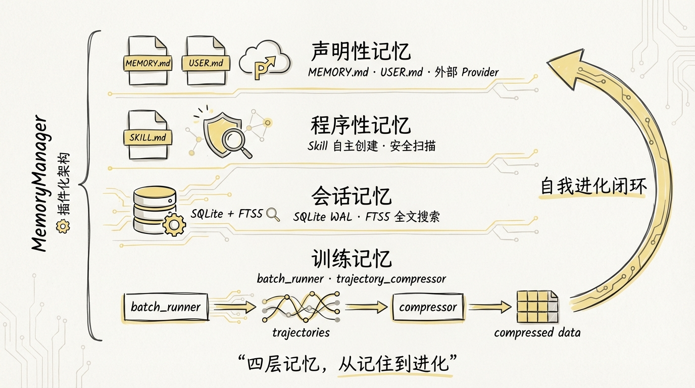
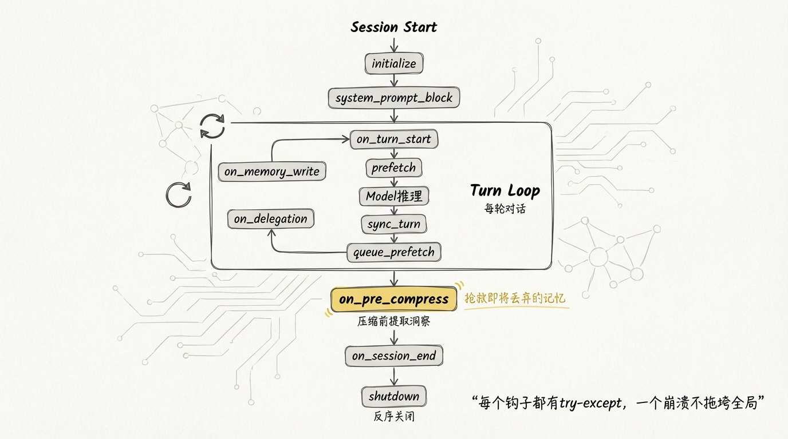
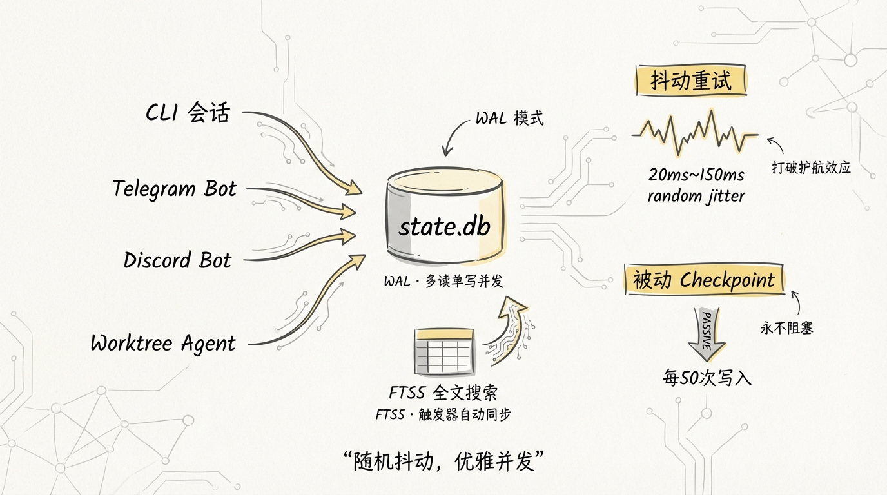
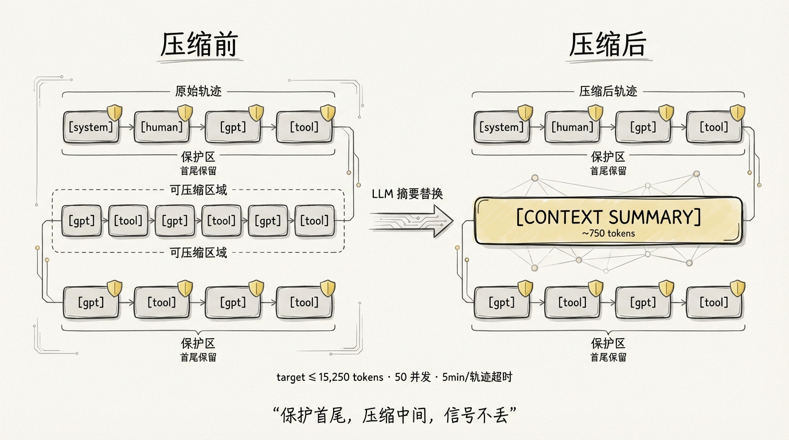
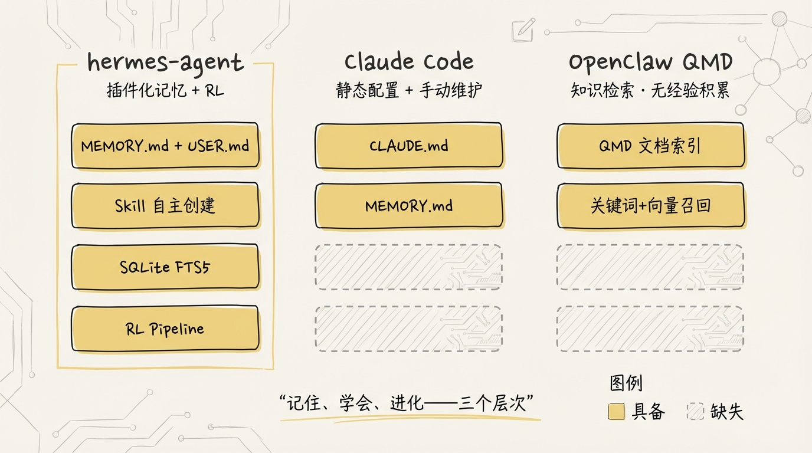

[English](docs/07-Memory-and-RL.md)

# 07 Memory 与 RL 训练：从记忆到自我进化



一个 Agent 跑完任务就忘干净，和一个能记住你偏好、积累经验、还能把自己的行为轨迹压缩成训练数据的 Agent，这两者之间的差距有多大？大概就是实习生和五年老员工的差距。

hermes-agent 的 Memory 系统远不止一个 MEMORY.md 文件那么简单。它是一套**插件化记忆架构 + RL 训练数据流水线 + Skill 自主创建机制**的组合体。这篇文章把这条链路从头到尾拆开来看。

---

## 1️⃣ MemoryManager：记忆的总调度器

翻开 `agent/memory_manager.py`，你会发现 hermes-agent 没有把记忆逻辑分散在各处，而是用一个 **MemoryManager** 统一编排所有记忆后端。

```python
# agent/memory_manager.py

class MemoryManager:
    def __init__(self) -> None:
        self._providers: List[MemoryProvider] = []
        self._tool_to_provider: Dict[str, MemoryProvider] = {}
        self._has_external: bool = False
```

架构约束很明确：**内置 provider 永远在第一位，外部 provider 最多只能有一个**。尝试注册第二个外部 provider 会被直接拒绝并打 warning。这个设计避免了多记忆后端之间的 tool schema 膨胀和语义冲突。

```
┌────────────────────────────────────────────────────┐
│                   MemoryManager                     │
│                                                     │
│  ┌──────────────┐    ┌──────────────────────────┐  │
│  │   builtin     │    │  external (0 or 1)       │  │
│  │  MEMORY.md    │    │  honcho / hindsight /    │  │
│  │  USER.md      │    │  mem0 / holographic ...  │  │
│  └──────┬───────┘    └──────────┬───────────────┘  │
│         │                       │                   │
│         └───────────┬───────────┘                   │
│                     ▼                               │
│    tool_name → provider 路由索引 (O(1) 查找)        │
│    统一生命周期钩子广播                               │
└────────────────────────────────────────────────────┘
```

注册过程同时建立了 **tool_name → provider 的路由索引**。当模型调用一个 memory tool 时，MemoryManager 不需要遍历所有 provider，直接查字典路由到正确的后端。名字冲突时先注册的赢，后来的被忽略并打 warning。

### 生命周期钩子：从 on_turn_start 到 on_session_end

MemoryProvider 抽象基类（`agent/memory_provider.py`）定义了完整的生命周期，MemoryManager 在每个节点广播通知所有 provider：

```
Session Start
    │
    ▼
initialize(session_id, **kw)      ← 连接后端、创建资源、注入 hermes_home
    │
    ▼
system_prompt_block()             ← 静态记忆注入 system prompt
    │
    ▼
┌──────────── Turn Loop ──────────────┐
│                                      │
│  on_turn_start(turn, msg, **kw)     │ ← remaining_tokens, model, platform
│       │                              │
│       ▼                              │
│  prefetch(query, session_id)        │ ← 召回相关记忆
│       │                              │
│       ▼                              │
│  [Model 推理 + Tool 执行]            │
│       │                              │
│       ▼                              │
│  sync_turn(user, assistant)         │ ← 当前轮写入后端
│  queue_prefetch(query)              │ ← 为下一轮预热
│                                      │
│  on_memory_write(action, target,    │ ← 内置记忆写入时镜像
│                  content)            │
│  on_delegation(task, result)        │ ← 子 Agent 完成时通知
│                                      │
└──────────────────────────────────────┘
    │
    ▼
on_pre_compress(messages) → str   ← 压缩前抢救即将丢弃的记忆
    │
    ▼
on_session_end(messages)          ← 会话结束时做事实提取
    │
    ▼
shutdown()                        ← 反序关闭（后注册的先关）
```

几个关键钩子的职责：

| 钩子 | 调用时机 | 典型用途 |
|------|---------|---------|
| `on_turn_start(turn, msg, **kw)` | 每轮对话开始前 | 计数、scope 管理、定期维护 |
| `prefetch(query)` | API 调用前 | 基于当前问题召回相关记忆 |
| `sync_turn(user, asst)` | 每轮对话完成后 | 异步写入对话记录到后端 |
| `on_pre_compress(messages)` | 上下文压缩前 | 从即将被丢弃的消息中提取洞察 |
| `on_session_end(messages)` | 会话结束时 | 端到端事实抽取、摘要归档 |
| `on_memory_write(action, target, content)` | 内置记忆工具写入时 | 将 MEMORY.md 写入镜像到外部后端 |
| `on_delegation(task, result)` | 子 Agent 完成时 | 父 Agent 观察委托结果 |

**on_pre_compress** 是最精巧的钩子。上下文压缩器准备砍掉旧消息时，MemoryManager 先让所有 provider 过一遍即将被丢弃的内容，提取有价值的信息。返回的文本会被注入到压缩摘要的 prompt 里，确保压缩器生成摘要时保留 provider 提取的关键信息。**压缩器压的是上下文窗口，但知识不会丢失。**

```python
# agent/memory_manager.py

def on_pre_compress(self, messages: List[Dict[str, Any]]) -> str:
    parts = []
    for provider in self._providers:
        try:
            result = provider.on_pre_compress(messages)
            if result and result.strip():
                parts.append(result)
        except Exception as e:
            logger.debug("Memory provider '%s' on_pre_compress failed: %s",
                         provider.name, e)
    return "\n\n".join(parts)
```

每个钩子都有 try-except 包裹，**一个 provider 崩溃不会拖垮另一个**。内置 provider 和外部 provider 互不干扰。这种防御式编程在 memory 层面尤其重要，因为外部 provider 可能依赖网络 API，而网络永远不可靠。

还有一个容易忽略的细节：`on_memory_write` 的广播机制**跳过 builtin provider 自身**，因为它就是写入源头，再通知自己就成环了。

```python
# agent/memory_manager.py

def on_memory_write(self, action: str, target: str, content: str) -> None:
    for provider in self._providers:
        if provider.name == "builtin":
            continue  # 跳过写入源头
        provider.on_memory_write(action, target, content)
```

shutdown 的顺序也值得注意：**反序关闭**。后注册的 provider 先 shutdown，这在外部 provider 依赖内置 provider 的场景下是正确的 teardown 顺序。



---

## 2️⃣ 8 种 Memory 后端的插件发现机制

`plugins/memory/` 目录下住着 8 个子目录，每个都是一个独立的记忆后端插件：

```
plugins/memory/
├── __init__.py              # discover_memory_providers / load_memory_provider
├── byterover/               # ByteRover 向量记忆
├── hindsight/               # Hindsight 回溯记忆
├── holographic/             # 全息记忆（本地向量存储）
│   ├── __init__.py
│   ├── holographic.py
│   ├── retrieval.py
│   └── store.py
├── honcho/                  # Honcho 云端记忆（唯一带 CLI 的插件）
│   ├── __init__.py
│   ├── client.py
│   ├── session.py
│   └── cli.py
├── mem0/                    # Mem0 记忆服务
├── openviking/              # OpenViking
├── retaindb/                # RetainDB
└── supermemory/             # SuperMemory
```

用户在 `config.yaml` 里设一行 `memory.provider: honcho`，整条发现链就跑起来了。

### discover_memory_providers：轻量级扫描

```python
# plugins/memory/__init__.py

def discover_memory_providers() -> List[Tuple[str, str, bool]]:
    results = []
    for child in sorted(_MEMORY_PLUGINS_DIR.iterdir()):
        if not child.is_dir() or child.name.startswith(("_", ".")):
            continue
        init_file = child / "__init__.py"
        if not init_file.exists():
            continue

        # 从 plugin.yaml 读描述（轻量，不执行代码）
        desc = ""
        yaml_file = child / "plugin.yaml"
        if yaml_file.exists():
            meta = yaml.safe_load(open(yaml_file))
            desc = meta.get("description", "")

        # 实例化 provider 并调用 is_available() 检查可用性
        available = True
        try:
            provider = _load_provider_from_dir(child)
            available = provider.is_available() if provider else False
        except Exception:
            available = False

        results.append((child.name, desc, available))
    return results
```

发现流程分三步：

1. 扫描 `plugins/memory/` 下所有子目录，跳过 `_` 和 `.` 开头的
2. 读取 `plugin.yaml` 获取描述信息（轻量级元数据，不执行代码）
3. 尝试加载 provider 并调用 `is_available()` 检查依赖是否就绪

### _load_provider_from_dir：两种注册模式

加载单个 provider 时支持两种发现策略：

```python
# plugins/memory/__init__.py

# 模式 1: register(ctx) 函数式注册（标准 Hermes plugin 写法）
if hasattr(mod, "register"):
    collector = _ProviderCollector()
    mod.register(collector)
    if collector.provider:
        return collector.provider

# 模式 2: 类扫描 fallback（直接找 MemoryProvider 子类）
from agent.memory_provider import MemoryProvider
for attr_name in dir(mod):
    attr = getattr(mod, attr_name, None)
    if (isinstance(attr, type) and issubclass(attr, MemoryProvider)
            and attr is not MemoryProvider):
        return attr()
```

`_ProviderCollector` 是一个 **Fake Context**，只捕获 `register_memory_provider` 调用，其余方法（`register_tool`、`register_hook`、`register_cli_command`）全是 no-op。这种 Duck Typing 的加载方式，让 memory plugin 可以复用通用 plugin 的注册接口，同时又和主 plugin 系统隔离。

### 子模块预注册：解决相对导入的坑

加载 provider 时有一段容易被忽略的代码：

```python
# plugins/memory/__init__.py

# 预注册子模块，让 "from .store import MemoryStore" 这类导入正常工作
for sub_file in provider_dir.glob("*.py"):
    if sub_file.name == "__init__.py":
        continue
    sub_name = sub_file.stem
    full_sub_name = f"{module_name}.{sub_name}"
    if full_sub_name not in sys.modules:
        sub_spec = importlib.util.spec_from_file_location(full_sub_name, str(sub_file))
        if sub_spec:
            sub_mod = importlib.util.module_from_spec(sub_spec)
            sys.modules[full_sub_name] = sub_mod
            sub_spec.loader.exec_module(sub_mod)
```

这解决了 Python 动态加载插件时最常见的坑：`importlib.util.spec_from_file_location` 创建的模块默认不支持相对导入。holographic 插件里写 `from .store import MemoryStore` 会直接炸，除非先把 `store` 子模块注册到 `sys.modules`。

### CLI 命令的按需加载

Honcho 插件带了一个 CLI 子命令（`hermes honcho ...`），其发现逻辑单独处理：

```python
# plugins/memory/__init__.py

def discover_plugin_cli_commands() -> List[dict]:
    active_provider = _get_active_memory_provider()  # 只读 config，不加载插件
    if not active_provider:
        return results

    # 只加载激活 provider 的 cli.py
    cli_file = plugin_dir / "cli.py"
    # ...
```

只有**当前激活的** memory provider 的 CLI 命令才会被注册。这是个轻量级扫描，在 argparse 构建阶段调用，只导入 `cli.py` 而不加载完整的 plugin 模块。


---

## 3️⃣ BuiltinMemoryProvider：内置 Markdown 记忆

```python
# agent/builtin_memory_provider.py

class BuiltinMemoryProvider(MemoryProvider):
    """Built-in file-backed memory (MEMORY.md + USER.md)."""

    def __init__(self, memory_store=None, memory_enabled=False,
                 user_profile_enabled=False):
        self._store = memory_store
        self._memory_enabled = memory_enabled
        self._user_profile_enabled = user_profile_enabled

    @property
    def name(self) -> str:
        return "builtin"

    def is_available(self) -> bool:
        return True  # 永远可用，无外部依赖

    def get_tool_schemas(self) -> List[Dict[str, Any]]:
        return []  # memory tool 由 run_agent.py 直接拦截处理
```

**BuiltinMemoryProvider 是一个极其轻量的适配器**，整个文件只有 115 行。真正的存储逻辑在 `tools/memory_tool.py` 的 MemoryStore 里。它做的事情很克制：

1. `system_prompt_block()` 把 MEMORY.md 和 USER.md 的内容注入系统提示词，用的是**加载时的冻结快照**，而不是实时数据。这保证了同一会话内系统提示词不变，**prompt cache 不会被频繁失效**。

2. `get_tool_schemas()` 返回空列表。memory 工具是在 `run_agent.py` 的 agent loop 里被**拦截式处理**的，不走标准的 tool registry 分发。builtin provider 纯粹是个数据通道，不参与 tool routing。

3. `prefetch()` 返回空字符串。内置记忆不做查询召回，它把全量内容放进系统提示词，让 LLM 自己在上下文里找。

这里有一个设计权衡：**全量注入 vs 查询召回**。

| 策略 | 代表 | 优势 | 劣势 |
|------|------|------|------|
| 全量注入 | builtin provider | 简单可靠，零检索误差 | MEMORY.md 变大后吃 token |
| 查询召回 | 外部 provider (prefetch) | 按需检索，节省 token | 检索质量有不确定性 |

还有 `on_memory_write` 的广播效果：当内置记忆工具写入时，MemoryManager 通知所有外部 provider 进行镜像同步。你用 Honcho 或 Mem0 做外部记忆时，MEMORY.md 的每次改动都会同步过去。**双向可用，单向同步**。

---

## 4️⃣ SQLite + FTS5 持久化：WAL 模式、抖动重试、被动 checkpoint

Memory provider 管记忆，但 Agent 的**会话状态、消息历史、token 统计**这些运行时数据需要另一套持久化方案。这就是 `hermes_state.py` 里的 `SessionDB`。

```python
# hermes_state.py

class SessionDB:
    _WRITE_MAX_RETRIES = 15
    _WRITE_RETRY_MIN_S = 0.020   # 20ms
    _WRITE_RETRY_MAX_S = 0.150   # 150ms
    _CHECKPOINT_EVERY_N_WRITES = 50
```

### WAL 模式与并发

hermes-agent 在 gateway 模式下会有**多个进程共享同一个 state.db**：CLI 会话、Telegram bot、Discord bot、worktree agent 都可能同时读写。

```python
# hermes_state.py

self._conn = sqlite3.connect(
    str(self.db_path),
    check_same_thread=False,
    timeout=1.0,           # 短超时，靠应用层重试
    isolation_level=None,  # 手动管理事务
)
self._conn.execute("PRAGMA journal_mode=WAL")
self._conn.execute("PRAGMA foreign_keys=ON")
```

WAL（Write-Ahead Logging）允许**多个读者和一个写者并发**。读操作不阻塞写，写操作不阻塞读。SQLite 默认的 DELETE journal 模式下 reader 和 writer 互斥，在 gateway 场景会导致可见的 TUI 卡顿。

### 抖动重试打破护航效应

SQLite 内置的 busy handler 用确定性 sleep 来处理写锁冲突。多个 writer 同时竞争时会形成 **convoy effect**：大家按固定间隔重试，每次都在同一时刻撞车。

hermes-agent 的解法是把 SQLite timeout 设短到 1 秒，然后在应用层用**随机抖动重试**：

```python
# hermes_state.py

def _execute_write(self, fn):
    for attempt in range(self._WRITE_MAX_RETRIES):  # 最多 15 次
        try:
            with self._lock:
                self._conn.execute("BEGIN IMMEDIATE")
                try:
                    result = fn(self._conn)
                    self._conn.commit()
                except BaseException:
                    self._conn.rollback()
                    raise
            # 成功后定期做被动 checkpoint
            self._write_count += 1
            if self._write_count % 50 == 0:
                self._try_wal_checkpoint()
            return result
        except sqlite3.OperationalError as exc:
            if "locked" in str(exc).lower():
                jitter = random.uniform(0.020, 0.150)  # 20ms~150ms 随机
                time.sleep(jitter)
                continue
            raise
```

**BEGIN IMMEDIATE** 在事务开始时就抢写锁，而不是等到 commit 时才发现冲突。锁竞争在第一时间暴露出来，应用层立即释放 Python 锁、sleep 一个随机时间再重试。这种**自然错开**的效果比确定性调度好得多。

### 被动 WAL Checkpoint

WAL 文件如果不做 checkpoint 会无限增长。hermes-agent 选择了**被动 checkpoint**策略：

```python
# hermes_state.py

def _try_wal_checkpoint(self) -> None:
    """PASSIVE checkpoint，不阻塞，不抛异常"""
    try:
        with self._lock:
            result = self._conn.execute(
                "PRAGMA wal_checkpoint(PASSIVE)"
            ).fetchone()
    except Exception:
        pass  # Best effort — never fatal
```

**PASSIVE 模式永远不阻塞。** 它只把没有其他连接还在读的 WAL 帧刷回主数据库文件。碰到被占用的帧就跳过，不等待。关闭连接时也会做一次 checkpoint，尽力控制 WAL 文件大小。

### FTS5 全文搜索

消息存储之上建了一层 FTS5 虚拟表，通过触发器自动同步：

```sql
-- hermes_state.py

CREATE VIRTUAL TABLE IF NOT EXISTS messages_fts USING fts5(
    content,
    content=messages,
    content_rowid=id
);

CREATE TRIGGER IF NOT EXISTS messages_fts_insert AFTER INSERT ON messages BEGIN
    INSERT INTO messages_fts(rowid, content) VALUES (new.id, new.content);
END;

CREATE TRIGGER IF NOT EXISTS messages_fts_delete AFTER DELETE ON messages BEGIN
    INSERT INTO messages_fts(messages_fts, rowid, content)
        VALUES('delete', old.id, old.content);
END;
```

搜索接口做了**查询消毒**，处理了一个微妙的 FTS5 问题：

```python
# hermes_state.py

@staticmethod
def _sanitize_fts5_query(query: str) -> str:
    # 保护平衡的引号短语
    sanitized = re.sub(r'"[^"]*"', _preserve_quoted, query)
    # 剥离不匹配的 FTS5 特殊字符
    sanitized = re.sub(r'[+{}()\"^]', " ", sanitized)
    # 将连字符/点号词组用引号包裹
    # FTS5 会把 "chat-send" 拆成 "chat AND send"
    # 用引号包裹保持短语语义
    sanitized = re.sub(r"\b(\w+(?:[.-]\w+)+)\b", r'"\1"', sanitized)
```

### Schema 迁移

SessionDB 用一个 `schema_version` 表做版本控制，当前版本是 6。每次升级都是 `ALTER TABLE ADD COLUMN` 式的增量迁移：

```python
# hermes_state.py

if current_version < 6:
    # v6: reasoning 字段，保持多轮推理连续性
    for col_name, col_type in [
        ("reasoning", "TEXT"),
        ("reasoning_details", "TEXT"),
        ("codex_reasoning_items", "TEXT"),
    ]:
        cursor.execute(f'ALTER TABLE messages ADD COLUMN "{col_name}" {col_type}')
```

v6 加的 reasoning 字段很有意思：它把 assistant 的推理链持久化到数据库，这样 gateway 会话 reload 时 reasoning 不会丢失。对于 OpenRouter、OpenAI 这类需要重放 reasoning 的 provider，这是保证多轮推理连续性的关键。



---

## 5️⃣ batch_runner.py：并行轨迹生成

从记忆跨到 RL 训练。`batch_runner.py` 是 hermes-agent 的**数据工厂**，负责从 prompt 数据集批量生成 Agent 行为轨迹。

```
                     ┌────────────────────┐
                     │   dataset.jsonl    │
                     │  (prompts + images)│
                     └────────┬───────────┘
                              │
                     ┌────────▼───────────┐
                     │   BatchRunner      │
                     │                    │
                     │  ┌──── Pool(N) ───┐│
                     │  │ Worker 1       ││
                     │  │ Worker 2       ││  multiprocessing.Pool
                     │  │ Worker 3       ││
                     │  │ Worker 4       ││
                     │  └────────────────┘│
                     └────────┬───────────┘
                              │
              ┌───────────────┼───────────────┐
              ▼               ▼               ▼
        batch_0.jsonl   batch_1.jsonl   batch_N.jsonl
              │               │               │
              └───────────────┼───────────────┘
                              ▼
                     trajectories.jsonl
                     (合并 + 过滤腐败数据)
```

### 工具集采样

每个 prompt 不是用固定的工具集跑，而是从**分布中采样**：

```python
# batch_runner.py

selected_toolsets = sample_toolsets_from_distribution(config["distribution"])

agent = AIAgent(
    enabled_toolsets=selected_toolsets,
    save_trajectories=False,  # 由 BatchRunner 自己管
    skip_context_files=True,  # 不让 SOUL.md/AGENTS.md 污染轨迹
    skip_memory=True,         # 批量跑不用持久记忆
)
```

`skip_memory=True` 这个参数很关键。批量生成训练数据时，你不希望 Agent 的持久记忆干扰每个独立样本的行为。每个 prompt 应该是一个干净的独立试验。

每个 prompt 还支持**独立的容器镜像覆盖**：

```python
# batch_runner.py

container_image = prompt_data.get("image") or prompt_data.get("docker_image")
if container_image:
    from tools.terminal_tool import register_task_env_overrides
    overrides = {
        "docker_image": container_image,
        "modal_image": container_image,
        "singularity_image": f"docker://{container_image}",
        "daytona_image": container_image,
    }
    register_task_env_overrides(task_id, overrides)
```

数据集中的每行可以指定自己需要的 Docker 镜像。对于需要特定环境的编程任务（比如某个 prompt 需要 CUDA 环境，另一个需要 Node.js 18），这让每个样本都能在正确的沙箱里执行。

### 推理覆盖率过滤

生成的轨迹不是全收，而是做了一道**推理质量筛选**：

```python
# batch_runner.py

reasoning = result.get("reasoning_stats", {})
if not reasoning.get("has_any_reasoning", True):
    print(f"   🚫 Prompt {prompt_index} discarded (no reasoning in any turn)")
    discarded_no_reasoning += 1
    continue
```

如果一条轨迹的所有 assistant turn 都没有推理过程（没有 `<REASONING_SCRATCHPAD>` 也没有 native thinking token），直接丢弃。**没有推理的轨迹对 RL 训练没有价值**，留着只会引入噪声。

推理统计本身也很详细：

```python
# batch_runner.py

def _extract_reasoning_stats(messages):
    for msg in messages:
        if msg.get("role") != "assistant":
            continue
        has_scratchpad = "<REASONING_SCRATCHPAD>" in content
        has_native_reasoning = bool(msg.get("reasoning", "").strip())
        if has_scratchpad or has_native_reasoning:
            with_reasoning += 1
    return {
        "total_assistant_turns": total,
        "turns_with_reasoning": with_reasoning,
        "turns_without_reasoning": total - with_reasoning,
        "has_any_reasoning": with_reasoning > 0,
    }
```

### 断点续跑与腐败数据过滤

BatchRunner 实现了两层容错：

**按 prompt 文本的内容匹配**（而非仅靠索引）：

```python
# batch_runner.py

def _scan_completed_prompts_by_content(self) -> set:
    """扫描所有 batch 文件，按 prompt 文本匹配已完成的任务"""
    for batch_file in batch_files:
        for line in f:
            entry = json.loads(line)
            if entry.get("failed", False):
                continue  # 失败的可以重试
            for msg in entry.get("conversations", []):
                if msg.get("from") == "human":
                    completed_prompts.add(msg.get("value", "").strip())
                    break
    return completed_prompts
```

按文本匹配比按索引匹配更鲁棒。即使数据集被重新排序，已跑过的 prompt 也不会重复执行。

合并 batch 文件时还有一层**数据卫生检查**：

```python
# batch_runner.py

# 检查模型幻觉出的无效工具名
VALID_TOOLS = ALL_POSSIBLE_TOOLS  # 从 model_tools.py 自动派生，不用手动维护
invalid_tools = [k for k in tool_stats if k not in VALID_TOOLS]
if invalid_tools:
    filtered_entries += 1
    continue  # 丢弃这条
```

模型有时会在 tool_call 里编造不存在的工具名。这些**幻觉工具调用**会导致下游 HuggingFace datasets 的 Arrow/Parquet schema 不一致。合并时直接过滤掉。

### tool_stats 的归一化

为了确保所有 batch 文件的 schema 一致（HuggingFace datasets 严格要求），每条轨迹的 tool_stats 都会被归一化：

```python
# batch_runner.py

def _normalize_tool_stats(tool_stats):
    normalized = {}
    for tool in ALL_POSSIBLE_TOOLS:
        if tool in tool_stats:
            normalized[tool] = tool_stats[tool].copy()
        else:
            normalized[tool] = {"count": 0, "success": 0, "failure": 0}
    return normalized
```

没用到的工具也会出现在统计里，值为零。这保证了每条记录的 schema 完全相同。

---

## 6️⃣ trajectory_compressor.py：RL 训练数据压缩

batch_runner 产出的原始轨迹往往太长，直接用于训练会浪费 token budget。`TrajectoryCompressor` 负责**在保留训练信号的前提下把轨迹压短**。

```python
# trajectory_compressor.py

@dataclass
class CompressionConfig:
    target_max_tokens: int = 15250
    summary_target_tokens: int = 750
    protect_first_system: bool = True
    protect_first_human: bool = True
    protect_first_gpt: bool = True
    protect_first_tool: bool = True
    protect_last_n_turns: int = 4
    summarization_model: str = "google/gemini-3-flash-preview"
    max_concurrent_requests: int = 50
    per_trajectory_timeout: int = 300  # 5 分钟超时
```

### 压缩策略：分区保护 + 最小化信息损失

```
原始轨迹：
[system] [human] [gpt] [tool] [gpt] [tool] ... [gpt] [tool] [gpt] [tool]
 ↑ 保护 ↑  ↑保护↑ ↑保护↑ ↑保护↑                         ↑── 保护最后4轮 ──↑
                              ↑────── 可压缩区域 ──────↑

压缩后：
[system] [human] [gpt] [tool] [CONTEXT SUMMARY] ... [gpt] [tool] [gpt] [tool]
                                   ↑ 一条摘要消息替换 N 条被压缩的 turn
```

保护逻辑：

| 保护项 | 默认值 | 理由 |
|--------|--------|------|
| protect_first_system | ✅ | 人格定义和工具 schema |
| protect_first_human | ✅ | 任务描述 |
| protect_first_gpt | ✅ | 模型对任务的初始理解 |
| protect_first_tool | ✅ | 第一次工具探索的结果 |
| protect_last_n_turns = 4 | ✅ | 最终行动和结论（RL reward signal） |

压缩只在中间区域动刀，而且**只压缩刚好够用的量**：

```python
# trajectory_compressor.py

tokens_to_save = total_tokens - self.config.target_max_tokens
target_tokens_to_compress = tokens_to_save + self.config.summary_target_tokens

accumulated_tokens = 0
compress_until = compress_start
for i in range(compress_start, compress_end):
    accumulated_tokens += turn_tokens[i]
    compress_until = i + 1
    if accumulated_tokens >= target_tokens_to_compress:
        break  # 够了就停，不多压
```

被压缩的 turn 不是直接丢弃，而是**用 LLM 生成摘要替换**：

```python
# trajectory_compressor.py

summary = await self._generate_summary_async(content_to_summarize, metrics)

compressed.append({
    "from": "human",
    "value": summary  # "[CONTEXT SUMMARY]: ..."
})
```

摘要 prompt 要求 LLM 以中立视角描述 assistant 做了什么、获得了什么关键信息、做了什么决策。目标约 750 tokens，factual 为主。

### 异步并行处理

整个压缩流水线是全异步的，用 `asyncio.Semaphore` 控制并发：

```python
# trajectory_compressor.py

semaphore = asyncio.Semaphore(self.config.max_concurrent_requests)  # 默认 50

async def process_single(file_path, entry_idx, entry, ...):
    async with semaphore:
        processed_entry, metrics = await asyncio.wait_for(
            self.process_entry_async(entry),
            timeout=self.config.per_trajectory_timeout  # 默认 300s
        )
```

50 个并发 API 调用同时跑摘要生成。每条轨迹有独立的 5 分钟超时，超时的轨迹直接跳过不写入输出，比让一条卡住的轨迹拖住整个流水线好得多。

LLM 调用支持两种路径：**centralized provider router**（通过 `call_llm`，自动处理 auth 和 headers）和**原生 OpenAI client**（用于自定义 endpoint）。provider 检测逻辑根据 base_url 自动识别 OpenRouter、Nous、Kimi、MiniMax 等后端。retry 用的是项目统一的 `jittered_backoff`，失败 3 次后降级为固定 fallback 摘要。

### Metrics 报告

压缩完成后输出一份详尽的统计报告，写入 `compression_metrics.json`：

```python
# trajectory_compressor.py → AggregateMetrics

{
    "summary": { "total_trajectories", "trajectories_compressed", "trajectories_still_over_limit" },
    "tokens":  { "total_before", "total_after", "total_saved", "overall_compression_ratio" },
    "turns":   { "total_before", "total_after", "total_removed" },
    "averages": { "avg_compression_ratio", "avg_tokens_saved_per_compressed" },
    "summarization": { "total_api_calls", "total_errors", "success_rate" },
    "processing": { "duration_seconds", "start_time", "end_time" }
}
```



---

## 7️⃣ Skill 自主创建与安全扫描

Skill 是 hermes-agent 的**程序性记忆**：它记录的不是事实，而是**怎么做一件事**。当 Agent 在一个复杂任务中成功了（5+ 次工具调用、克服了错误、发现了非显然的工作流），它可以**自主创建 Skill** 把方法固化下来。

```
~/.hermes/skills/
├── my-skill/
│   ├── SKILL.md           ← YAML frontmatter + Markdown 正文
│   ├── references/        ← 参考资料
│   ├── templates/         ← 模板文件
│   ├── scripts/           ← 脚本
│   └── assets/            ← 其他资源
└── devops/
    └── k8s-rollback/
        └── SKILL.md
```

6 种操作：**create**、**edit**（全量重写）、**patch**（靶向替换，用 fuzzy_find_and_replace 引擎处理空白差异）、**delete**、**write_file**（支持文件写入）、**remove_file**。

Skill 名称有严格约束：小写字母、数字、连字符、下划线，最长 64 字符。SKILL.md 内容最大 100,000 字符（约 36k tokens），支持文件最大 1 MiB。分类目录可选，用于按领域组织（比如 `devops/`、`data-science/`）。

### 安全扫描：Agent 创建的也不能信

每次 Skill 写入后，`tools/skills_guard.py` 会做一轮**静态安全扫描**。超过 70 条正则规则，覆盖 8 大威胁类别：

| 类别 | 典型模式 | 严重度 |
|------|---------|--------|
| **Exfiltration** | `curl $TOKEN`、读取 `~/.ssh`、dump `os.environ` | Critical |
| **Injection** | `ignore previous instructions`、`DAN mode`、HTML 隐藏注释 | Critical |
| **Destructive** | `rm -rf /`、`mkfs`、覆写 `/etc/` | Critical |
| **Persistence** | 修改 `crontab`、`authorized_keys`、agent config 文件 | Medium~Critical |
| **Obfuscation** | `base64 -d \| sh`、`eval('...')`、`echo \| bash`、chr() 拼接 | High~Critical |
| **Supply Chain** | `curl \| sh`、unpinned `pip install`、`git clone` | Medium~Critical |
| **Credential Exposure** | 硬编码 API key、嵌入 private key、GitHub PAT | Critical |
| **Privilege Escalation** | `sudo`、`setuid`、`NOPASSWD` | High~Critical |

还有**隐形 unicode 字符检测**：

```python
# tools/skills_guard.py

INVISIBLE_CHARS = {
    '\u200b',  # zero-width space
    '\u200c',  # zero-width non-joiner
    '\u202e',  # right-to-left override
    # ... 17 种不可见字符
}
```

攻击者可能用零宽字符在 SKILL.md 里藏指令，肉眼看不出来但 LLM 会执行。扫描器逐行检测这些字符。

**结构性检查**也不遗漏：文件数量上限 50、总大小上限 1MB、检测可执行二进制文件（.exe/.dll/.so）、检测指向目录外的 symlink。

扫描结果经过**信任级别策略矩阵**过滤：

```python
# tools/skills_guard.py

INSTALL_POLICY = {
    #                  safe      caution    dangerous
    "builtin":       ("allow",  "allow",   "allow"),
    "trusted":       ("allow",  "allow",   "block"),
    "community":     ("allow",  "block",   "block"),
    "agent-created": ("allow",  "allow",   "ask"),
}
```

Agent 自己创建的 Skill 享有 `agent-created` 信任级别：caution 允许通过（比 community 宽松），dangerous 触发确认而非直接放行。

被扫描拦截的操作会**立即回滚**：

```python
# tools/skill_manager_tool.py → _create_skill

scan_error = _security_scan_skill(skill_dir)
if scan_error:
    shutil.rmtree(skill_dir, ignore_errors=True)  # 整个目录删掉
    return {"success": False, "error": scan_error}
```

`_edit_skill` 和 `_patch_skill` 也有回滚逻辑：先备份原始内容，扫描失败就恢复原文。所有文件写入用 `_atomic_write_text()`：写到同目录临时文件，然后 `os.replace()` 原子替换，进程崩溃也不会产生半写的文件。

### LLM 审计：正则抓不住的交给模型

`skills_guard.py` 还有一个 `llm_audit_skill()` 方法，在静态扫描之后用 LLM 做二次审计。LLM 审计的结论**只能提升严重度，不能降低**：

```python
# tools/skills_guard.py

# LLM can only raise severity, not lower it
verdict_priority = {"safe": 0, "caution": 1, "dangerous": 2}
if verdict_priority.get(merged_verdict, 0) < verdict_priority.get(static_result.verdict, 0):
    merged_verdict = static_result.verdict
```

正则能抓住已知模式，LLM 能抓住**上下文相关的新型攻击**。两层叠加，漏网的概率更低。


---

## 8️⃣ 对比：hermes-agent vs Claude Code 的记忆体系

Claude Code 用的是 `CLAUDE.md` + `MEMORY.md` 双文件体系。放在一起比较：

| 维度 | hermes-agent | Claude Code |
|------|-------------|-------------|
| **记忆存储** | MEMORY.md + USER.md + 外部 provider | CLAUDE.md（项目指令）+ MEMORY.md（用户记忆）|
| **记忆架构** | 插件化，1 内置 + 1 外部可选 | 固定双文件，无插件 |
| **记忆召回** | 内置全量注入 / 外部 provider 查询召回 | 全量注入系统提示词 |
| **持久化** | SQLite WAL + FTS5 全文搜索 | 文件系统，无数据库 |
| **Skill 系统** | Agent 自主创建 + 安全扫描 + 分类目录 | 无（靠 CLAUDE.md 手动维护指令）|
| **RL 数据采集** | batch_runner + trajectory_compressor | 无公开的 RL pipeline |
| **上下文压缩前** | `on_pre_compress` 钩子提取洞察 | 压缩时保留 CLAUDE.md |
| **多 provider** | 8 种（Honcho / Mem0 / Holographic 等）| 无外部记忆后端 |
| **安全防护** | 70+ 正则 + 信任矩阵 + LLM 审计 | 依赖 Anthropic 自身安全层 |

Claude Code 的 CLAUDE.md 更像一个**静态配置文件**。它在项目根目录，被 git 跟踪，内容由人工维护。hermes-agent 的 Skill 系统是**动态的程序性记忆**，由 Agent 在运行时自主创建和迭代。

一个核心区别：Claude Code 的记忆是**声明式**的（告诉 Agent 你是谁、规则是什么），hermes-agent 的 Skill 是**过程式**的（告诉 Agent 遇到这类问题该怎么一步步做）。Claude Code 没有**主动记忆能力**，它的记忆完全依赖人类手动编辑，模型本身不会自动提取和存储有用信息。

还有一个动态召回的差异。Claude Code 把 CLAUDE.md 的全部内容塞进每次对话的 system prompt，文件大了就浪费 token。hermes-agent 的外部 provider 支持 `prefetch()` 语义召回，只拉跟当前 query 相关的记忆片段。

---

## 9️⃣ 对比：hermes-agent vs OpenClaw QMD 索引

OpenClaw 实例用的是 QMD 索引方案，和 hermes-agent 的记忆体系走了完全不同的路线：

| 维度 | hermes-agent Memory | OpenClaw QMD 索引 |
|------|--------------------|--------------------|
| **索引粒度** | 按会话 turn 级别 | 按 QMD 文档级别 |
| **检索方式** | FTS5 全文 + provider 向量检索 | 关键词匹配 + 向量召回 |
| **写入时机** | 每轮对话后异步 sync | 文档变更时批量重建 |
| **持久化** | SQLite WAL 单文件 | 独立索引服务 |
| **多租户** | session_id + user_id 隔离 | 实例级隔离（每个容器独立）|
| **RL 支持** | batch_runner 原生支持 | 无 |
| **记忆类型** | 事实记忆 + 程序性记忆（Skill）| 知识库检索，无程序性记忆 |
| **冷启动** | MEMORY.md 持久化 + 外部 provider | QMD 文档预加载 |
| **更新节奏** | 实时（每轮对话）| 离线批量 |

两个系统面对的问题域不同。OpenClaw 解决的是**如何让 Agent 获取外部知识**，hermes-agent 解决的是**如何让 Agent 积累自身经验**。前者是 RAG，后者更接近 episodic memory + procedural memory。

OpenClaw 的 QMD 索引是面向**知识库问答**设计的，最小单元是一个 Question-Answer 对，索引建好后基本不变。hermes-agent 的记忆系统面向的是 **Agent 工作流**，最小单元是一次对话中提取的事实或过程，随着 Agent 使用不断演化。

QMD 索引解决的是**给定知识如何检索**，Hermes Memory 解决的是**新知识如何积累和复用**。



---

## 🔟 整条链路串起来

从记忆到 RL 训练，hermes-agent 的数据流是这样的：

```
  ┌──────────────────────────────────────────────────────────────┐
  │                    Runtime Memory Loop                       │
  │                                                              │
  │  MEMORY.md ──→ system_prompt ──→ Agent 对话 ──→ sync_turn  │
  │  USER.md                              │                      │
  │  External Provider                    │                      │
  │       ↑                               ▼                      │
  │  on_session_end ←── on_pre_compress ←── messages             │
  │                                                              │
  │  Skill 自主创建 ←── 复杂任务成功 ←── Agent 对话              │
  └──────────────────────────────────────────────────────────────┘
                              │
                              ▼
  ┌──────────────────────────────────────────────────────────────┐
  │                    RL Training Pipeline                       │
  │                                                              │
  │  dataset.jsonl ──→ batch_runner ──→ trajectories.jsonl      │
  │  (per-prompt      (multiprocessing   (tool stats +          │
  │   container image   + toolset sampling  reasoning coverage + │
  │   override)         + checkpoint)       corruption filter)   │
  │                                          │                   │
  │                                          ▼                   │
  │                               trajectory_compressor          │
  │                    (head/tail 保护 + 中间区域 LLM 摘要)      │
  │                    (async semaphore + per-trajectory timeout) │
  │                                          │                   │
  │                                          ▼                   │
  │                               compressed.jsonl               │
  │                               (≤15250 tokens/轨迹)           │
  └──────────────────────────────────────────────────────────────┘
```

这里有**四层记忆**在协同工作：

1. **声明性记忆**（MEMORY.md / USER.md）：Agent 知道什么事实。
2. **程序性记忆**（SKILL.md）：Agent 会做什么方法论。
3. **会话记忆**（SQLite + FTS5）：Agent 做过什么历史。
4. **训练记忆**（batch_runner + trajectory_compressor）：Agent 如何变得更好。

前三层是运行时能力，第四层是进化能力。MemoryManager 的插件架构确保了前三层可以接入任意后端，batch_runner + trajectory_compressor 确保了第四层有一条完整的数据 pipeline。

这四层加在一起，Agent 才真正具备了**从自己的行为中学习**的闭环能力。

Claude Code 有记忆但没有 RL 数据流水线，OpenClaw 有知识检索但没有经验积累。hermes-agent 把这三件事串在一条链路上，让 Agent 不再是一个跑完就忘的工具。

这大概就是 hermes-agent 在 Memory 层面最有野心的地方：它想让 Agent 变得更好，而且是**自动地**变得更好。

---

> Next: [08-三方对比](08-三方对比.md)
