[English](docs/08-Three-Way-Comparison.md)

# 08 三方对比：Hermes Agent vs OpenClaw vs Claude Code

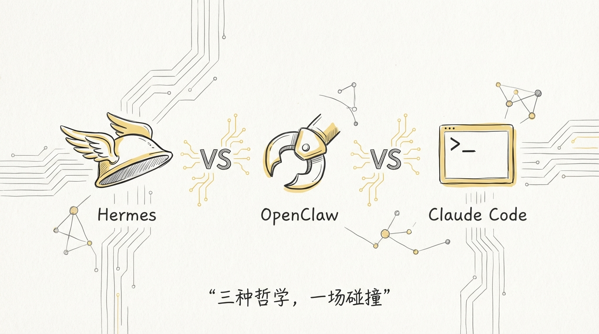

大部分人评价一个 Agent 框架，看的是功能列表、Star 数、Demo 效果。这些指标有用，但它们回答的是**这东西能不能跑**，而不是**这东西为什么这么设计**。

这篇文章把三个我深入读过源码的 Agent 系统拉到一起，从 13 个维度做一次横向解剖。不是为了评出优劣，是为了看清楚：**同样是 AI Agent，三种完全不同的产品哲学会把架构带向哪里。**

Hermes Agent 是 Nous Research 做的开源全栈 Agent，33 万行 Python。Claude Code 是 Anthropic 的官方编程助手，51 万行 TypeScript，源码因 npm sourcemap 泄露。OpenClaw 是开源的个人 AI 助手平台，100 万行+ TypeScript，基于插件体系连接 23+ 渠道。

三个项目，三种基因，三条完全不同的演化路径。

---

## 1️⃣ 背景与定位：研究驱动 vs 平台驱动 vs 工程驱动

| 维度 | Hermes Agent | OpenClaw | Claude Code |
|------|-------------|---------------------|-------------|
| 出品方 | Nous Research（开源模型团队） | 开源社区（Peter Steinberger 发起） | Anthropic（模型公司） |
| 核心动机 | 用 Agent 数据训练更好的模型 | 做一个个人 AI 助手，连接所有渠道 | 用 Agent 释放自家模型能力 |
| 用户画像 | 研究者 + 开源开发者 | 个人用户 + 开源社区 | 个人开发者 |
| 开源状态 | 完全开源（Apache 2.0） | 完全开源（MIT） | 客户端源码泄露 |
| 代码语言 | Python | TypeScript | TypeScript |

三者的定位差异从出生那天就决定了。

**Hermes Agent** 的母公司 Nous Research 是做开源模型微调的。他们的核心能力是 Hermes 系列模型，在 HuggingFace 上长期排开源榜前列。做 Agent 框架的动机很明确：**Agent 跑的每一次工具调用轨迹，都是训练下一代模型的素材。** 所以 Hermes Agent 内置了 `batch_runner.py` 和 `trajectory_compressor.py`，别的框架都没有。

**OpenClaw** 定位是个人 AI 助手。你在自己的设备上跑一个 Gateway，它帮你连接 WhatsApp、Telegram、Slack、Discord 等 23+ 个渠道。追求的是**本地化、隐私、多渠道统一体验**，通过插件体系扩展能力。

**Claude Code** 的定位最纯粹：一个跑在开发者终端里的 AI 编程助手。Anthropic 做它的核心目的是让 Claude 模型在编程场景下的体验达到极致。所有工程投入都指向一个目标：**让开发者信任这个 Agent，愿意让它操作自己的代码库。**

```
Hermes Agent                OpenClaw                    Claude Code
┌──────────────┐           ┌──────────────┐           ┌──────────────┐
│   Research    │           │   Platform   │           │  Engineering │
│   驱动        │           │   驱动        │           │  驱动         │
│              │           │              │           │              │
│  模型训练闭环  │           │  个人AI助手    │           │  极致开发体验  │
│  RL 轨迹采集  │           │  23+ 渠道     │           │  权限安全     │
│  开源社区     │           │  插件体系     │           │  流式 UI      │
└──────────────┘           └──────────────┘           └──────────────┘
```

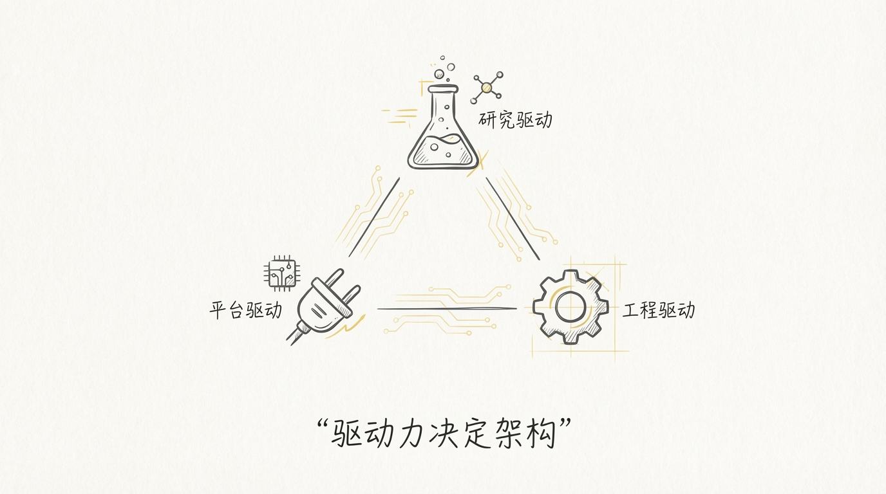

---

## 2️⃣ 架构对比：Python 单体 vs Node.js 插件体系 vs TypeScript 产品级工程

| 维度 | Hermes Agent | OpenClaw | Claude Code |
|------|-------------|---------------------|-------------|
| 语言 | Python | TypeScript | TypeScript |
| 运行时 | CPython 3.10+ | Node.js 24+ | Bun 1.3.11+ |
| 架构风格 | **单体**（run_agent.py 9,431 行） | **插件体系**（Extensions + Gateway） | **模块化单仓**（2,766 个文件） |
| 入口数量 | 2（CLI + Gateway） | 2（CLI + Gateway） | 1（CLI） |
| 构建工具 | pip / uv | pnpm / bun | Bun bundler |
| 核心文件 | run_agent.py（9,431 行） | gateway/run.py + extensions/ | query.ts（1,700 行） |

Hermes Agent 的架构用一个词概括：**大单体**。一个 `AIAgent` 类，56 个构造参数，9,431 行代码，什么都往里塞。CLI 和 Gateway 共用同一个类，子 Agent 和主 Agent 也是同一个类。好处是跑起来简单，坏处是改起来牵一发动全身。

OpenClaw 走了另一条路：**插件化**。核心是一个轻量的 Gateway 进程，所有能力通过 Extensions 挂载。IM 渠道是插件，工具是插件，存储后端是插件。用户通过 `openclaw onboard` 交互式引导完成配置，`openclaw gateway` 启动服务。整个系统通过 npm/pnpm 安装，运行在本地或 Docker 容器中。

Claude Code 是**产品级模块化**。51 万行代码分散在 2,766 个文件里，每个模块职责清晰。Agent 循环、权限系统、工具系统、压缩系统各自独立，通过 TypeScript 类型系统保证接口契约。用 React + ink 做终端 UI，这个选择在 Agent 框架里几乎是独一份。

```
Hermes Agent               OpenClaw                    Claude Code
┌────────────────┐        ┌────────────────┐         ┌────────────────┐
│  run_agent.py  │        │    Gateway     │         │   cli.tsx      │
│  9,431 行      │        │   ┌────────┐   │         │   init.ts      │
│  AIAgent 类    │        │   │Ext.A   │   │         │   main.tsx     │
│  什么都做      │        │   │Ext.B   │   │         ├────────────────┤
│                │        │   │Ext.C   │   │         │  query.ts      │
│  cli.py        │        │   │ ...    │   │         │  1,700 行      │
│  gateway/run.py│        │   └────────┘   │         │  Agent 循环    │
│                │        │                │         ├────────────────┤
│  全部共用      │        │  Extensions    │         │  permissions/  │
│  一个类        │        │  插件隔离       │         │  6,300 行      │
└────────────────┘        └────────────────┘         │  compact/      │
                                                     │  26 个文件     │
                                                     └────────────────┘
  Python 大单体              Node.js 插件               TS 模块化单仓
```

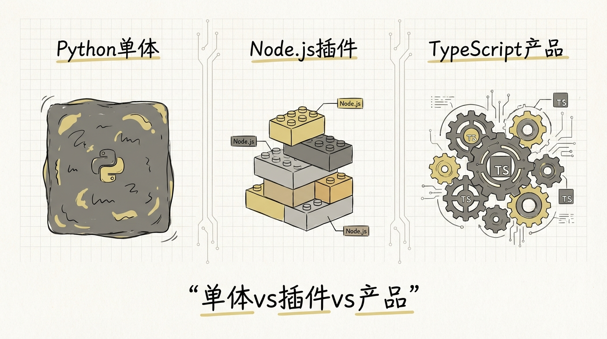

---

## 3️⃣ Agent 循环：同步 while + 线程池 vs Gateway 事件驱动 vs AsyncGenerator + yield

这是三个项目最核心的分歧点。Agent 循环是引擎，引擎的设计决定了车能跑多快、跑多稳。

| 维度 | Hermes Agent | OpenClaw | Claude Code |
|------|-------------|---------------------|-------------|
| 循环模型 | `while api_call_count < 90` | Gateway 事件回调 | `async function*` yield |
| 并发模型 | `ThreadPoolExecutor`（OS 线程） | Node.js 事件循环 | 原生 `Promise.all` |
| 流式传播 | 8 个回调插槽 | WebSocket push | `yield` → `for await` |
| 中断机制 | `_interrupt_requested` 标志位 | 用户消息触发新事件 | `AbortController` signal |
| 迭代上限 | 90 次（硬上限） | 无显式上限（依赖消息轮次） | 无上限（动态压缩） |
| 状态管理 | `self._xxx` 实例变量 | 外部 SessionStore | 不可变 state 拷贝 |
| 预算控制 | `IterationBudget`（70%/90% 两级预警） | 无内置 | 无内置（靠压缩续命） |

**Hermes Agent** 用的是最朴素的同步 while 循环。每轮迭代：调 API → 解析响应 → 执行工具 → 追加结果 → 检查预算 → 继续。并行工具执行用 `ThreadPoolExecutor`，最多 8 个 worker，还有一套精密的安全检查决定哪些工具能并行。

这个选择的 trade-off 很清楚：Python 的 async 生态碎片化严重，Hermes 要兼容 Playwright、Firecrawl、各种同步 SDK。用同步循环 + 线程池桥接异步，是**最务实的选择**。代价是线程安全的防御代码散落在每个角落：`threading.Lock()`、`threading.RLock()`、`_SafeWriter` catch `ValueError`。

**OpenClaw** 的循环隐藏在 Gateway 的事件驱动架构里。用户从 IM 渠道发来一条消息，Gateway 收到事件，调用 Agent 处理，Agent 返回结果，Gateway 推送回渠道。没有一个显式的 while 循环在那里转，每条消息的处理是独立的函数调用。多轮对话的状态通过外部 SessionStore 维护。

**Claude Code** 用了 JavaScript 生态最优雅的方案：`AsyncGenerator`。核心循环是一个 `async function*`，每产生一个 token 就 `yield` 出来，上层 `for await` 循环实时渲染到终端。这套机制让流式输出、中途暂停等用户确认、恢复执行这些场景天然流畅。

```
Hermes:                     OpenClaw:                   Claude Code:

while count < 90:           on("message", async (msg)   async function* query() {
  resp = call_api()           => {                        // Stage 1: Prefetch
  if tool_calls:                session = getSession()    yield* prefetch()
    results = exec()            result = await agent()    // Stage 2: Build
    messages.append()           session.save()            const req = build()
    count += 1                  push(result)              // Stage 3: API
  else:                       })                          for await (chunk) {
    break                                                   yield chunk
                                                          }
同步 while                  事件回调                      // Stage 4-6...
+ ThreadPoolExecutor        + SessionStore                yield* execTools()
                                                        }
```

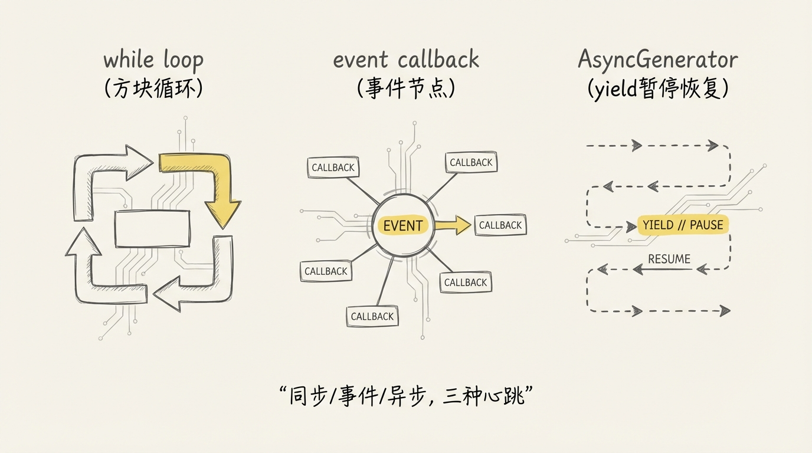

---

## 4️⃣ 工具系统：Registry 模式 vs MCP 协议 + Extensions vs 内置 40+ 工具 + Skill

| 维度 | Hermes Agent | OpenClaw | Claude Code |
|------|-------------|---------------------|-------------|
| 注册方式 | `ToolRegistry` 单例 + `importlib` 导入 | Extensions 声明式 + MCP | 硬编码注册 + feature flag |
| 内置工具数 | ~25 个核心 | 依赖插件（10-50 个） | 40+ |
| 扩展协议 | 无标准协议 | **MCP 协议** | MCP 协议 + Skill |
| 工具发现 | `model_tools.py` 硬编码模块列表 | 插件自注册 + 配置 | `tools.ts` 注册表 |
| 异步桥接 | 持久化 event loop `_run_async()` | 原生 async | 原生 async |
| 结果大小控制 | 三级防御（自限 → 落盘 → 整轮预算） | 插件自行控制 | 微压缩清理 |
| 并行执行 | 安全检查 → 白名单 / 路径冲突检测 | 依赖 Node.js 事件循环 | `Promise.all` 直接并行 |

Hermes Agent 的工具注册是**经典的 Registry 模式**。`ToolRegistry` 是一个全局单例，每个工具模块在 `import` 时调用 `registry.register()` 注册自己。工具发现是硬编码的：`model_tools.py` 里有一个模块列表，逐个 `importlib.import_module()`。

一个值得注意的工程细节：Hermes 维护了一个**持久化 event loop** 来桥接同步 Agent 循环和异步工具 handler。这解决了 Python 里经典的 `Event loop is closed` 问题。

OpenClaw 走了**标准化协议路线**。工具通过 MCP（Model Context Protocol）协议接入，外部工具不需要知道 OpenClaw 的内部实现，只要实现 MCP 接口就能被发现和调用。这让工具生态可以独立于平台演进。

Claude Code 的工具系统最重：**40+ 内置工具**覆盖了文件操作、代码搜索、Bash 执行、Web 访问、Agent fork 等几乎所有编程场景，再通过 MCP 接入外部工具，通过 Skill 系统加载可复用的工作流。feature flag 控制哪些工具对当前用户可见，82 个 flag 的粒度说明了产品化的深度。

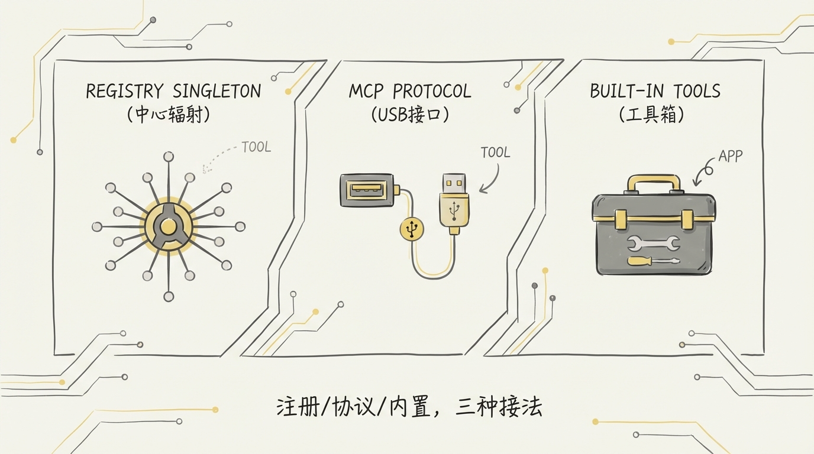

---

## 5️⃣ Provider 管理：凭证池化 vs 配置声明式 vs 模型 fallback 链

| 维度 | Hermes Agent | OpenClaw | Claude Code |
|------|-------------|---------------------|-------------|
| Provider 数量 | **15+**（注册表式） | **1 per instance** | **1**（Anthropic） |
| 消息格式 | OpenAI 内部 + 出口适配 | OpenAI 兼容 | Anthropic 原生 |
| 凭证管理 | `credential_pool` 多凭证池化 | Docker 环境变量注入 | 单凭证 `~/.claude.json` |
| 选择策略 | 4 种（fill_first / round_robin / random / least_used） | 运维固定配置 | 无（只有一个） |
| 耗尽处理 | 冷却（429→1h, 402→24h）+ 自动降级 | 依赖 K8s 健康检查 | 报错，用户手动处理 |
| 辅助任务路由 | 7 级优先级自动检测链 | 无（单模型做所有事） | 无（所有任务都用 Anthropic） |
| Fallback | 链式 fallback（主 → 备 1 → 备 2） | 无 | 模型级别（Opus → Sonnet → Small） |

Hermes Agent 在 Provider 管理上的投入是三者中最重的，4 个文件共 7,733 行代码。`credential_pool.py` 管理同一个 Provider 下的多个 API Key，支持轮转、冷却、并发租约。`auxiliary_client.py` 为辅助任务（压缩、搜索、视觉分析）自动寻找最便宜的可用 Provider。

这种复杂度来自产品定位：面向终端用户的桌面 CLI，必须处理用户手里有各种 Provider 凭证的情况。

OpenClaw 的做法是**声明式配置**。通过 `openclaw.json` 声明 Provider 和 fallback 链，`openclaw onboard` 提供交互式引导。支持 OAuth device flow 和 API key，运行时自动处理切换。比 Hermes 简单，比 Claude Code 灵活。

Claude Code 更极端：**只对接自家 API。** 连 fallback 都是在 Anthropic 的模型线内做，Opus → Sonnet → Small。这让它的 API 客户端可以深度优化 Prompt Cache、Extended Thinking 等 Anthropic 专属特性。

```
           Provider 复杂度
           ←───────────────────────────→
  Claude Code        OpenClaw        Hermes Agent
  │                  │               │
  │  1 Provider      │  1 per inst.  │  15+ Providers
  │  Anthropic only  │  固定配置      │  4 种池化策略
  │  深度优化        │  声明式配置      │  7 级辅助路由
  │                  │               │  自动降级链
```

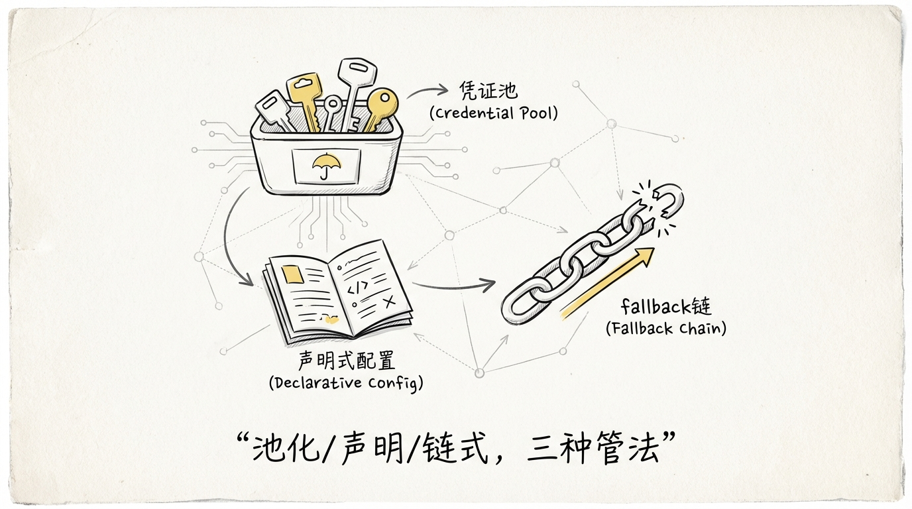

---

## 6️⃣ 消息网关：内置 11 平台 vs 80+ 插件 vs 纯终端

| 维度 | Hermes Agent | OpenClaw | Claude Code |
|------|-------------|---------------------|-------------|
| 渠道数 | **11 个内置** | **80+ 插件** | **0**（纯终端） |
| 渠道列表 | Telegram / Discord / Slack / WhatsApp / Signal / Matrix / Email / HomeAssistant / Mattermost / DingTalk / Feishu | 微信 / 企微 / Slack / 飞书 / DingTalk / Telegram 等 80+ | 终端 CLI only |
| 实现方式 | `gateway/` 目录，每个平台一个 .py 文件 | Extensions 插件体系 | N/A |
| 会话管理 | `SessionStore` + SQLite | 外部 SessionStore + Redis | 终端 session |
| 多租户 | 单实例多用户（通过 user_id 隔离） | 单实例多渠道（Extensions 插件隔离） | 单用户 |
| 消息协议 | 各平台原生 SDK | 统一消息格式 + 适配层 | N/A |

Hermes Agent 的 `gateway/` 目录是一个小型消息中间件。每个平台一个 Python 文件，`base.py` 定义了统一的 `PlatformAdapter` 接口。新增一个平台，只需要继承 base 类实现几个方法。11 个平台的代码直接内置在仓库里，不需要额外安装。

OpenClaw 的消息网关是平台的核心竞争力。80+ 个渠道插件通过 Extensions 体系挂载，每个渠道有独立的消息格式适配和状态管理。微信渠道走 iLink Bot API 长轮询 + HTTP JSON 协议，企微渠道有两个版本迭代。

Claude Code 彻底不做消息网关。它的用户界面就是终端，用 React + ink 渲染。所有精力投入到终端交互体验上：实时流式输出、权限确认弹窗、进度条、代码高亮。

这三种选择背后是三种产品判断：

- Hermes 认为 **Agent 应该在用户所在的地方**，所以内置 11 个平台
- OpenClaw 认为 **渠道越多覆盖越广**，所以做插件体系让社区贡献
- Claude Code 认为 **开发者的终端就是最好的界面**，不需要多余的东西

---

## 7️⃣ Memory：SQLite FTS5 + 8 插件 vs QMD 索引 vs CLAUDE.md 五层 + MEMORY.md

| 维度 | Hermes Agent | OpenClaw | Claude Code |
|------|-------------|---------------------|-------------|
| 持久化存储 | **SQLite + FTS5 全文搜索** | **QMD 格式文件索引** | **Markdown 文件** |
| 记忆层级 | 8 种 Memory 插件后端 | 单层 QMD 索引 | **五层** CLAUDE.md 覆盖链 |
| 会话记忆 | `sessions` 表 + `messages_fts` | Session 外部存储 | Session Memory + MEMORY.md |
| 搜索能力 | SQLite FTS5 全文搜索 | QMD 关键词匹配 | 文件系统 + Grep 工具 |
| 写入模式 | SQLite WAL（多读单写） | 文件写入 | Agent 主动写 MEMORY.md |
| 跨 session | `parent_session_id` 链式追溯 | 依赖外部存储 | CLAUDE.md 跨 session 持久 |
| 并发安全 | WAL + 随机抖动退避（20-150ms） | 插件自行处理 | 单用户无并发问题 |

Hermes Agent 的记忆系统建在 **SQLite** 上，用 **FTS5** 做全文搜索索引。`hermes_state.py` 里的 `SessionDB` 管理会话数据，WAL 模式解决 Gateway 多用户并发读写。8 种 Memory 插件后端让用户可以选择不同的存储和检索策略。`session_search` 工具允许 Agent 搜索历史 session 的对话内容，即使那些对话已经被压缩掉了。

OpenClaw 用 **QMD 格式**做知识索引，相对轻量。核心文档和配置通过 QMD 文件管理，Agent 可以按需检索。适合个人知识管理和文档检索场景。

Claude Code 的记忆系统设计得最精巧。**五层 CLAUDE.md 覆盖链**从全局管理级（`/etc/claude-code/CLAUDE.md`）到用户级（`~/.claude/CLAUDE.md`）到项目级到本地级再到自动记忆，层层叠加。高优先级覆盖低优先级的冲突配置，不冲突的全部保留。这个设计和 CSS 层叠规则、Kubernetes ConfigMap 覆盖链是同构的。

MEMORY.md 是另一个亮点：**Agent 自己写给自己看的长期记忆**。Agent 在工作中发现了值得记住的信息，主动写入 MEMORY.md，下次 session 自动加载。最大 200 行 / 25,000 字节的容量限制确保它不会无限膨胀侵占上下文窗口。

```
Hermes:                  OpenClaw:               Claude Code:
┌──────────────┐        ┌──────────────┐        ┌──────────────────┐
│ SQLite + FTS5│        │  QMD 索引     │        │ /etc/CLAUDE.md   │ L1
│              │        │              │        │ ~/.claude/       │ L2
│ sessions 表  │        │  关键词匹配   │        │ project/CLAUDE.md│ L3
│ messages_fts │        │              │        │ CLAUDE.local.md  │ L4
│              │        │  外部存储     │        │ TEAMMEM (flag)   │ L5
│ 8 插件后端   │        │  依赖        │        │                  │
│ WAL 并发     │        │              │        │ MEMORY.md        │
│              │        │              │        │ Session Memory   │
└──────────────┘        └──────────────┘        └──────────────────┘
  数据库范式               文件索引范式             配置覆盖链范式
```

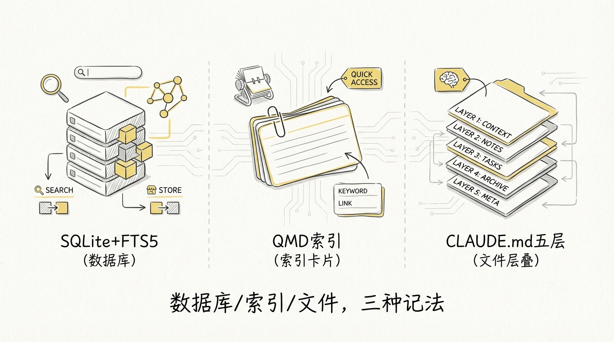

---

## 8️⃣ 上下文管理：LLM 结构化摘要 vs compaction 策略 vs 三层压缩

上下文窗口溢出是每个 Agent 必须面对的问题。三者的解法差异巨大。

| 维度 | Hermes Agent | OpenClaw | Claude Code |
|------|-------------|---------------------|-------------|
| 压缩层数 | **2 层**（裁剪 + LLM 摘要） | **1 层**（固定窗口裁剪） | **3 层**（微压缩 + SM + Full Compact） |
| 触发阈值 | 50% 上下文窗口 | 固定消息数 | 上下文窗口 - 13,000 token |
| 摘要方式 | LLM 七段式结构化模板 | 无摘要（截断即丢） | LLM 九段式结构化模板 |
| 迭代更新 | **有**（`_previous_summary` 增量更新） | 无 | **无**（每次从零生成） |
| 头部保护 | 固定 3 条 | 保留 system prompt | 隐式保护 |
| 尾部保护 | Token 预算 20K + 保底 20 条 | 保留最近 N 轮 | 保留最新消息 |
| Session 分裂 | **有**（`parent_session_id` 链） | 无 | 无 |
| 工具结果落盘 | 超限写入 `/tmp/hermes-results/` | 无 | 微压缩清理旧 tool_result |
| 熔断器 | 600 秒冷却 | 无 | 连续 3 次失败停止重试 |
| 摘要模型 | auxiliary client（便宜小模型） | N/A | fork 独立 Agent（同模型） |

Hermes 的压缩策略在**迭代更新**上有独特优势。50% 的阈值看起来激进，但配合 `_previous_summary` 增量更新，每次压缩的内容量更小，摘要质量更高。七段式模板（Goal / Constraints / Progress / Key Decisions / Relevant Files / Next Steps / Critical Context）强制 LLM 按类别填充，减少信息遗漏。

OpenClaw 的做法最简单：**砍到最近 N 轮，被砍的就丢了。** 零额外计算成本，零延迟。适合短对话、高吞吐的客服场景。

Claude Code 的三层压缩是业界最精细的方案。**微压缩**每次调用都执行，清理旧 tool_result，零成本。**Session Memory** 把关键信息沉淀到持久化文件，释放上下文空间。**Full Compact** 是最后的兜底，fork 独立 Agent 做九段式全量摘要。三层递进，成本从低到高。代码注释里记录了 2026 年 3 月的生产事故：1,279 个 session 出现连续压缩失败，最严重的一个失败了 3,272 次。加了熔断器之后问题消失。

```
信息保留度
  高 ▲
     │  Claude Code          Hermes Agent
     │  三层压缩              LLM 摘要 + 迭代更新
     │  九段式模板             七段式模板
     │
     │
     │                                          OpenClaw
     │                                          固定窗口裁剪
  低 └──────────────────────────────────────────────→
                                               工程复杂度 低
     工程复杂度 高
```

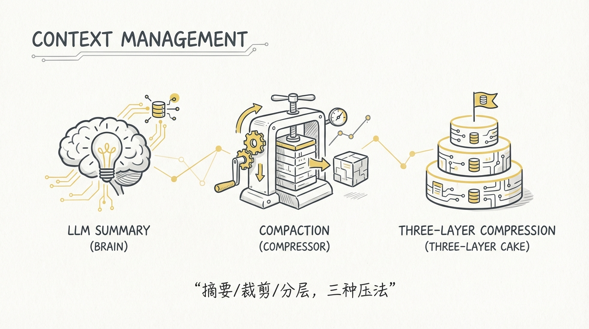

---

## 9️⃣ 权限系统：基础审批 vs 无内置 vs 6,300 行三模式 + ML 分类器

| 维度 | Hermes Agent | OpenClaw | Claude Code |
|------|-------------|---------------------|-------------|
| 代码规模 | 基础工具审批逻辑 | 无内置权限系统 | **6,300+ 行 / 25 个文件** |
| 权限模式 | 工具启用/禁用 | 声明式配置（容器级隔离） | **三模式**（default / auto / plan） |
| 危险命令拦截 | 工具白名单 | Docker 沙箱隔离 | **42 条硬编码**危险模式 |
| ML 分类器 | 无 | 无 | **YOLO 分类器**（side-query Claude 评估） |
| 行为学习 | 无 | 无 | **Denial Tracking**（追踪用户拒绝模式） |
| 文件沙箱 | 环境隔离（Docker / SSH / Modal） | Docker namespace 隔离 | `pathValidation.ts` 路径校验 |
| 规则配置 | `enabled_toolsets` / `disabled_toolsets` | 容器环境变量 | `settings.json` allow/deny + 通配符 |

权限系统是三者差距最大的维度。

**Claude Code** 在这里投入了整个代码库中最多的工程资源。6,300 行代码，25 个文件，三种权限模式。default 模式每次弹窗确认。auto 模式用 ML 分类器预判风险，只有高风险操作才弹窗。plan 模式让模型先规划再执行，低置信度的步骤才需要确认。42 条硬编码的危险命令模式覆盖了所有能启动解释器或执行任意代码的入口。Denial Tracking 追踪用户的拒绝行为并自适应调整策略。

为什么 Claude Code 在权限上投入这么重？因为它**直接操作用户的电脑**。读写文件、执行 bash 命令、打开浏览器抓网页。一个 prompt injection 就可能让 Agent 执行 `rm -rf /`。权限系统是 Claude Code 作为产品能被用户信任的底线。

**Hermes Agent** 的权限控制相对基础。主要通过 `enabled_toolsets` / `disabled_toolsets` 控制工具可用性，加上环境层面的隔离（Docker / SSH / Modal 沙箱）。它的安全思路是**把 Agent 关在笼子里**，笼子是 Docker 容器或远程 SSH，而不是在 Agent 层面做精细的命令级拦截。

**OpenClaw** 没有内置精细的权限系统。安全依赖插件沙箱和运行环境隔离。Agent 实例可以跑在 Docker 容器里，容器的 namespace 天然限制了文件系统和网络访问。对于个人助手场景，用户自己控制部署环境，这个粒度够用。

```
权限精细度
  高 ▲
     │  Claude Code
     │  42 条规则 + ML 分类器
     │  三模式 + 行为学习
     │  6,300 行专用代码
     │
     │
     │  Hermes Agent             OpenClaw
     │  工具白名单 +              容器隔离 +
     │  环境沙箱                  声明式配置
  低 └──────────────────────────────────────────→
     Agent 级                              基础设施级
     权限控制                               权限控制
```

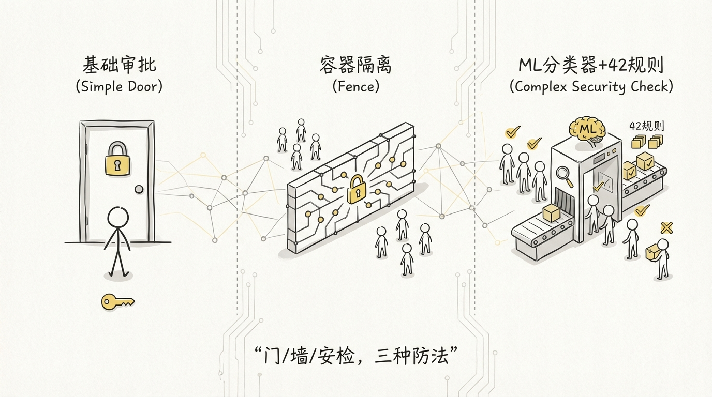

---

## 🔟 部署模型

| 维度 | Hermes Agent | OpenClaw | Claude Code |
|------|-------------|---------------------|-------------|
| 安装方式 | `pip install` / `uv install` | `npm install -g openclaw` | `npm install -g @anthropic-ai/claude-code` |
| 运行环境 | 本地 / Docker / Modal / SSH / Daytona / Singularity | 本地 / Docker / NixOS | 本地终端（Bun 运行时） |
| 多实例 | Gateway 单进程多用户 | Gateway 单进程多渠道 | 单用户单实例 |
| 配置管理 | `cli-config.yaml` + 环境变量 | `openclaw.json` + `openclaw onboard` | `settings.json` + CLAUDE.md |
| 灰度能力 | 无内置 | 无内置 | 无（82 个 feature flag 做能力灰度） |
| 运维 | 用户自运维 | 用户自运维 | Anthropic 托管 API + 用户本地 CLI |
| 资源隔离 | 6 种终端后端选择 | Docker / NixOS 隔离 | 文件系统沙箱 |

Hermes Agent 提供了**最多的部署选项**：6 种终端后端（local / Docker / SSH / Modal / Daytona / Singularity），覆盖从开发者笔记本到云端 GPU 实例的所有场景。Gateway 模式下单进程可以同时服务多个 IM 平台的用户。

OpenClaw 支持 **npm 全局安装、Docker 和 NixOS** 三种部署方式。`openclaw onboard --install-daemon` 可以一键安装 Gateway 守护进程（launchd/systemd），保持后台常驻。配置通过 `openclaw.json` 声明式管理，`openclaw doctor` 做健康检查。

Claude Code 的部署模型最简单：**npm install 到本地，跑在终端里。** 服务端是 Anthropic 的 API，不需要用户自己部署。82 个 feature flag 做的是**能力灰度**而非实例灰度。

---

## 1️⃣1️⃣ RL 训练集成：Hermes 独有的闭环

这个维度只有 Hermes Agent 有实质性的实现，Claude Code 和 OpenClaw 都没有。

| 组件 | 功能 | 代码量 |
|------|------|--------|
| `batch_runner.py` | 并行运行多个 Agent 实例，执行不同任务 | ~500 行 |
| `trajectory_compressor.py` | 压缩 RL 训练轨迹，保留关键决策点 | ~1,500 行 |
| `tinker-atropos/` | 对接 RL 训练流程 | 独立模块 |
| `datagen-config-examples/` | 训练数据生成配置示例 | 配置文件 |

`batch_runner.py` 可以并行跑几十个 Agent 实例，每个实例执行一个 SWE-bench 或自定义任务，完整记录工具调用轨迹。`trajectory_compressor.py` 用精确 HuggingFace tokenizer 计数，把冗长的轨迹压缩到目标 token 预算（默认 15,250），50 并发异步处理。

这形成了一个 **Agent → 数据 → 模型 → 更好的 Agent** 的飞轮：

```
┌──────────────────────────────────────────────────────┐
│                                                      │
│  Hermes Agent 执行任务                                │
│       ↓                                              │
│  batch_runner.py 记录工具调用轨迹                      │
│       ↓                                              │
│  trajectory_compressor.py 压缩成训练数据               │
│       ↓                                              │
│  Tinker-Atropos RL 训练                               │
│       ↓                                              │
│  更好的 Hermes 模型                                    │
│       ↓                                              │
│  Hermes Agent 表现更好 → 产出更高质量的轨迹             │
│       ↓                                              │
│  (循环)                                               │
│                                                      │
└──────────────────────────────────────────────────────┘
```

Claude Code 和 OpenClaw 没有做这个，原因不同。Claude Code 背后是 Anthropic，训练数据的采集和处理在服务端完成，不需要在客户端暴露。OpenClaw 专注于做个人 AI 助手和多渠道连接，RL 训练不在其产品范围内。

**Hermes Agent 把训练数据采集内置在 Agent 框架里，这个设计决策暴露了 Nous Research 的底层战略：Agent 不只是产品，更是数据工厂。**

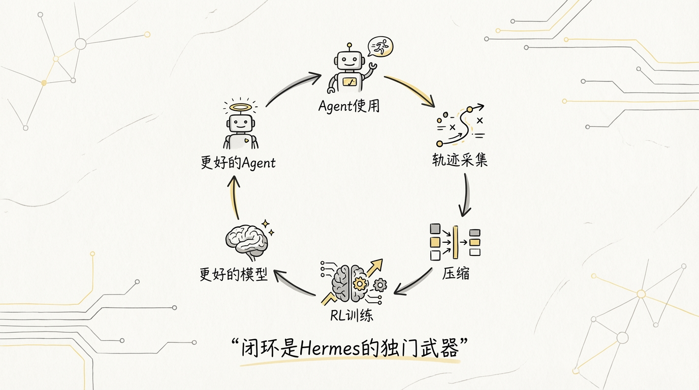

---

## 1️⃣2️⃣ 代码规模

| 指标 | Hermes Agent | OpenClaw | Claude Code |
|------|-------------|---------------------|-------------|
| 代码总行数 | **~334,661 行** | **100 万行+** | **515,498 行** |
| 核心语言 | Python | TypeScript + Python + Vue.js | TypeScript |
| 文件数 | 744（.py） | 数千 | 2,766 |
| 最大单文件 | run_agent.py（9,431 行） | gateway/run.py（数千行） | main.tsx（5,000+ 行） |
| 核心循环 | 9,431 行（单文件） | 分散在 Gateway + Extensions | 1,700 行（query.ts） |
| 权限系统 | 分散在各工具中 | 无独立模块 | 6,300 行 / 25 个文件 |
| 压缩系统 | context_compressor.py + trajectory_compressor.py | compaction 策略代码 | 26 个文件（compact/） |
| 测试目录 | 42 个 | 有 | 有 |

代码量的差异部分反映了**功能覆盖面**的差异，部分反映了**工程化深度**的差异。

OpenClaw 的 100 万行+ 包含了 Gateway 核心、80+ Extensions 插件、CLI 工具、文档站等多个模块的总量。单看 Gateway 核心，体量小得多。

Claude Code 的 51 万行全部是客户端代码，没有后端。权限系统 6,300 行、压缩系统 26 个文件、MCP 集成 12,000+ 行，这些数字说明了**产品级工程**的投入深度。

Hermes Agent 的 33 万行全是 Python，包含了 Agent 核心、11 个平台网关、6 种终端后端、RL 训练管线。run_agent.py 一个文件 9,431 行，是三者中单文件密度最高的。

---

## 1️⃣3️⃣ 选型决策树

到了最实际的问题：选哪个？

```
你要做什么？
│
├─ 研究 Agent / 训练自己的模型
│   └─→ Hermes Agent
│       RL 轨迹采集是内置的，别的都没有
│
├─ 个人 AI 助手 / 多渠道连接
│   ├─ 需要接入多个 IM 渠道？
│   │   ├─ 11 个够用 → Hermes Agent (Gateway 模式)
│   │   └─ 需要 23+ 渠道或自定义插件 → OpenClaw
│   │
│   └─ 想要本地部署 + 隐私优先？
│       └─→ OpenClaw (npm install + 本地 Gateway)
│
├─ 个人开发者日常编程
│   └─→ Claude Code
│       权限系统、流式 UI、上下文管理都是为这个场景打磨的
│
├─ 需要对接多个 LLM Provider
│   └─→ Hermes Agent
│       15+ Provider、4 种池化策略、7 级辅助路由
│
└─ 需要二次开发 Agent 框架
    ├─ Python 技术栈 → Hermes Agent (开源 Apache 2.0)
    ├─ TypeScript 技术栈 → 参考 Claude Code 架构
    └─ 需要插件化扩展 → OpenClaw 架构思路
```

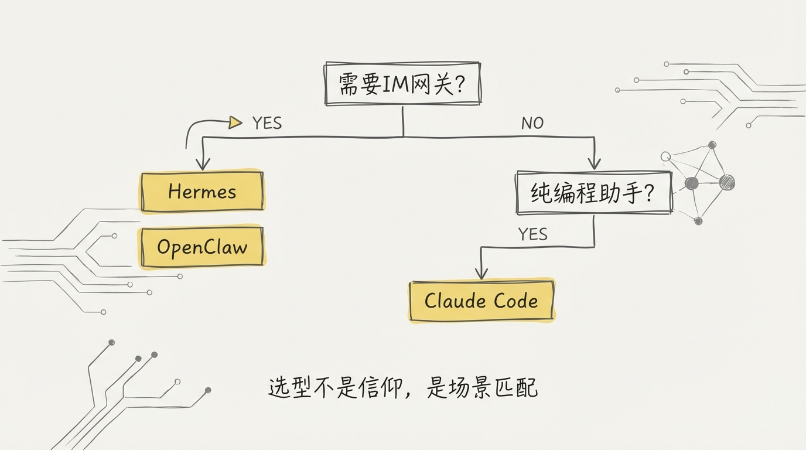

---

## 结语

| 项目 | 一句话定位 |
|------|-----------|
| **Hermes Agent** | 研究团队做的全栈 Agent，从用到训练的闭环，代码朴素但野心不小 |
| **OpenClaw** | 平台团队做的 Agent 基座，靠插件和容器编排连接一切业务场景 |
| **Claude Code** | 产品团队做的编程助手，6,300 行权限系统和三层压缩说明了什么叫 Harness Engineering |

三个项目走了三条完全不同的路，但有一个共识：**模型能力是地基，把模型能力安全、高效、稳定地释放出来的 Harness，才是 Agent 产品的核心壁垒。**

Hermes 用 RL 训练闭环强化地基，OpenClaw 用插件体系扩大覆盖面，Claude Code 用极致工程深挖 Harness。三种策略都合理，因为它们面对的用户、约束和目标本来就不同。

你选哪条路，取决于你到底想解决什么问题。

---

> 本文是 Hermes Agent 源码解剖系列的终篇。完整系列：
> - [01-全景图](01-全景图.md)
> - [02-Agent核心循环](02-Agent核心循环.md)
> - [04-多Provider适配](04-多Provider适配.md)
> - [05-上下文压缩](05-上下文压缩.md)
> - **08-三方对比（本文）**
